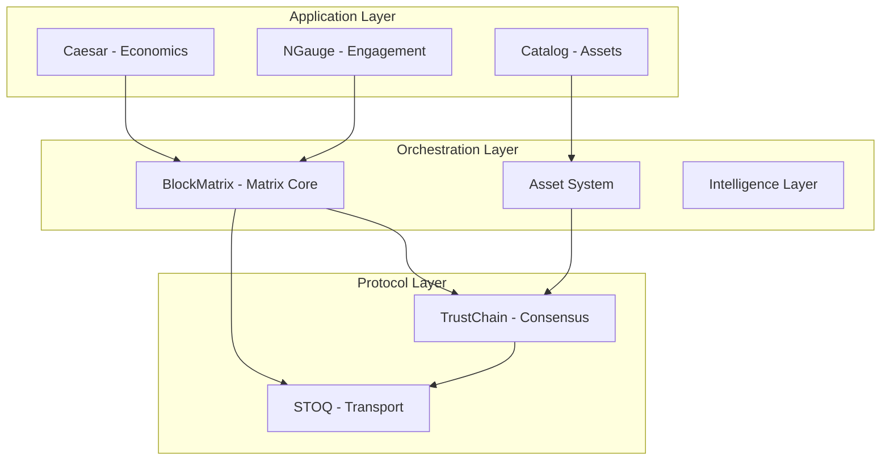

# HyperMesh Architecture Type Map

## Executive Summary

This document provides a comprehensive map of type definitions, trait hierarchies, and architectural dependencies across the HyperMesh distributed computing platform. The analysis reveals a well-structured, layered architecture with clear boundaries but some areas of concern regarding component coupling.

## Core Architecture Layers



## Component Type Hierarchies

### 1. STOQ (Transport Layer) - 92% Complete

**Core Traits:**
- `Transport` - Pure packet delivery interface
- `Listener` - Connection acceptance
- `StoqProtocolExtension` - Protocol extensions

**Key Types:**
- `StoqTransport` - Main transport implementation
- `NetworkTier` - Network performance tiers
- `NetworkIsolationManager` - Multi-network support
- `FalconEngine` - Quantum-resistant crypto
- `StoqPacket` - Packet structure with extensions

**Dependencies:**
- External only (quinn, rustls, tokio)
- NO internal HyperMesh dependencies
- Clean protocol boundary

### 2. BlockMatrix (Orchestration) - 50% Complete

**Core Traits:**
- `AssetAdapter` - Universal asset interface (CPU/GPU/Memory/Storage)
- `IntelligenceLayer` - ML/AI integration
- `MatrixNode` - Node positioning interface
- `BlockchainNode` - Per-node blockchain

**Key Types:**
- `MatrixCoordinate` - (x,y,z) positioning
- `NodeBlockchain` - Independent blockchain per node
- `AssetManager` - Asset lifecycle management
- `ProxyAddress` - NAT-like addressing
- `ConsensusProof` - Four-proof validation

**Matrix-Specific Types:**
- `Vector3D` - 3D vector operations
- `Matrix3x3` - Matrix transformations
- `TensorOperation` - Tensor math for routing
- `PathFinder` - A* pathfinding in matrix
- `GpsCoordinate` - Real-world mapping

**Dependencies:**
- → STOQ (transport)
- → TrustChain (consensus)
- Circular: Assets ↔ Consensus

### 3. TrustChain (Consensus) - 95% Complete

**Core Traits:**
- `Proof` - Validation interface
- `ConsensusNode` - Node consensus participation
- `CertificateAuthority` - CA operations

**Proof Types (Four-Proof System):**
- `SpaceProof` - WHERE (storage location)
- `StakeProof` - WHO (ownership/stake)
- `WorkProof` - WHAT (computation)
- `TimeProof` - WHEN (temporal ordering)

**Key Types:**
- `FalconCertificate` - Quantum-resistant certs
- `ConsensusEngine` - Proof validation
- `ProductionValidator` - Production checks

**Dependencies:**
- → STOQ (uses transport)
- Clean boundaries

### 4. Catalog (Asset Management) - 30% Complete

**Core Traits:**
- `LibraryInterface` - Asset library ops
- `PackageValidator` - Validation logic
- `DependencyResolver` - Dependency management

**Key Types:**
- `AssetLibrary` - Main library
- `LibraryAssetPackage` - Package structure
- `PackageCache` - Multi-tier caching (L1/L2/L3)
- `ValidationResult` - Validation outcomes

**Dependencies:**
- → BlockMatrix (for execution)
- Clean API boundaries

### 5. Caesar (Economics) - 40% Complete

**Core Traits:**
- `BankingApiProvider` - Banking integration
- `CryptoExchangeProvider` - Exchange ops

**Key Types:**
- `InteropTransaction` - Bridge transactions
- `VelocityZone` - Economic zones
- `BridgeFees` - Fee structures
- `AssetType` - Asset classification

**Dependencies:**
- → BlockMatrix (for assets)
- External APIs (Stripe, Plaid, etc.)

## Architectural Patterns

### 1. Asset Adapter Pattern
```rust
trait AssetAdapter {
    async fn validate_consensus_proof(&self, proof: &ConsensusProof) -> Result<bool>;
    async fn allocate_asset(&self, request: &AssetAllocationRequest) -> Result<AssetAllocation>;
    async fn assign_proxy_address(&self, asset_id: &AssetId) -> Result<ProxyAddress>;
}
```
- Uniform interface for all resource types
- Consensus validation at adapter level
- NAT-like proxy addressing built-in

### 2. Four-Proof Consensus
Every operation requires ALL four proofs:
- Not split by asset type
- Unified validation
- Temporal ordering critical

### 3. Matrix Topology
- Nodes as matrix cells (x,y,z)
- Tensor operations for routing
- Distance-based neighbor discovery
- Geospatial awareness

### 4. Privacy Tiers
Network transport independent from blockchain:
- Anonymous, Private, Federated, Public
- Flexible privacy matrix
- Protocol-level enforcement in STOQ

## Architectural Issues Found

### 1. Circular Dependencies
- **BlockMatrix ↔ Assets**: Bidirectional dependency creates coupling
- **Recommendation**: Extract shared types to common crate

### 2. Type Duplication
- `PrivacyTier` defined in multiple places (STOQ, BlockMatrix, Assets)
- `ConsensusProof` duplicated between TrustChain and BlockMatrix
- **Recommendation**: Create shared types crate

### 3. Missing Abstractions
- No unified error type hierarchy
- No common metric/monitoring interface
- **Recommendation**: Define core trait abstractions

### 4. Incomplete Integration Points
- Caesar → BlockMatrix integration partial
- Catalog → BlockMatrix execution delegation incomplete
- **Recommendation**: Define clear API contracts

## Data Flow Patterns

### 1. Asset Allocation Flow
```
User Request → BlockMatrix → AssetAdapter → ConsensusProof → TrustChain
                    ↓              ↓                              ↓
              ProxyAddress    Allocation              Validation
                    ↓              ↓                              ↓
              NAT System    Resource Claim              STOQ Transport
```

### 2. Matrix Routing Flow
```
Source Node → MatrixCoordinate → TensorOperation → PathFinder
                    ↓                   ↓              ↓
              Position Calc      Matrix Math      A* Algorithm
                    ↓                   ↓              ↓
              Neighbor List      Route Calc      Optimal Path
```

### 3. Consensus Validation Flow
```
Transaction → Four Proofs → ConsensusEngine → BlockMatrix
                  ↓              ↓                ↓
            Space+Stake     Validation       Blockchain
            Work+Time          ↓                ↓
                          Certificate      Node Chain
```

## Key Architectural Decisions

### Strengths
1. **Clean Protocol Boundaries**: STOQ has zero internal dependencies
2. **Uniform Asset Model**: Everything is an asset with adapters
3. **Matrix-First Design**: Tensor operations native to architecture
4. **Quantum-Resistant**: FALCON-1024 throughout
5. **Multi-Network Support**: Isolation built into transport

### Weaknesses
1. **Type Duplication**: Common types scattered across components
2. **Circular Dependencies**: Assets ↔ Consensus coupling
3. **Incomplete Caesar Integration**: Economics not fully integrated
4. **Missing CLI**: No unified command interface

## Recommendations

### Immediate Actions
1. **Extract Common Types**: Create `hypermesh-types` crate for shared definitions
2. **Break Circular Dependencies**: Use dependency injection or interfaces
3. **Standardize Error Handling**: Create unified error hierarchy
4. **Complete Integration Tests**: End-to-end testing across components

### Medium-Term Improvements
1. **Unified CLI**: Create comprehensive CLI for all operations
2. **Metric Standardization**: Common monitoring interface
3. **API Gateway**: Unified entry point for external clients
4. **Documentation**: Generate type docs from this analysis

### Long-Term Architecture
1. **Microkernel Pattern**: Move to plugin-based architecture
2. **Event Sourcing**: For audit and replay capabilities
3. **CQRS Pattern**: Separate read/write paths for scale
4. **Service Mesh**: Full mesh networking between components

## Conclusion

The HyperMesh architecture demonstrates sophisticated design with clear layer separation and innovative concepts like matrix topology and four-proof consensus. However, type duplication and circular dependencies indicate areas needing refactoring. The 25-30% overall implementation suggests significant work remains, particularly in integration and production readiness.

**Priority Focus Areas:**
1. Resolve circular dependencies
2. Complete Caesar-BlockMatrix integration
3. Implement unified CLI
4. Comprehensive integration testing

The architecture is sound but requires refinement for production deployment.