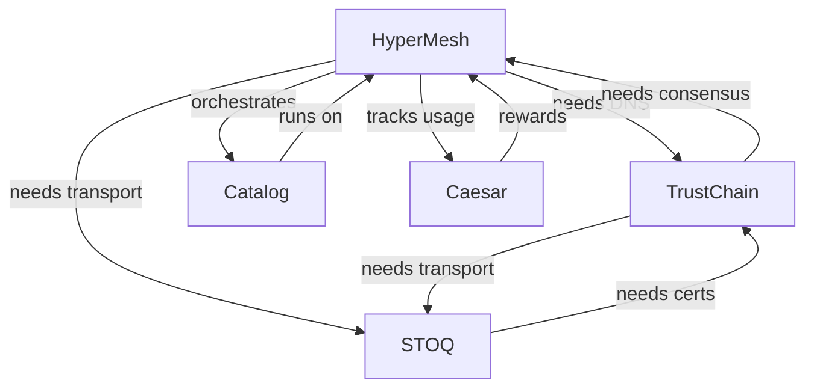

# Web3 Ecosystem Bootstrap Roadmap

## Problem: Circular Dependencies

The Web3 ecosystem has a critical circular dependency problem:



## Solution: Phased Bootstrap Architecture

### Phase 0: Traditional Bootstrap (Current)
**Duration**: Initial startup
**Components**: Individual service bootstrapping
**Trust Model**: Traditional PKI/DNS

```yaml
bootstrap_sequence:
  1_infrastructure:
    - Start STOQ with self-signed certificates
    - Initialize TrustChain with traditional DNS
    - Bootstrap HyperMesh with local configuration

  2_trust_establishment:
    - TrustChain issues certificates to STOQ
    - STOQ validates and replaces self-signed certs
    - HyperMesh registers with TrustChain

  3_service_registration:
    - Catalog connects via TrustChain DNS
    - Caesar registers economic endpoints
    - All services establish mutual TLS
```

### Phase 1: Hybrid Trust Model
**Duration**: 0-5 minutes after bootstrap
**Components**: Mixed traditional/federated
**Trust Model**: Transitional PKI with consensus validation

```yaml
hybrid_operations:
  certificate_authority:
    - Traditional CA operations continue
    - Consensus validation begins (non-blocking)
    - Certificate transparency logging active

  dns_resolution:
    - Traditional DNS primary
    - HyperMesh DNS secondary
    - Gradual migration of records

  transport_security:
    - STOQ uses TrustChain certificates
    - Falcon post-quantum signatures optional
    - Connection pooling established
```

### Phase 2: Partial Federation
**Duration**: 5-30 minutes after bootstrap
**Components**: Majority federated operations
**Trust Model**: Consensus-validated with fallback

```yaml
federation_features:
  consensus_validation:
    - Four-proof consensus for critical operations
    - Byzantine fault tolerance active
    - Automatic node reputation tracking

  distributed_dns:
    - HyperMesh DNS becomes primary
    - Traditional DNS as fallback only
    - Asset-based name resolution

  economic_integration:
    - Caesar tracks resource usage
    - Reward calculations active
    - Staking mechanisms enabled
```

### Phase 3: Full Federation
**Duration**: 30+ minutes after bootstrap
**Components**: Fully distributed operation
**Trust Model**: Pure consensus-based trust

```yaml
full_federation:
  autonomous_operation:
    - No traditional DNS dependency
    - Pure consensus validation
    - Self-healing network topology

  advanced_features:
    - NAT-like memory addressing
    - Remote proxy routing
    - Cross-chain asset management

  economic_maturity:
    - Automated market making
    - Dynamic pricing models
    - Full DeFi integration
```

## Implementation Architecture

### Service Abstraction Layers

```rust
// Core abstraction for service discovery
pub trait ServiceDiscovery: Send + Sync {
    async fn resolve(&self, service: &str) -> Result<ServiceEndpoint>;
    async fn register(&self, service: ServiceRegistration) -> Result<()>;
    async fn health_check(&self) -> Result<HealthStatus>;
}

// Implementations for each phase
pub struct TraditionalDNS;    // Phase 0
pub struct HybridResolver;    // Phase 1
pub struct FederatedResolver; // Phase 2-3

// Runtime phase selection
pub struct AdaptiveResolver {
    phase: AtomicU8,
    resolvers: [Box<dyn ServiceDiscovery>; 4],
}
```

### Component Interfaces

```rust
// Clean component boundaries
pub trait TransportProvider {
    async fn connect(&self, endpoint: &Endpoint) -> Result<Connection>;
    async fn listen(&self, addr: SocketAddr) -> Result<Listener>;
}

pub trait CertificateProvider {
    async fn get_certificate(&self, domain: &str) -> Result<Certificate>;
    async fn validate(&self, cert: &Certificate) -> Result<bool>;
}

pub trait ConsensusProvider {
    async fn validate_proof(&self, proof: &ConsensusProof) -> Result<bool>;
    async fn generate_proof(&self, data: &[u8]) -> Result<ConsensusProof>;
}
```

### Dependency Injection

```rust
// Component initialization with dependency injection
pub struct ComponentInitializer {
    transport: Arc<dyn TransportProvider>,
    certificates: Arc<dyn CertificateProvider>,
    consensus: Arc<dyn ConsensusProvider>,
    discovery: Arc<dyn ServiceDiscovery>,
}

impl ComponentInitializer {
    pub async fn initialize_hypermesh(&self) -> Result<HyperMesh> {
        // Initialize with injected dependencies
        let config = HyperMeshConfig {
            transport: self.transport.clone(),
            certificates: self.certificates.clone(),
            consensus: self.consensus.clone(),
            discovery: self.discovery.clone(),
        };

        HyperMesh::new(config).await
    }
}
```

## Bootstrap Sequence

### 1. Infrastructure Layer (0-10 seconds)

```bash
# Start order matters!
1. STOQ Transport (self-signed certs)
2. TrustChain CA (traditional DNS)
3. HyperMesh Core (local config)
```

### 2. Trust Establishment (10-30 seconds)

```bash
# Certificate replacement
1. TrustChain issues certificates
2. STOQ replaces self-signed
3. All services validate trust
```

### 3. Service Discovery (30-60 seconds)

```bash
# Registration and discovery
1. Services register with TrustChain DNS
2. HyperMesh asset registry populated
3. Caesar economic endpoints active
```

### 4. Consensus Activation (1-5 minutes)

```bash
# Consensus validation begins
1. Four-proof validators start
2. Byzantine detection enabled
3. Reputation system activated
```

### 5. Full Operations (5+ minutes)

```bash
# Advanced features enabled
1. NAT-like addressing active
2. Remote proxy routing enabled
3. Cross-component orchestration
```

## Configuration Management

### Phase-Based Configuration

```toml
# bootstrap.toml
[phases]
current_phase = 0  # Auto-increments

[phase_0]
dns_mode = "traditional"
cert_mode = "self_signed"
consensus = false

[phase_1]
dns_mode = "hybrid"
cert_mode = "trustchain"
consensus = true
consensus_mode = "optional"

[phase_2]
dns_mode = "federated_primary"
cert_mode = "trustchain"
consensus = true
consensus_mode = "recommended"

[phase_3]
dns_mode = "federated_only"
cert_mode = "consensus_validated"
consensus = true
consensus_mode = "mandatory"
```

### Service Dependencies

```yaml
service_dependencies:
  stoq:
    phase_0: []  # No dependencies
    phase_1: ["trustchain_ca"]
    phase_2: ["trustchain_ca", "hypermesh_consensus"]
    phase_3: ["full_federation"]

  trustchain:
    phase_0: ["stoq_transport"]
    phase_1: ["stoq_transport"]
    phase_2: ["stoq_transport", "hypermesh_assets"]
    phase_3: ["full_consensus"]

  hypermesh:
    phase_0: ["stoq_transport", "trustchain_dns"]
    phase_1: ["stoq_transport", "trustchain_full"]
    phase_2: ["all_services"]
    phase_3: ["autonomous"]
```

## Monitoring and Health Checks

### Bootstrap Progress Tracking

```rust
pub struct BootstrapMonitor {
    phase: AtomicU8,
    component_status: DashMap<String, ComponentStatus>,
    health_checks: DashMap<String, HealthCheck>,
    metrics: BootstrapMetrics,
}

pub struct ComponentStatus {
    name: String,
    phase: u8,
    status: Status,
    last_transition: SystemTime,
    error_count: u32,
}

pub struct BootstrapMetrics {
    phase_durations: [Duration; 4],
    component_startup_times: HashMap<String, Duration>,
    dependency_resolution_time: Duration,
    total_bootstrap_time: Duration,
}
```

### Health Check Protocol

```rust
#[async_trait]
pub trait HealthCheckable {
    async fn health(&self) -> HealthStatus;
    async fn readiness(&self) -> ReadinessStatus;
    async fn dependencies(&self) -> Vec<DependencyStatus>;
}

pub struct HealthStatus {
    pub healthy: bool,
    pub phase: u8,
    pub uptime: Duration,
    pub last_check: SystemTime,
}
```

## Error Recovery

### Fallback Mechanisms

```rust
pub struct FallbackManager {
    strategies: Vec<Box<dyn FallbackStrategy>>,
    max_retries: u32,
    backoff: ExponentialBackoff,
}

#[async_trait]
pub trait FallbackStrategy {
    async fn can_handle(&self, error: &Error) -> bool;
    async fn execute(&self) -> Result<()>;
}

// Example: DNS fallback
pub struct DnsFallback {
    primary: Box<dyn DnsResolver>,
    secondary: Box<dyn DnsResolver>,
    traditional: Box<dyn DnsResolver>,
}
```

### Graceful Degradation

```yaml
degradation_modes:
  network_partition:
    - Continue with cached data
    - Use local consensus only
    - Queue updates for sync

  certificate_failure:
    - Fall back to previous valid cert
    - Use traditional validation
    - Alert administrators

  consensus_timeout:
    - Use quorum consensus
    - Reduce proof requirements
    - Enable emergency mode
```

## Testing Strategy

### Integration Tests

```rust
#[tokio::test]
async fn test_bootstrap_sequence() {
    let bootstrap = Bootstrap::new();

    // Phase 0
    bootstrap.start_infrastructure().await?;
    assert_eq!(bootstrap.phase(), 0);

    // Phase 1
    bootstrap.establish_trust().await?;
    assert_eq!(bootstrap.phase(), 1);

    // Phase 2
    bootstrap.enable_federation().await?;
    assert_eq!(bootstrap.phase(), 2);

    // Phase 3
    bootstrap.complete_federation().await?;
    assert_eq!(bootstrap.phase(), 3);
}
```

### Chaos Testing

```yaml
chaos_scenarios:
  - name: "Component failure during bootstrap"
    action: "Kill TrustChain at phase 1"
    expected: "Fallback to traditional DNS"

  - name: "Network partition during federation"
    action: "Isolate 30% of nodes"
    expected: "Continue with quorum"

  - name: "Byzantine nodes during consensus"
    action: "Inject malicious validators"
    expected: "Detection and isolation"
```

## Success Criteria

### Phase Transition Requirements

```yaml
phase_transitions:
  to_phase_1:
    - All services started
    - Basic connectivity established
    - Health checks passing

  to_phase_2:
    - TrustChain certificates active
    - STOQ transport secured
    - Service discovery operational

  to_phase_3:
    - Consensus validation active
    - Byzantine detection online
    - Federation endpoints ready

  to_complete:
    - All advanced features active
    - Performance targets met
    - No fallback mechanisms active
```

### Performance Targets

```yaml
bootstrap_performance:
  phase_0: < 10 seconds
  phase_1: < 30 seconds
  phase_2: < 2 minutes
  phase_3: < 5 minutes
  total: < 10 minutes

operational_performance:
  dns_resolution: < 10ms
  certificate_validation: < 50ms
  consensus_validation: < 100ms
  service_discovery: < 20ms
```

## Conclusion

This phased bootstrap approach eliminates circular dependencies by:

1. **Temporal Decoupling**: Services start with minimal dependencies and gradually integrate
2. **Abstraction Layers**: Clean interfaces prevent tight coupling
3. **Fallback Mechanisms**: Multiple paths ensure resilience
4. **Progressive Enhancement**: Features enable as dependencies become available

The system can start from zero and bootstrap itself to full federation without external dependencies, solving the circular dependency problem while maintaining security and performance requirements.