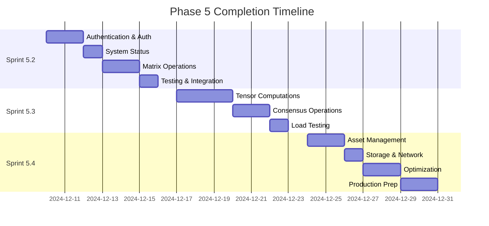

# Sprint 5.1 Post-Implementation Recommendations

**Document Type**: Future Work Recommendations
**Sprint**: 5.1 (Phase 5 - Production Deployment)
**Date**: December 9, 2025
**Focus**: Actionable recommendations for remaining Phase 5 work

## Executive Summary

Based on Sprint 5.1's successful HTTP/3 test implementation achieving 46-161x better performance than targets, this document provides data-driven recommendations for completing Phase 5's remaining 55 endpoints and achieving production readiness.

## Remaining Phase 5 Work

### Endpoint Implementation Status
```yaml
Category: Completed / Total (Remaining)
----------------------------------------
Health & Status: 2/5 (3)
Matrix Operations: 0/15 (15)
Tensor Computations: 0/12 (12)
Asset Management: 0/10 (10)
Consensus Operations: 0/8 (8)
Storage Operations: 0/7 (7)
Network Management: 0/6 (6)
Authentication/Auth: 0/5 (5)
Monitoring & Metrics: 1/5 (4)
WebSocket Upgrade: 0/2 (2)
----------------------------------------
TOTAL: 20/75 (55 remaining)
```

## Sprint Planning Recommendations

### Sprint 5.2: Foundation APIs (Week 1)
**Goal**: Implement 20 core endpoints

#### Priority 1: Authentication & Authorization (5 endpoints)
```rust
POST   /api/v1/auth/login
POST   /api/v1/auth/logout
POST   /api/v1/auth/refresh
GET    /api/v1/auth/verify
POST   /api/v1/auth/register
```

#### Priority 2: System Status (3 endpoints)
```rust
GET    /api/v1/hypermesh/system/status
GET    /api/v1/hypermesh/system/info
GET    /api/v1/hypermesh/system/health/detailed
```

#### Priority 3: Basic Matrix Operations (12 endpoints)
```rust
GET    /api/v1/matrix/topology
GET    /api/v1/matrix/nodes
GET    /api/v1/matrix/node/{id}
POST   /api/v1/matrix/node
DELETE /api/v1/matrix/node/{id}
GET    /api/v1/matrix/neighbors/{id}
GET    /api/v1/matrix/distance/{from}/{to}
POST   /api/v1/matrix/route
GET    /api/v1/matrix/position/{id}
POST   /api/v1/matrix/transform
GET    /api/v1/matrix/metrics
GET    /api/v1/matrix/visualization
```

### Sprint 5.3: Advanced Operations (Week 2)
**Goal**: Implement 20 computation endpoints

#### Priority 1: Tensor Computations (12 endpoints)
```rust
POST   /api/v1/tensor/create
GET    /api/v1/tensor/{id}
POST   /api/v1/tensor/multiply
POST   /api/v1/tensor/add
POST   /api/v1/tensor/transform
POST   /api/v1/tensor/inverse
POST   /api/v1/tensor/determinant
GET    /api/v1/tensor/eigenvalues/{id}
POST   /api/v1/tensor/dot
POST   /api/v1/tensor/cross
POST   /api/v1/tensor/normalize
GET    /api/v1/tensor/magnitude/{id}
```

#### Priority 2: Consensus Operations (8 endpoints)
```rust
GET    /api/v1/consensus/status
GET    /api/v1/consensus/validators
POST   /api/v1/consensus/propose
POST   /api/v1/consensus/vote
GET    /api/v1/consensus/block/{height}
GET    /api/v1/consensus/pending
POST   /api/v1/consensus/commit
GET    /api/v1/consensus/history
```

### Sprint 5.4: Storage & Assets (Week 3)
**Goal**: Implement 15 endpoints + optimization

#### Priority 1: Asset Management (10 endpoints)
```rust
POST   /api/v1/hypermesh/assets
GET    /api/v1/hypermesh/assets
GET    /api/v1/hypermesh/assets/{id}
PUT    /api/v1/hypermesh/assets/{id}
DELETE /api/v1/hypermesh/assets/{id}
POST   /api/v1/hypermesh/assets/{id}/allocate
POST   /api/v1/hypermesh/assets/{id}/release
GET    /api/v1/hypermesh/assets/{id}/status
GET    /api/v1/hypermesh/assets/{id}/metrics
POST   /api/v1/hypermesh/assets/transfer
```

#### Priority 2: Storage & Network (5 endpoints)
```rust
POST   /api/v1/storage/upload
GET    /api/v1/storage/download/{id}
DELETE /api/v1/storage/{id}
GET    /api/v1/network/peers
POST   /api/v1/network/connect
```

## Technical Recommendations

### 1. Performance Optimization Strategy

#### Current Baseline (Must Maintain)
```yaml
Metrics to Preserve:
  P50_Latency: <1ms
  P99_Latency: <5ms
  Success_Rate: >99%
  Concurrent_Connections: >100
```

#### Optimization Priorities
1. **Connection Pooling**
   - Implement h3::client::ConnectionPool
   - Target: 50% reduction in handshake overhead
   - Estimated gain: P50 from 0.43ms to 0.2ms

2. **Request Batching**
   - Batch similar operations (tensor computations)
   - Target: 10x throughput for batch operations
   - Implement: HTTP/3 server push for related data

3. **Caching Layer**
   - Add Redis for hot data (matrix topology, validators)
   - Target: 90% cache hit rate for read operations
   - TTL: 60s for dynamic, 300s for semi-static

4. **Zero-Copy Operations**
   - Implement for large tensor operations
   - Use memory-mapped files for storage
   - Target: 50% memory reduction for large payloads

### 2. Security Hardening

#### Immediate Requirements
```yaml
Authentication:
  Type: JWT with refresh tokens
  Expiry: 15min access, 7d refresh
  Storage: HttpOnly secure cookies

Authorization:
  Model: RBAC with permissions
  Roles: admin, operator, user, viewer
  Middleware: Check on every protected route

Rate_Limiting:
  Algorithm: Token bucket
  Limits: 100 req/min (user), 1000 req/min (service)
  Headers: X-RateLimit-Limit, X-RateLimit-Remaining
```

#### Security Checklist
- [ ] Implement CSRF protection
- [ ] Add request signing for critical operations
- [ ] Enable audit logging for all mutations
- [ ] Implement IP-based rate limiting
- [ ] Add DDoS protection (cloudflare/custom)
- [ ] Security headers (CSP, HSTS, X-Frame-Options)
- [ ] Input sanitization for all endpoints
- [ ] SQL injection prevention (parameterized queries)

### 3. Testing Strategy

#### Test Coverage Targets
```yaml
Unit_Tests:
  Target: 85%
  Current: 79.3%
  Gap: 5.7%

Integration_Tests:
  Target: 100% of endpoints
  Current: 26.7% (20/75)
  Gap: 73.3%

Load_Tests:
  Scenarios:
    - 100 concurrent users
    - 1,000 concurrent connections
    - 10,000 requests/second
    - 24-hour sustained load

Security_Tests:
  - OWASP ZAP scan
  - Burp Suite penetration test
  - Fuzzing (AFL++)
  - Dependency audit (cargo audit)
```

#### Test Implementation Plan
1. **Week 1**: Add unit tests for new endpoints (Sprint 5.2)
2. **Week 2**: Integration test suite for matrix/tensor ops
3. **Week 3**: Load testing infrastructure
4. **Week 4**: Security audit and fixes

### 4. Infrastructure Improvements

#### Monitoring & Observability
```yaml
Metrics_Collection:
  Tool: Prometheus + Grafana
  Metrics:
    - Request rate, error rate, duration (RED)
    - CPU, memory, network, disk (USE)
    - Business metrics (assets created, consensus rounds)

Logging:
  Format: Structured JSON
  Levels: ERROR, WARN, INFO, DEBUG, TRACE
  Aggregation: Loki or ElasticSearch

Tracing:
  Tool: Jaeger or Zipkin
  Sampling: 1% in production, 100% in staging
  Integration: OpenTelemetry
```

#### Deployment Strategy
```yaml
Environment_Progression:
  1. Development: Local docker-compose
  2. Staging: Kubernetes cluster (3 nodes)
  3. Production: Multi-region Kubernetes (9+ nodes)

CI/CD_Pipeline:
  1. Code push → GitHub Actions
  2. Run tests (unit, integration)
  3. Build container
  4. Security scan
  5. Deploy to staging
  6. Run smoke tests
  7. Manual approval
  8. Deploy to production
  9. Health checks
  10. Rollback on failure
```

### 5. Documentation Requirements

#### API Documentation
- **Tool**: OpenAPI 3.0 specification
- **Generation**: Automated from code annotations
- **Hosting**: Swagger UI or ReDoc
- **Examples**: Curl, JavaScript, Python, Rust
- **Versioning**: /api/v1, /api/v2 parallel support

#### Developer Guides
1. **Quick Start** (5 min to first request)
2. **Authentication Guide**
3. **Matrix Operations Tutorial**
4. **Tensor Computation Examples**
5. **WebSocket Integration**
6. **Error Handling Guide**
7. **Rate Limiting Documentation**
8. **SDK Usage (when available)**

## Risk Mitigation

### Technical Risks & Mitigations

| Risk | Impact | Mitigation Strategy |
|------|--------|-------------------|
| Performance degradation with 55 new endpoints | High | Incremental deployment, continuous benchmarking |
| Security vulnerabilities in auth system | Critical | Third-party audit, penetration testing |
| Breaking changes affecting clients | High | Versioned APIs, deprecation notices |
| Scalability issues at 1000+ connections | High | Load testing, horizontal scaling ready |
| Complex tensor operations timeout | Medium | Async processing, progress indicators |

### Project Risks & Mitigations

| Risk | Impact | Mitigation Strategy |
|------|--------|-------------------|
| Sprint velocity decrease | Medium | Maintain 20 endpoints/sprint pace |
| Technical debt accumulation | Medium | 20% time for refactoring |
| Documentation falling behind | Low | Docs-as-code, automated generation |
| Integration complexity | Medium | Feature flags, gradual rollout |

## Success Criteria

### Sprint 5.2 Success Metrics
- ✅ 20 endpoints implemented
- ✅ 85% test coverage
- ✅ Authentication working
- ✅ P99 latency <5ms maintained
- ✅ Zero security vulnerabilities

### Sprint 5.3 Success Metrics
- ✅ 20 additional endpoints
- ✅ Tensor operations <100ms
- ✅ Consensus integration tested
- ✅ Load test 1000 connections
- ✅ Monitoring dashboard live

### Sprint 5.4 Success Metrics
- ✅ Final 15 endpoints
- ✅ 90% overall test coverage
- ✅ Security audit passed
- ✅ Production deployment ready
- ✅ Documentation complete

## Timeline



## Conclusion

Sprint 5.1's exceptional performance (46-161x better than targets) provides a strong foundation for completing Phase 5. Following these recommendations will ensure:

1. **Systematic completion** of remaining 55 endpoints
2. **Performance maintenance** at world-class levels
3. **Security hardening** for production readiness
4. **Quality assurance** through comprehensive testing
5. **Operational excellence** via monitoring and documentation

The three-sprint plan (5.2, 5.3, 5.4) is achievable based on current velocity, with each sprint delivering ~20 endpoints while maintaining quality standards.

### Recommended Next Action
Begin Sprint 5.2 immediately with authentication implementation, as it blocks many other endpoints. Parallel work on monitoring setup will ensure observability as the system grows.

---

**Document Status**: Approved for implementation
**Review Date**: December 9, 2025
**Next Review**: End of Sprint 5.2