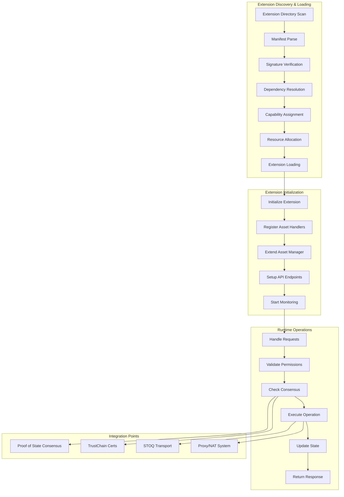

# HyperMesh Extension Integration Flow

## Overview

This document details the complete integration flow for extensions, specifically demonstrating how Catalog transforms from a standalone service to a HyperMesh extension providing decentralized asset library functionality.

## Integration Flow Diagram



## Detailed Integration Steps

### Phase 1: Extension Preparation

#### 1.1 Extension Package Structure
```
catalog-extension/
├── manifest.json           # Extension metadata
├── catalog.wasm           # Compiled extension (WebAssembly)
├── catalog.so             # Native extension (shared library)
├── assets/                # Static assets
│   ├── schemas/          # Asset schemas
│   ├── templates/        # Asset templates
│   └── icons/           # Asset icons
├── config/               # Configuration files
│   ├── default.toml     # Default configuration
│   └── schema.json      # Configuration schema
├── certs/               # Certificates
│   ├── extension.crt    # TrustChain certificate
│   └── extension.key    # Private key (encrypted)
└── docs/                # Documentation
    ├── API.md          # API documentation
    └── USAGE.md        # Usage guide
```

#### 1.2 Manifest Configuration
```json
{
  "manifest_version": "1.0",
  "extension": {
    "id": "hypermesh.catalog",
    "name": "HyperMesh Catalog",
    "version": "1.0.0",
    "description": "Decentralized asset library for HyperMesh ecosystem",
    "author": {
      "name": "HyperMesh Team",
      "email": "catalog@hypermesh.online",
      "url": "https://hypermesh.online"
    },
    "license": "MIT",
    "homepage": "https://hypermesh.online/catalog"
  },
  "runtime": {
    "type": "native",
    "entry_point": "catalog.so",
    "api_version": "1.0"
  },
  "dependencies": {
    "hypermesh": ">=1.0.0",
    "stoq-transport": ">=1.0.0",
    "trustchain": ">=1.0.0"
  },
  "capabilities": {
    "required": [
      "asset:read",
      "asset:write",
      "asset:create",
      "network:connect",
      "consensus:validate",
      "storage:read",
      "storage:write"
    ],
    "optional": [
      "vm:execute",
      "container:deploy"
    ]
  },
  "resources": {
    "limits": {
      "cpu_percent": 25.0,
      "memory_mb": 2048,
      "storage_gb": 100,
      "network_mbps": 100
    },
    "requests": {
      "cpu_percent": 10.0,
      "memory_mb": 512,
      "storage_gb": 10,
      "network_mbps": 10
    }
  },
  "assets": {
    "provided_types": [
      "library.julia",
      "library.python",
      "library.rust",
      "container.docker",
      "vm.wasm",
      "dataset.scientific"
    ],
    "handlers": [
      {
        "type": "library.julia",
        "handler": "JuliaLibraryHandler"
      },
      {
        "type": "container.docker",
        "handler": "DockerContainerHandler"
      }
    ]
  },
  "security": {
    "certificate_fingerprint": "SHA256:abc123...",
    "signature_algorithm": "FALCON-1024",
    "sandbox_policy": "strict",
    "network_policy": "restricted"
  },
  "configuration": {
    "schema": "config/schema.json",
    "defaults": "config/default.toml"
  }
}
```

### Phase 2: Dynamic Loading Process

#### 2.1 Extension Discovery
```rust
impl ExtensionDiscovery {
    async fn scan_extensions(&self) -> Result<Vec<ExtensionManifest>> {
        let mut manifests = Vec::new();

        for dir in &self.extension_dirs {
            let pattern = format!("{}/*/manifest.json", dir.display());
            for entry in glob(&pattern)? {
                let manifest = self.load_manifest(entry?).await?;
                manifests.push(manifest);
            }
        }

        // Sort by dependency order
        self.topological_sort(manifests)
    }

    async fn load_manifest(&self, path: PathBuf) -> Result<ExtensionManifest> {
        let content = tokio::fs::read_to_string(path).await?;
        let manifest: ExtensionManifest = serde_json::from_str(&content)?;

        // Verify manifest signature
        self.verify_signature(&manifest)?;

        Ok(manifest)
    }
}
```

#### 2.2 Dependency Resolution
```rust
impl DependencyResolver {
    async fn resolve(&self, extension: &ExtensionManifest) -> Result<DependencyGraph> {
        let mut graph = DependencyGraph::new();

        for dep in &extension.dependencies {
            let installed = self.registry.get(&dep.name)?;

            if !dep.version_req.matches(&installed.version) {
                return Err(DependencyError::VersionMismatch {
                    required: dep.version_req.clone(),
                    found: installed.version.clone(),
                });
            }

            graph.add_edge(extension.id.clone(), dep.name.clone());
        }

        // Check for circular dependencies
        if graph.has_cycle() {
            return Err(DependencyError::CircularDependency);
        }

        Ok(graph)
    }
}
```

#### 2.3 Loading and Initialization
```rust
impl ExtensionLoader {
    async fn load_extension(&self, manifest: ExtensionManifest) -> Result<Box<dyn HyperMeshExtension>> {
        // Verify certificate
        let cert = self.load_certificate(&manifest).await?;
        self.trust_chain.verify_certificate(&cert).await?;

        // Load extension binary
        let extension = match manifest.runtime.type {
            RuntimeType::Native => {
                self.load_native_extension(&manifest).await?
            },
            RuntimeType::WebAssembly => {
                self.load_wasm_extension(&manifest).await?
            },
        };

        // Create sandbox
        let sandbox = self.create_sandbox(&manifest.resources)?;

        // Initialize with configuration
        let config = self.build_config(&manifest)?;
        extension.initialize(config).await?;

        Ok(extension)
    }

    async fn load_native_extension(&self, manifest: &ExtensionManifest) -> Result<Box<dyn HyperMeshExtension>> {
        let lib_path = manifest.path.join(&manifest.runtime.entry_point);

        // Load shared library
        let lib = unsafe { Library::new(lib_path)? };

        // Get extension factory function
        let factory: Symbol<ExtensionFactory> = unsafe {
            lib.get(b"create_extension")?
        };

        // Create extension instance
        let extension = factory()?;

        Ok(extension)
    }
}
```

### Phase 3: Catalog-Specific Integration

#### 3.1 Asset Handler Registration
```rust
impl CatalogExtension {
    async fn register_asset_handlers(&self) -> Result<()> {
        // Register Julia library handler
        self.asset_manager.register_handler(
            AssetType::Library(LibraryType::Julia),
            Box::new(JuliaLibraryHandler::new(self.config.clone()))
        ).await?;

        // Register Python library handler
        self.asset_manager.register_handler(
            AssetType::Library(LibraryType::Python),
            Box::new(PythonLibraryHandler::new(self.config.clone()))
        ).await?;

        // Register container handler
        self.asset_manager.register_handler(
            AssetType::Container,
            Box::new(ContainerHandler::new(self.config.clone()))
        ).await?;

        // Register dataset handler
        self.asset_manager.register_handler(
            AssetType::Dataset,
            Box::new(DatasetHandler::new(self.config.clone()))
        ).await?;

        Ok(())
    }
}
```

#### 3.2 P2P Distribution Setup
```rust
impl CatalogDistribution {
    async fn setup_p2p_distribution(&mut self) -> Result<()> {
        // Initialize STOQ transport
        self.stoq = StoqTransport::new(StoqConfig {
            listen_addr: self.config.p2p_addr,
            max_connections: 1000,
            bandwidth_limit: self.config.bandwidth_limit,
        }).await?;

        // Join catalog DHT network
        self.dht = DhtNetwork::join(
            "hypermesh-catalog",
            self.stoq.clone()
        ).await?;

        // Start content discovery service
        self.discovery = ContentDiscovery::new(
            self.dht.clone(),
            self.stoq.clone()
        );

        self.discovery.start().await?;

        Ok(())
    }

    async fn distribute_package(&self, package: &AssetPackage) -> Result<DistributionHash> {
        // Chunk package for distribution
        let chunks = self.chunk_package(package)?;

        // Create merkle tree for verification
        let merkle_tree = MerkleTree::from_chunks(&chunks);

        // Distribute chunks via STOQ
        let futures: Vec<_> = chunks.iter().map(|chunk| {
            self.stoq.distribute_chunk(chunk.clone())
        }).collect();

        let chunk_hashes = futures::future::join_all(futures).await?;

        // Register in DHT
        let distribution_hash = self.dht.put(
            package.id.clone(),
            PackageMetadata {
                chunks: chunk_hashes,
                merkle_root: merkle_tree.root(),
                size: package.size,
                consensus_proof: package.consensus_proof.clone(),
            }
        ).await?;

        Ok(distribution_hash)
    }
}
```

#### 3.3 Consensus Integration
```rust
impl CatalogConsensus {
    async fn validate_package_operation(
        &self,
        operation: &PackageOperation,
        proof: &ConsensusProof
    ) -> Result<bool> {
        // Validate all four proofs
        let validations = futures::join!(
            self.validate_space_proof(&proof.space_proof, operation),
            self.validate_stake_proof(&proof.stake_proof, operation),
            self.validate_work_proof(&proof.work_proof, operation),
            self.validate_time_proof(&proof.time_proof, operation)
        );

        match validations {
            (Ok(true), Ok(true), Ok(true), Ok(true)) => {
                // All proofs valid
                Ok(true)
            },
            _ => {
                // At least one proof failed
                Ok(false)
            }
        }
    }

    async fn validate_space_proof(
        &self,
        proof: &SpaceProof,
        operation: &PackageOperation
    ) -> Result<bool> {
        // Verify storage commitment
        let required_space = self.calculate_required_space(operation);

        if proof.committed_space < required_space {
            return Ok(false);
        }

        // Verify proof validity
        self.proof_of_state.verify_space_proof(proof).await
    }
}
```

### Phase 4: Runtime Operation

#### 4.1 Request Handling
```rust
impl CatalogExtension {
    async fn handle_request(&self, request: ExtensionRequest) -> ExtensionResponse {
        // Check rate limiting
        if !self.rate_limiter.allow(&request.client_id) {
            return ExtensionResponse::rate_limited();
        }

        // Validate permissions
        if let Err(e) = self.validate_permissions(&request).await {
            return ExtensionResponse::permission_denied(e);
        }

        // Route to appropriate handler
        match request.method.as_str() {
            "catalog.list" => self.handle_list_packages(request).await,
            "catalog.search" => self.handle_search_packages(request).await,
            "catalog.install" => self.handle_install_package(request).await,
            "catalog.publish" => self.handle_publish_package(request).await,
            "catalog.verify" => self.handle_verify_package(request).await,
            _ => ExtensionResponse::method_not_found(),
        }
    }

    async fn handle_install_package(&self, request: ExtensionRequest) -> ExtensionResponse {
        let params: InstallParams = request.params()?;

        // Verify consensus proof
        if !self.validate_consensus(&params.consensus_proof).await? {
            return ExtensionResponse::invalid_proof();
        }

        // Get package metadata
        let package = self.get_package(&params.package_id).await?;

        // Verify package signature
        self.verify_package_signature(&package).await?;

        // Download via P2P
        let content = self.download_package(&package).await?;

        // Install package
        let result = self.install_package_content(
            content,
            params.install_options
        ).await?;

        // Register installed assets
        self.register_package_assets(&result).await?;

        ExtensionResponse::success(result)
    }
}
```

#### 4.2 Asset Management Integration
```rust
impl CatalogAssetIntegration {
    async fn register_package_assets(&self, package: &InstalledPackage) -> Result<()> {
        for asset in &package.assets {
            // Create asset in HyperMesh
            let asset_id = self.asset_manager.create_asset(
                AssetCreationSpec {
                    name: asset.name.clone(),
                    asset_type: asset.asset_type.clone(),
                    metadata: asset.metadata.clone(),
                    privacy_level: PrivacyLevel::Private,
                    consensus_requirements: ConsensusRequirements::default(),
                }
            ).await?;

            // Set up proxy access if needed
            if asset.requires_proxy {
                self.setup_proxy_access(&asset_id, &asset.proxy_config).await?;
            }

            // Register with appropriate handler
            let handler = self.get_handler_for_type(&asset.asset_type)?;
            handler.register_asset(asset_id, asset.clone()).await?;
        }

        Ok(())
    }

    async fn setup_proxy_access(
        &self,
        asset_id: &AssetId,
        config: &ProxyConfig
    ) -> Result<()> {
        // Create NAT-like addressing
        let global_address = self.proxy_manager.allocate_global_address(
            asset_id,
            config.address_type
        ).await?;

        // Configure routing rules
        self.proxy_manager.add_routing_rule(
            RoutingRule {
                source: global_address.clone(),
                destination: asset_id.clone(),
                trust_requirements: config.trust_requirements.clone(),
                consensus_validation: true,
            }
        ).await?;

        // Set up federation if needed
        if config.enable_federation {
            self.setup_federated_access(asset_id, &global_address).await?;
        }

        Ok(())
    }
}
```

### Phase 5: Monitoring and Maintenance

#### 5.1 Health Monitoring
```rust
impl CatalogMonitoring {
    async fn monitor_health(&self) {
        loop {
            let health = HealthStatus {
                cpu_usage: self.measure_cpu_usage().await,
                memory_usage: self.measure_memory_usage().await,
                network_usage: self.measure_network_usage().await,
                active_operations: self.count_active_operations().await,
                error_rate: self.calculate_error_rate().await,
            };

            // Check against thresholds
            if health.cpu_usage > 0.8 {
                self.apply_backpressure().await;
            }

            if health.error_rate > 0.05 {
                self.enter_degraded_mode().await;
            }

            // Report to extension manager
            self.report_health(health).await;

            tokio::time::sleep(Duration::from_secs(10)).await;
        }
    }
}
```

#### 5.2 State Management
```rust
impl CatalogState {
    async fn checkpoint_state(&self) -> Result<()> {
        let state = ExtensionState {
            version: 1,
            timestamp: SystemTime::now(),
            installed_packages: self.list_installed_packages().await?,
            active_downloads: self.list_active_downloads().await?,
            cache_contents: self.export_cache().await?,
            configuration: self.config.clone(),
        };

        // Serialize state
        let serialized = bincode::serialize(&state)?;

        // Encrypt with user key
        let encrypted = self.encrypt_state(&serialized)?;

        // Store with consensus validation
        self.state_store.put(
            "catalog.state",
            encrypted,
            ConsensusProof::new()
        ).await?;

        Ok(())
    }

    async fn restore_state(&mut self) -> Result<()> {
        // Retrieve encrypted state
        let encrypted = self.state_store.get("catalog.state").await?;

        // Decrypt with user key
        let decrypted = self.decrypt_state(&encrypted)?;

        // Deserialize state
        let state: ExtensionState = bincode::deserialize(&decrypted)?;

        // Restore components
        self.restore_packages(&state.installed_packages).await?;
        self.restore_downloads(&state.active_downloads).await?;
        self.restore_cache(&state.cache_contents).await?;

        Ok(())
    }
}
```

## Integration Testing

### Test Scenarios

#### 1. Extension Loading Test
```rust
#[tokio::test]
async fn test_catalog_extension_loading() {
    let manager = ExtensionManager::new(config);
    let catalog = CatalogExtension::new();

    // Load extension
    manager.load_extension(Box::new(catalog)).await.unwrap();

    // Verify extension is loaded
    let loaded = manager.get_extension("hypermesh.catalog").await;
    assert!(loaded.is_some());

    // Verify capabilities granted
    let caps = manager.get_granted_capabilities("hypermesh.catalog").await;
    assert!(caps.contains(&ExtensionCapability::AssetManagement));
}
```

#### 2. Package Installation Test
```rust
#[tokio::test]
async fn test_package_installation() {
    let catalog = setup_catalog_extension().await;

    // Create consensus proof
    let proof = create_test_consensus_proof().await;

    // Install package
    let result = catalog.install_package(
        "julia-scientific-computing",
        InstallOptions {
            verify_signatures: true,
            consensus_proof: proof,
        }
    ).await.unwrap();

    // Verify installation
    assert!(result.success);
    assert!(!result.installed_assets.is_empty());

    // Verify assets registered
    for asset_id in result.installed_assets {
        let asset = catalog.asset_manager.get_asset(&asset_id).await.unwrap();
        assert_eq!(asset.state, AssetState::Active);
    }
}
```

#### 3. P2P Distribution Test
```rust
#[tokio::test]
async fn test_p2p_package_distribution() {
    let catalog = setup_catalog_with_p2p().await;

    // Publish package
    let package = create_test_package();
    let hash = catalog.distribute_package(&package).await.unwrap();

    // Verify distributed
    assert!(!hash.is_empty());

    // Download from another node
    let catalog2 = setup_catalog_with_p2p().await;
    let downloaded = catalog2.download_package(&hash).await.unwrap();

    // Verify content matches
    assert_eq!(package.content, downloaded.content);
}
```

## Performance Optimization

### Caching Strategy
```rust
impl CatalogCache {
    async fn cache_package(&self, package: &Package) -> Result<()> {
        // LRU cache with size limit
        if self.cache_size() + package.size > self.max_cache_size {
            self.evict_lru().await?;
        }

        // Store in cache
        self.cache.put(package.id.clone(), package.clone()).await;

        // Update access time
        self.update_access_time(&package.id).await;

        Ok(())
    }
}
```

### Parallel Operations
```rust
impl CatalogOperations {
    async fn parallel_install(&self, packages: Vec<String>) -> Vec<Result<InstallResult>> {
        let futures: Vec<_> = packages.into_iter().map(|pkg| {
            self.install_package(pkg, Default::default())
        }).collect();

        futures::future::join_all(futures).await
    }
}
```

## Migration Path

### Phase 1: Preparation (Week 1)
- [ ] Implement extension traits
- [ ] Create asset handlers
- [ ] Set up testing infrastructure

### Phase 2: Integration (Week 2)
- [ ] Integrate with AssetManager
- [ ] Connect to STOQ transport
- [ ] Implement consensus validation

### Phase 3: Testing (Week 3)
- [ ] Unit testing
- [ ] Integration testing
- [ ] Performance testing

### Phase 4: Deployment (Week 4)
- [ ] Package extension
- [ ] Sign with TrustChain
- [ ] Deploy to registry
- [ ] Monitor production

## Conclusion

The integration flow transforms Catalog from a standalone service into a fully integrated HyperMesh extension, providing:

1. **Seamless Integration**: Native integration with HyperMesh systems
2. **Security**: Multi-layer security with consensus validation
3. **Performance**: Optimized caching and parallel operations
4. **Distribution**: P2P asset distribution via STOQ
5. **Extensibility**: Plugin architecture for future enhancements

This architecture ensures Catalog can evolve as part of the HyperMesh ecosystem while maintaining its core functionality as a decentralized asset library.