# Caesar Token Ecosystem Development - PDL Roadmap

## PROJECT OVERVIEW
**Objective**: Complete development of Caesar Token ecosystem including Agora DEX, Satchel Wallet, and Tablets UI dashboard  
**Current Status**: Phase 3 Infrastructure Complete - Expanding to Full Ecosystem  
**Timeline**: 7-10 days for comprehensive ecosystem development  
**Repository**: /home/persist/repos/work/vazio/caesar  

## 7-PHASE PDL WORKFLOW FOR ECOSYSTEM EXPANSION

### Phase 1: Discovery & Ideation ✅ COMPLETED
**Status**: Infrastructure analysis complete  
**Deliverables**: Current state assessment, market requirements identified  

### Phase 2: Definition & Scoping ✅ COMPLETED  
**Status**: Technical requirements defined  
**Deliverables**: Feature specifications, architecture decisions documented  

### Phase 3: Design & Prototyping ✅ COMPLETED
**Status**: Basic infrastructure implemented  
**Deliverables**: Smart contracts deployed, basic frontend operational  

### Phase 4: Enhanced Development & Implementation 🔄 ACTIVE
**Lead**: Engineering Manager  
**Duration**: 7-10 days  
**Status**: INITIATING - Ready for full ecosystem development  

**Sprint 4.1: Agora DEX Enhancement** (Days 1-3)
- **Assignee**: Frontend Developer + Engineering Manager
- **Deliverables**:
  - Advanced trading interface with professional charts
  - Limit orders and stop-loss functionality
  - Liquidity mining interface
  - DAO governance integration
  - Mobile-responsive design
  - Real-time market data integration

**Sprint 4.2: Satchel Wallet Development** (Days 2-4) [PARALLEL]
- **Assignee**: Backend Developer + Security Auditor
- **Deliverables**:
  - Hardware wallet support (Ledger, Trezor)
  - Multi-chain asset management
  - Security features and recovery options
  - DeFi protocol integrations
  - Transaction history and analytics
  - Caesar token native optimizations

**Sprint 4.3: Tablets UI Dashboard** (Days 3-5) [PARALLEL]
- **Assignee**: Product Designer + Frontend Developer
- **Deliverables**:
  - Comprehensive portfolio dashboard
  - Token analytics with demurrage tracking
  - Mining interface and performance monitoring
  - Cross-chain bridge management UI
  - Real-time data visualization
  - Performance optimization tools

**Sprint 4.4: Integration & Testing** (Days 4-6)
- **Assignee**: QA Engineer + Engineering Manager
- **Deliverables**:
  - Cross-component integration testing
  - End-to-end user workflow validation
  - Performance benchmarking
  - Security auditing of wallet components
  - Multi-chain deployment testing

**Sprint 4.5: Production Deployment** (Days 6-7)
- **Assignee**: DevOps Engineer + Engineering Manager
- **Deliverables**:
  - Production deployment pipeline
  - Multi-chain infrastructure setup
  - Monitoring and alerting systems
  - Documentation completion
  - Launch readiness validation

### Phase 5: Testing & Quality Assurance ⏳ PENDING
**Lead**: QA Engineer  
**Duration**: 3-4 days  
**Status**: Will initiate after Phase 4 completion  

### Phase 6: Launch & Deployment ⏳ PENDING
**Lead**: Engineering Manager  
**Duration**: 2-3 days  
**Status**: Production deployment and launch  

### Phase 7: Post-Launch Growth & Iteration ⏳ PENDING
**Lead**: Product Manager  
**Duration**: Ongoing  
**Status**: User adoption and feature iteration  

## CURRENT INFRASTRUCTURE (FOUNDATION)

### Existing Components ✅
- **Smart Contracts**: DEX Factory + CAESAR Token on Sepolia
- **Basic Trading Interface**: React/TypeScript implementation
- **Cross-Chain Bridge**: LayerZero V2 integration
- **Wallet Connection**: RainbowKit multi-chain support
- **Analytics**: Basic volume and TVL tracking

### Target Architecture 🎯
```
caesar/
├── cesar-token/                 # Core smart contracts (EXISTING)
├── scrolls-app/                 # Frontend ecosystem (TO BUILD)
│   ├── agora-dex/              # Enhanced DEX platform
│   ├── satchel-wallet/         # Multi-chain wallet
│   └── tablets-ui/             # Analytics dashboard
├── shared/                      # Common utilities and types
└── deployment/                  # Multi-chain deployment scripts
```

## PARALLEL DEVELOPMENT STRATEGY

### Worktree Management
- `.claude/worktrees/agora-dex-enhancement/` - Advanced trading platform
- `.claude/worktrees/satchel-wallet-development/` - Wallet implementation  
- `.claude/worktrees/tablets-ui-dashboard/` - Analytics interface
- `.claude/worktrees/ecosystem-integration/` - Cross-component integration

### Development Dependencies

```mermaid
gantt
    title Caesar Ecosystem Development Timeline
    dateFormat X
    axisFormat %d
    
    section Sprint 4.1
    Agora DEX Enhancement    :a1, 0, 3d
    
    section Sprint 4.2
    Satchel Wallet Development :a2, 1, 3d
    
    section Sprint 4.3  
    Tablets UI Dashboard     :a3, 2, 3d
    
    section Sprint 4.4
    Integration Testing      :a4, 3, 3d
    
    section Sprint 4.5
    Production Deployment    :a5, 5, 2d
```


## AGENT COORDINATION MATRIX

### Primary Development Leads
- **Engineering Manager**: Overall architecture and sprint coordination
- **Frontend Developer**: Agora DEX and Tablets UI implementation
- **Backend Developer**: Satchel Wallet and API infrastructure
- **Product Designer**: User experience across all components

### Specialized Support
- **QA Engineer**: Testing strategy and quality gates (ALL sprints)
- **Security Auditor**: Wallet security and smart contract validation
- **DevOps Engineer**: Deployment automation and infrastructure
- **Performance Engineer**: Optimization and scalability

### Communication Protocol
- **Daily Stand-ups**: Sprint progress via Nabu notifications
- **QA Gates**: No sprint completion without QA validation
- **Integration Points**: Cross-team coordination for dependencies
- **Memory Storage**: Critical findings and decisions in Telos

## SUCCESS METRICS

### Technical Deliverables
✅ **Complete Ecosystem**: All three applications operational  
✅ **User Experience**: Seamless workflow across components  
✅ **Performance**: Sub-3 second load times, real-time updates  
✅ **Security**: Hardware wallet support, audit completion  
✅ **Multi-Chain**: Full deployment across supported networks  

### Business Objectives
- Professional-grade trading platform competitive with major DEXs
- Secure wallet solution with Caesar-specific optimizations
- Comprehensive analytics for power users and institutions
- Scalable architecture supporting ecosystem growth

## IMMEDIATE EXECUTION PLAN (Next 4 Hours)

1. **PDL Repository Initialization**: Set up formal tracking ⏱️ 30 mins
2. **Sprint 4.1 Delegation**: Engineering Manager takes lead ⏱️ 15 mins
3. **Worktree Setup**: Parallel development environments ⏱️ 45 mins
4. **Service Registration**: Nabu coordination setup ⏱️ 15 mins
5. **Development Kickoff**: Begin Agora DEX enhancement ⏱️ Ongoing

## RISK MITIGATION

### Technical Risks
- **Integration Complexity**: Incremental integration approach with continuous testing
- **Performance Scaling**: Early optimization focus with dedicated performance engineering
- **Security Vulnerabilities**: Embedded security auditing throughout development

### Project Risks  
- **Timeline Pressure**: Flexible sprint boundaries with core feature prioritization
- **Resource Conflicts**: Clear agent delegation with backup assignments
- **Quality Assurance**: QA engineer embedded in all development sprints

## QUALITY GATES

### Phase 4 Completion Criteria
- ✅ All three ecosystem components operational
- ✅ Cross-component integration tested and validated
- ✅ Performance benchmarks met (load time, responsiveness)
- ✅ Security audit passed for wallet components
- ✅ Multi-chain deployment successful
- ✅ QA Engineer sign-off on all deliverables
- ✅ Documentation complete and validated

---

**Project Manager**: Active and coordinating ecosystem development  
**Current Phase**: Phase 4 - Enhanced Development & Implementation  
**Next Milestone**: Sprint 4.1 kickoff with Engineering Manager  
**Target Completion**: 7-10 days for complete ecosystem  

**Status**: READY FOR ENGINEERING MANAGER DELEGATION 🚀