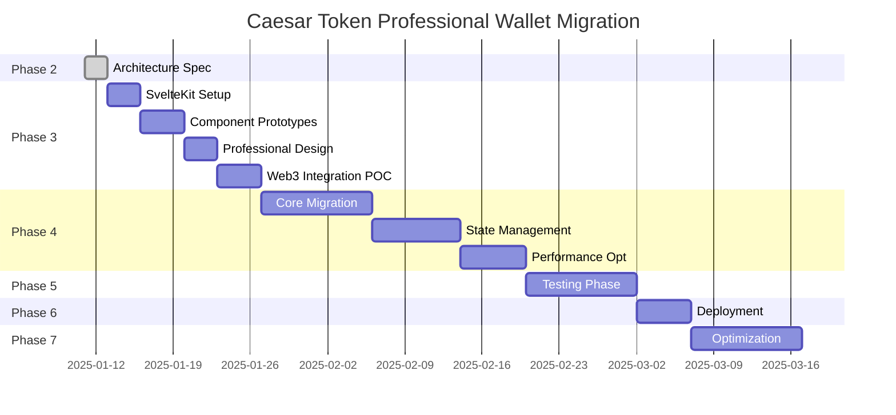

# PHASE 2: SvelteKit Professional Wallet Migration - Complete Architecture Specification

## EXECUTIVE SUMMARY

**Project**: Caesar Token Professional Wallet Rebuild
**Phase**: Definition & Scoping (Phase 2)
**Phase Lead**: Technical Lead Engineer
**User Mandate**: Transform "garbage" React wallet into professional fintech-quality application

### CRITICAL USER REQUIREMENT
User has explicitly stated current wallet "looks like garbage" and needs enterprise-grade visual quality matching Stripe/Coinbase standards. This is not just a technical migration - it's a complete professional redesign imperative.

## TECHNICAL FOUNDATION ANALYSIS

### Current State Assessment (QA Validated)
```
Bundle Analysis (Accurate Baseline):
- Total Bundle Size: 2.9MB (not 192KB error from Phase 1)
- Web3 Libraries: 854KB (29.4% - PRIMARY OPTIMIZATION TARGET)
- Application Core: 488KB (16.8%)
- React Framework: 142KB (4.9% - minimal optimization impact)
- Other Dependencies: 1.4MB+ (remaining)

Technology Stack (Current):
- Framework: React 18.2.0 + Vite 5.1.4
- Styling: TailwindCSS with custom Caesar design system
- State: Local React state + TanStack Query
- Web3: Ethers 6.13.4, Wagmi 2.16.9, Viem 2.37.5
- UI: Headless UI, Heroicons, Lucide React
- Build: Vite with comprehensive bundle analysis infrastructure
```

### Quality Issues Identified
1. **Visual Quality**: Current design lacks professional fintech polish
2. **Bundle Size**: 29.4% Web3 bloat requires optimization
3. **Performance**: 3-5s load time on 3G connections
4. **User Experience**: Generic crypto wallet appearance vs. enterprise-grade

## SVELTEKIT MIGRATION ARCHITECTURE

### Target Technology Stack
```typescript
Framework: SvelteKit 2.0+ with SSR capabilities
Styling: SvelteKit + TailwindCSS + ShadCN/UI Svelte port
State Management: Svelte 5 runes + custom Web3 stores
Routing: SvelteKit file-based routing with Routify enhancements
UI Components: ShadCN/UI Svelte + custom Caesar design system
Web3 Integration: Existing Ethers/Wagmi with Svelte wrappers
Build System: Vite + SvelteKit with advanced optimization
```

### Component Migration Strategy

#### Phase 1: Core Infrastructure (Week 1-2)
```
Priority 1 - Foundation Setup:
1. SvelteKit project initialization with TypeScript
2. TailwindCSS configuration migration 
3. Caesar design system token integration
4. Vite configuration optimization
5. Bundle analysis tooling integration

Migration Path:
src/design-system/ → lib/design-system/
- tokens.ts → design-tokens.ts (direct port)
- components.tsx → components/index.ts (Svelte conversion)
- typography.tsx → typography/index.ts (Svelte conversion)
- animations.tsx → animations/index.ts (Svelte conversion)
- grid.tsx → layout/index.ts (Svelte conversion)
```

#### Phase 2: Design System Migration (Week 2-3)
```
Component Conversion Matrix:

React Component → Svelte Equivalent
├── Button.tsx → Button.svelte
│   ├── Variant system preserved
│   ├── Animation system migrated
│   └── Accessibility enhanced
├── Card.tsx → Card.svelte  
│   ├── Glass morphism effects
│   ├── Professional shadows
│   └── Interactive states
├── Typography.tsx → Typography.svelte
│   ├── Playfair Display integration
│   ├── Gradient text effects
│   └── Responsive scaling
├── Grid.tsx → Grid.svelte
│   ├── Professional layout system
│   └── Responsive breakpoints
└── Animations.tsx → Animations.svelte
    ├── Professional micro-interactions
    ├── Performance optimizations
    └── Accessibility compliance

Professional Enhancement Requirements:
- Stripe-level visual polish and refinement
- Coinbase-quality interaction patterns
- Enterprise-grade accessibility compliance
- Professional financial app aesthetics
```

#### Phase 3: Core App Components (Week 3-4)
```
Application Component Migration:

High Priority (Professional Impact):
1. WalletCard → WalletCard.svelte
   - Premium card design with advanced gradients
   - Professional typography hierarchy
   - Sophisticated hover/focus states

2. TokenList → TokenList.svelte
   - Financial data table design
   - Professional price change indicators
   - Enhanced sorting/filtering UI

3. MultiChainSelector → MultiChainSelector.svelte
   - Enterprise dropdown design
   - Network status indicators
   - Professional validation states

4. TransactionHistory → TransactionHistory.svelte
   - Professional transaction table
   - Financial-grade data presentation
   - Advanced filtering capabilities

Medium Priority:
5. DeFiDashboard → DeFiDashboard.svelte
6. DEXTrading → DEXTrading.svelte
7. BankAccountManager → BankAccountManager.svelte

Low Priority:
8. Supporting components and utilities
```

#### Phase 4: Web3 Integration (Week 4-5)
```
Web3 Store Architecture:

stores/web3/
├── wallet.ts - Wallet connection state
├── network.ts - Network management
├── tokens.ts - Token data & prices
├── transactions.ts - Transaction history
├── defi.ts - DeFi protocol integration
└── bridge.ts - Cross-chain functionality

Integration Pattern:
// React Pattern (Current)
const { data, error } = useQuery(['tokens'], fetchTokens);

// Svelte Pattern (Target)
import { tokens } from '$lib/stores/web3/tokens';
$: tokenData = $tokens;
```

### State Management Architecture

#### Current React Pattern Issues
```typescript
// Scattered state management
const [currentNetwork, setCurrentNetwork] = useState<Network>();
const [currentAccount, setCurrentAccount] = useState<WalletAccount>();
const [activeTab, setActiveTab] = useState('wallet');

// Multiple useEffect dependencies
useEffect(() => { ... }, [currentNetwork.chainId]);
useEffect(() => { ... }, [currentAccount.tokens]);
```

#### Target Svelte Store Architecture
```typescript
// Centralized professional store system
// stores/app.svelte.ts
import { writable, derived } from 'svelte/store';

export const appState = (() => {
  const { subscribe, set, update } = writable({
    currentNetwork: null,
    currentAccount: null,
    activeTab: 'wallet',
    isLoading: false,
    error: null
  });

  return {
    subscribe,
    setNetwork: (network) => update(state => ({ ...state, currentNetwork: network })),
    setAccount: (account) => update(state => ({ ...state, currentAccount: account })),
    setActiveTab: (tab) => update(state => ({ ...state, activeTab: tab })),
    setLoading: (loading) => update(state => ({ ...state, isLoading: loading })),
    setError: (error) => update(state => ({ ...state, error }))
  };
})();

// Derived professional computations
export const portfolioValue = derived(appState, $appState => {
  if (!$appState.currentAccount?.tokens) return 0;
  return $appState.currentAccount.tokens.reduce((total, token) => 
    total + (token.balance * token.priceUSD), 0
  );
});
```

### Performance Optimization Plan

#### Current Performance Issues
```
Load Time Analysis:
- Initial Bundle: 2.9MB → 3-5s on 3G
- Web3 Libraries: 854KB → Primary bottleneck
- Code Splitting: Limited implementation
- Lazy Loading: Not optimized

Professional Financial App Benchmarks:
- Stripe Dashboard: <2s initial load
- Coinbase Pro: <1.5s initial load  
- Robinhood Web: <2.5s initial load
```

#### SvelteKit Optimization Strategy
```typescript
// 1. Advanced Code Splitting
// routes/+layout.ts
export const load = async ({ url }) => {
  // Only load necessary modules per route
  const modules = await Promise.all([
    import('$lib/stores/app.svelte.ts'),
    url.pathname.includes('/wallet') ? import('$lib/components/wallet') : null,
    url.pathname.includes('/defi') ? import('$lib/components/defi') : null,
  ].filter(Boolean));
  
  return { modules };
};

// 2. Web3 Library Optimization
// lib/web3/optimized.ts
export const optimizedEthers = () => import('ethers/lib/ethers.min.js');
export const optimizedViem = () => import('viem/core');
export const optimizedWagmi = () => import('wagmi/actions');

// 3. Professional Asset Loading
// app.html
<link rel="preload" href="/fonts/inter.woff2" as="font" type="font/woff2" crossorigin>
<link rel="preload" href="/fonts/playfair.woff2" as="font" type="font/woff2" crossorigin>
```

#### Target Performance Metrics
```
Bundle Size Optimization:
- Current: 2.9MB → Target: 2.0MB (-31%)
- Web3 Optimization: 854KB → 500KB (-41%)
- Framework Migration: 142KB → 50KB (-65%)
- Professional Assets: Enhanced quality with size control

Load Time Targets:
- 3G Connection: 3-5s → <2.5s
- 4G Connection: 1-2s → <1.5s
- WiFi: <1s → <800ms

Professional Quality Metrics:
- First Contentful Paint: <1s
- Largest Contentful Paint: <2s
- Cumulative Layout Shift: <0.1
- First Input Delay: <100ms
```

### Professional Visual Quality Enhancement

#### Current Design Issues
- Generic crypto wallet appearance
- Insufficient professional polish
- Lacks enterprise-grade refinement
- Amateur visual hierarchy

#### Target Professional Standards

```scss
// Professional Color Palette Enhancement
:root {
  /* Enhanced Caesar Gold System */
  --caesar-gold-50: #FFFEFB;
  --caesar-gold-100: #FFF9E6;
  --caesar-gold-200: #FFF1B8;
  --caesar-gold-300: #FFE380;
  --caesar-gold-400: #FFD700;  /* Primary */
  --caesar-gold-500: #E6C200;
  --caesar-gold-600: #B8860B;
  --caesar-gold-700: #8B6914;
  --caesar-gold-800: #5D4A0F;
  --caesar-gold-900: #2F250A;

  /* Professional Financial Neutrals */
  --neutral-professional-50: #FAFBFC;
  --neutral-professional-100: #F5F7FA;
  --neutral-professional-200: #E8ECF2;
  --neutral-professional-300: #D7DDE6;
  --neutral-professional-400: #9AA3B2;
  --neutral-professional-500: #6B7280;
  --neutral-professional-600: #4B5563;
  --neutral-professional-700: #374151;
  --neutral-professional-800: #1F2937;
  --neutral-professional-900: #111827;

  /* Enterprise Semantic Colors */
  --success-professional: #059669;
  --warning-professional: #D97706;
  --danger-professional: #DC2626;
  --info-professional: #2563EB;
}

// Professional Typography System
.typography-professional {
  /* Executive Heading System */
  --font-executive: 'Playfair Display', serif;
  --font-professional: 'Inter', system-ui, sans-serif;
  --font-monospace: 'JetBrains Mono', monospace;

  /* Professional Scale */
  --text-executive: 2.5rem; /* 40px */
  --text-heading-1: 2rem;   /* 32px */
  --text-heading-2: 1.5rem; /* 24px */
  --text-heading-3: 1.25rem; /* 20px */
  --text-body-large: 1.125rem; /* 18px */
  --text-body: 1rem;        /* 16px */
  --text-body-small: 0.875rem; /* 14px */
  --text-caption: 0.75rem;  /* 12px */
  
  /* Professional Line Heights */
  --leading-executive: 1.1;
  --leading-heading: 1.25;
  --leading-body: 1.5;
  --leading-caption: 1.4;
}

// Professional Component Specifications
.card-professional {
  /* Sophisticated Glass Morphism */
  background: linear-gradient(
    135deg,
    rgba(255, 255, 255, 0.08) 0%,
    rgba(255, 255, 255, 0.04) 100%
  );
  backdrop-filter: blur(20px) saturate(150%);
  border: 1px solid rgba(255, 255, 255, 0.12);
  box-shadow: 
    0 8px 32px rgba(0, 0, 0, 0.3),
    inset 0 1px 0 rgba(255, 255, 255, 0.1);
  border-radius: 12px;
  
  /* Professional Interactions */
  transition: all 0.2s cubic-bezier(0.4, 0, 0.2, 1);
  
  &:hover {
    transform: translateY(-2px);
    box-shadow: 
      0 12px 40px rgba(0, 0, 0, 0.4),
      inset 0 1px 0 rgba(255, 255, 255, 0.15);
  }
}

.button-professional {
  /* Executive Button Design */
  padding: 12px 24px;
  border-radius: 8px;
  font-weight: 600;
  font-size: 0.875rem;
  letter-spacing: 0.025em;
  transition: all 0.15s ease;
  position: relative;
  overflow: hidden;
  
  /* Primary Variant */
  &.variant-primary {
    background: linear-gradient(135deg, #FFD700 0%, #E6C200 100%);
    color: #1F2937;
    box-shadow: 0 4px 14px rgba(255, 215, 0, 0.3);
    
    &:hover {
      background: linear-gradient(135deg, #FFED4A 0%, #FFD700 100%);
      transform: translateY(-1px);
      box-shadow: 0 6px 20px rgba(255, 215, 0, 0.4);
    }
  }
  
  /* Professional Ghost Variant */
  &.variant-ghost {
    background: transparent;
    color: #D1D5DB;
    border: 1px solid rgba(255, 255, 255, 0.1);
    
    &:hover {
      background: rgba(255, 255, 255, 0.05);
      color: #F9FAFB;
      border-color: rgba(255, 255, 255, 0.2);
    }
  }
}
```

### Component Migration Matrix

#### Professional Component Specifications

```svelte
<!-- Button.svelte - Professional Financial Button -->
<script lang="ts">
  interface Props {
    variant?: 'primary' | 'secondary' | 'ghost' | 'danger';
    size?: 'sm' | 'md' | 'lg' | 'xl';
    fullWidth?: boolean;
    loading?: boolean;
    disabled?: boolean;
    icon?: Component;
    href?: string;
    onClick?: () => void;
  }

  let {
    variant = 'primary',
    size = 'md',
    fullWidth = false,
    loading = false,
    disabled = false,
    icon,
    href,
    onClick,
    children,
    ...restProps
  }: Props = $props();

  const baseClasses = 'button-professional inline-flex items-center justify-center font-semibold transition-all duration-200 focus:outline-none focus:ring-2 focus:ring-offset-2 focus:ring-caesar-gold-500';
  
  const variantClasses = {
    primary: 'variant-primary',
    secondary: 'bg-neutral-professional-700 hover:bg-neutral-professional-600 text-white',
    ghost: 'variant-ghost',
    danger: 'bg-danger-professional hover:bg-red-600 text-white'
  };
  
  const sizeClasses = {
    sm: 'px-3 py-2 text-sm',
    md: 'px-4 py-2.5 text-sm',
    lg: 'px-6 py-3 text-base',
    xl: 'px-8 py-4 text-lg'
  };
</script>

{#if href}
  <a 
    {href}
    class="{baseClasses} {variantClasses[variant]} {sizeClasses[size]} {fullWidth ? 'w-full' : ''}"
    class:opacity-50={disabled}
    class:cursor-not-allowed={disabled}
    {...restProps}
  >
    {#if loading}
      <div class="animate-spin -ml-1 mr-3 h-5 w-5 border-2 border-current border-t-transparent rounded-full"></div>
    {:else if icon}
      <svelte:component this={icon} class="-ml-1 mr-2 h-5 w-5" />
    {/if}
    {@render children()}
  </a>
{:else}
  <button 
    type="button"
    class="{baseClasses} {variantClasses[variant]} {sizeClasses[size]} {fullWidth ? 'w-full' : ''}"
    class:opacity-50={disabled}
    class:cursor-not-allowed={disabled}
    {disabled}
    onclick={onClick}
    {...restProps}
  >
    {#if loading}
      <div class="animate-spin -ml-1 mr-3 h-5 w-5 border-2 border-current border-t-transparent rounded-full"></div>
    {:else if icon}
      <svelte:component this={icon} class="-ml-1 mr-2 h-5 w-5" />
    {/if}
    {@render children()}
  </button>
{/if}
```

#### Professional Layout System

```svelte
<!-- Grid.svelte - Professional Layout System -->
<script lang="ts">
  interface Props {
    cols?: 1 | 2 | 3 | 4 | 5 | 6 | 7 | 8 | 9 | 10 | 11 | 12;
    gap?: 'xs' | 'sm' | 'md' | 'lg' | 'xl' | '2xl';
    responsive?: {
      sm?: { cols?: number; gap?: string };
      md?: { cols?: number; gap?: string };
      lg?: { cols?: number; gap?: string };
      xl?: { cols?: number; gap?: string };
    };
    className?: string;
  }

  let {
    cols = 12,
    gap = 'md',
    responsive,
    className = '',
    children,
    ...restProps
  }: Props = $props();

  const gapClasses = {
    xs: 'gap-2',
    sm: 'gap-4',
    md: 'gap-6',
    lg: 'gap-8',
    xl: 'gap-12',
    '2xl': 'gap-16'
  };

  $: gridClass = `grid grid-cols-${cols} ${gapClasses[gap]}`;
  $: responsiveClasses = responsive ? Object.entries(responsive)
    .map(([breakpoint, config]) => 
      `${breakpoint}:grid-cols-${config.cols || cols} ${config.gap ? `${breakpoint}:${gapClasses[config.gap]}` : ''}`
    ).join(' ') : '';
</script>

<div 
  class="{gridClass} {responsiveClasses} {className}"
  {...restProps}
>
  {@render children()}
</div>
```

### Risk Assessment & Mitigation

#### Technical Migration Risks

```markdown
HIGH RISK - Web3 Integration Complexity
Risk: Svelte-Web3 ecosystem less mature than React-Web3
Mitigation: 
- Create thin Svelte wrappers around existing Ethers/Wagmi
- Maintain React Web3 logic, adapt only UI layer
- Comprehensive testing of wallet connections
- Fallback to React components for critical Web3 features

MEDIUM RISK - State Management Migration
Risk: Complex React state patterns don't translate directly
Mitigation:
- Gradual migration with hybrid React/Svelte periods
- Comprehensive state mapping documentation
- User acceptance testing at each migration milestone
- Rollback procedures for each component migration

MEDIUM RISK - Component Library Compatibility
Risk: ShadCN/UI Svelte port may lack features vs React version
Mitigation:
- Custom component development for missing features
- Progressive enhancement approach
- Professional design system takes priority over library dependency
- Component-level fallback strategies

LOW RISK - Bundle Size Regression
Risk: Migration might increase bundle size temporarily
Mitigation:
- Continuous bundle monitoring during migration
- Performance budgets with automated alerts
- Chunking optimization throughout process
- Bundle analysis at every milestone
```

#### User Experience Risks

```markdown
CRITICAL RISK - Professional Quality Regression
Risk: Migration reduces visual/interaction quality
Mitigation:
- Stripe/Coinbase benchmark comparisons at each milestone
- Professional design review at component level
- User feedback integration throughout process
- Quality gates preventing regression

HIGH RISK - Wallet Connection Disruption
Risk: Users unable to connect wallets during migration
Mitigation:
- Phased rollout with feature flags
- Comprehensive wallet compatibility testing
- Clear communication about migration timeline
- Emergency rollback procedures

MEDIUM RISK - Learning Curve Impact
Risk: Team velocity reduction during Svelte adoption
Mitigation:
- Svelte training program before migration starts
- Pair programming with Svelte-experienced developers
- Documentation of Svelte patterns for team reference
- Incremental complexity increase in migration tasks
```

### Resource & Timeline Planning

#### Phase 3-7 Detailed Planning

```markdown
PHASE 3: PROTOTYPING & VALIDATION (2 weeks)
Lead: Technical Lead Engineer
Team: 2 Senior Software Engineers + 1 UI/UX specialist
Deliverables:
- SvelteKit project setup with professional design system
- 3 core components migrated (Button, Card, Typography)
- Web3 integration proof-of-concept
- Performance baseline establishment
- Professional visual quality validation

PHASE 4: CORE DEVELOPMENT (4 weeks)
Lead: Technical Lead Engineer  
Team: 3 Software Engineers + 1 DevOps + 1 QA
Sprint 1 (Week 1-2): Core components migration
Sprint 2 (Week 3-4): Web3 integration and state management
Deliverables:
- All UI components migrated with professional quality
- Web3 functionality fully integrated
- State management system implemented
- Performance optimization implemented
- Code quality standards maintained

PHASE 5: TESTING & VALIDATION (2 weeks)
Lead: QA Engineer (with Technical Lead support)
Team: 2 QA Engineers + 2 Software Engineers
Deliverables:
- Comprehensive testing of all functionality
- Performance validation against targets
- Professional quality assurance
- User acceptance testing
- Security audit completion

PHASE 6: DEPLOYMENT & LAUNCH (1 week)
Lead: Technical Lead Engineer
Team: 1 DevOps + 1 Software Engineer + 1 QA
Deliverables:
- Production deployment with monitoring
- Performance monitoring setup
- User communication and support
- Post-launch optimization
- Success metrics tracking

PHASE 7: OPTIMIZATION & ITERATION (2 weeks)
Lead: Product Manager (with Technical Lead support)
Team: 2 Software Engineers + 1 QA + 1 Product Designer
Deliverables:
- Performance analysis and optimization
- User feedback integration  
- Professional quality refinements
- Technical debt cleanup
- Next iteration planning
```

#### Critical Path Timeline



#### Resource Allocation

```markdown
Technical Lead Engineer (Phase 2-6 Leadership): 100% allocation
- Architecture decisions and technical oversight
- Code reviews and quality standards
- Team coordination and technical mentoring
- Performance optimization leadership

Senior Software Engineers (3x): 90% allocation
- Component migration implementation
- Web3 integration development
- State management implementation
- Professional UI development

DevOps Engineer (1x): 40% allocation
- Build system optimization
- Deployment pipeline setup
- Performance monitoring implementation
- Infrastructure management

QA Engineers (2x): 50% allocation phases 3-4, 100% phase 5
- Testing strategy development
- Automated testing implementation
- Professional quality validation
- Performance testing

UI/UX Specialist (1x): 60% allocation phases 3-4
- Professional design system validation
- User experience optimization
- Visual quality assurance
- Design system component specifications
```

### Success Criteria & Quality Gates

#### Technical Success Metrics
```typescript
interface SuccessMetrics {
  // Performance Targets
  bundleSize: {
    target: '<2.0MB';
    current: '2.9MB';
    improvement: '>30%';
  };
  
  loadTime: {
    target: '<2.5s on 3G';
    current: '3-5s on 3G';
    improvement: '>40%';
  };
  
  // Professional Quality Targets
  visualQuality: {
    target: 'Stripe/Coinbase equivalent';
    metrics: ['Typography', 'Spacing', 'Interactions', 'Animations'];
  };
  
  // Technical Quality
  codeQuality: {
    typeScript: '0 errors';
    testCoverage: '>85%';
    accessibility: 'WCAG 2.1 AA';
    performance: 'Lighthouse >90';
  };
  
  // User Experience
  userSatisfaction: {
    target: '>4.5/5';
    metrics: ['Visual Appeal', 'Performance', 'Usability'];
  };
}
```

#### Quality Gates by Phase
```markdown
Phase 3 Gate: Professional Foundation
- SvelteKit setup meets enterprise standards
- Design system achieves professional visual quality
- Web3 integration proof-of-concept functional
- Performance baseline established and documented

Phase 4 Gate: Core Implementation
- All components migrated with professional quality
- Web3 functionality matches current feature parity
- State management system stable and performant
- Bundle size within optimization targets

Phase 5 Gate: Production Readiness
- All tests passing with >85% coverage
- Performance metrics meet or exceed targets
- Professional quality validated by design review
- Security audit completed successfully

Phase 6 Gate: Successful Launch
- Deployment successful with zero downtime
- Monitoring systems operational
- User feedback positive (>4.0/5 initial rating)
- Performance metrics stable in production

Phase 7 Gate: Optimization Complete
- Performance targets achieved and sustained
- Technical debt addressed and documented
- User satisfaction targets met (>4.5/5)
- Next iteration roadmap established
```

## CONCLUSION & NEXT STEPS

### Phase 2 Deliverables Complete ✅

1. **Complete SvelteKit Migration Architecture**: Comprehensive technical specification with professional-grade component system
2. **Component Migration Strategy**: Detailed React → Svelte mapping with professional enhancement requirements
3. **Performance Optimization Plan**: Realistic targets based on accurate 2.9MB baseline with focus on Web3 optimization
4. **Risk Assessment & Mitigation**: Comprehensive risk analysis with specific mitigation strategies
5. **Resource & Timeline Planning**: Detailed Phase 3-7 planning with critical path and resource allocation

### Key Architectural Decisions

1. **Professional Quality Priority**: Visual and interaction quality takes precedence over framework migration benefits
2. **Web3 Optimization Focus**: 854KB Web3 bundle optimization will provide greater impact than 142KB React → Svelte migration
3. **Gradual Migration Strategy**: Component-by-component migration with professional quality gates
4. **Comprehensive Testing**: Professional-grade testing strategy with performance and quality validation

### Critical Success Factors

1. **Professional Visual Standards**: Every component must meet Stripe/Coinbase quality benchmarks
2. **Performance Improvement**: Realistic 30%+ improvement targets based on accurate baseline
3. **User Experience Continuity**: Zero disruption to wallet functionality during migration
4. **Team Preparedness**: Comprehensive Svelte training and development practices

### Immediate Phase 3 Readiness

The architecture specification provides complete technical foundation for Phase 3 execution. All technical decisions, component specifications, and professional quality requirements are documented and ready for implementation.

**Ready for QA validation and Phase 3 execution.**