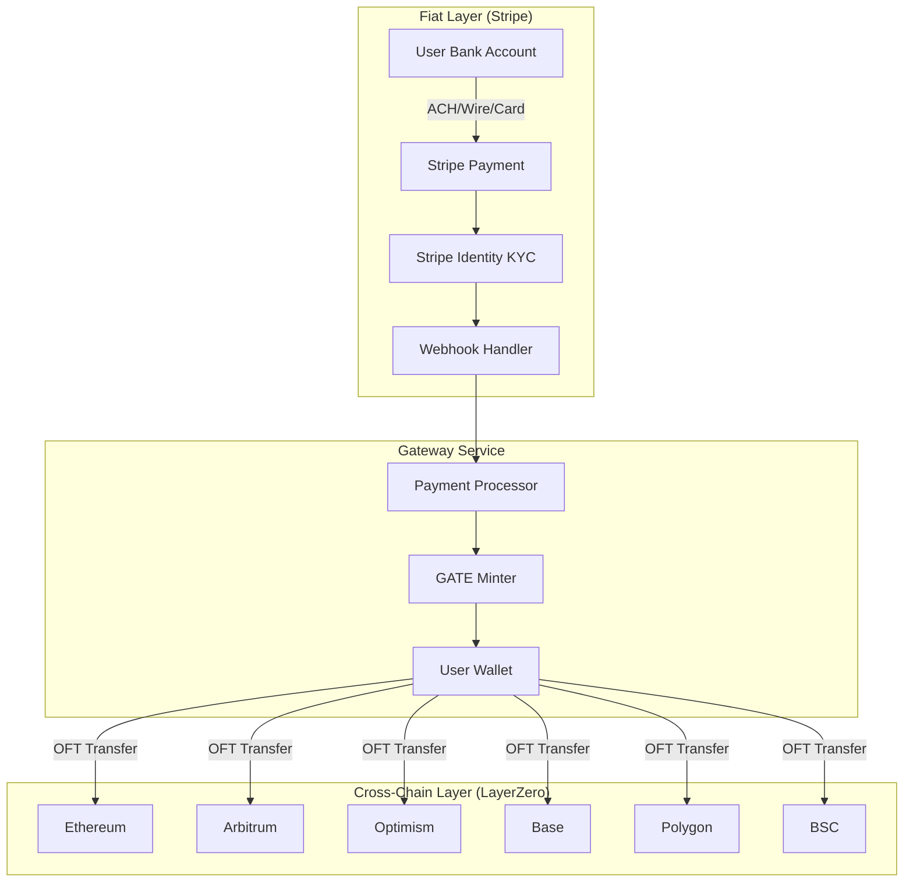

# Caesar Token: Stripe + LayerZero Architecture

## 🎯 Core Philosophy: Simplicity Through Focus

**Two Best-in-Class Integrations:**
- **Stripe**: Fiat on/off-ramps, KYC, compliance
- **LayerZero V2**: Cross-chain messaging and transfers

## Architecture Overview



## Implementation Architecture

### 1. Stripe Integration Components

```typescript
// stripe-gateway/src/services/StripeService.ts
interface StripeGatewayConfig {
  // Payment Processing
  acceptedMethods: ['card', 'ach_debit', 'wire_transfer'];
  supportedCurrencies: ['USD', 'EUR', 'GBP'];
  
  // Compliance
  kycProvider: 'stripe_identity';
  amlChecks: true;
  sanctionsScreening: true;
  
  // Limits
  minPurchase: 10;    // $10 minimum
  maxPurchase: 10000; // $10k per transaction
  dailyLimit: 50000;  // $50k daily per user
}
```

### 2. LayerZero V2 Setup

```solidity
// contracts/core/CaesarCoin.sol
contract CaesarCoin is OFT {
    // Clean, simple OFT implementation
    // No custom bridges needed
    // One contract, all chains
}
```

## 🔄 User Flow: Fiat to Any Chain

### Purchase Flow
```
1. User initiates purchase on webapp
2. Stripe Identity performs KYC (one-time)
3. Stripe processes payment (card/ACH/wire)
4. Webhook confirms payment
5. Gateway mints GATE to user's wallet
6. User can immediately bridge via LayerZero
```

### Example User Journey
```javascript
// 1. User wants $1000 GATE on Arbitrum
POST /api/purchase
{
  "amount": 1000,
  "currency": "USD",
  "destination_chain": "arbitrum",
  "wallet": "0x..."
}

// 2. Stripe creates payment intent
{
  "payment_intent": "pi_xxx",
  "client_secret": "pi_xxx_secret_xxx"
}

// 3. After payment confirmation
{
  "status": "success",
  "gate_amount": 1000,
  "tx_hash": "0x...",
  "chain": "arbitrum"
}
```

## 💰 Revenue Model Integration

### Stripe Fees (Fiat Layer)
- **Card**: 2.9% + $0.30
- **ACH**: 0.8% (capped at $5)
- **Wire**: $15 fixed

### LayerZero Fees (Cross-Chain)
- **Base fee**: ~$0.10-1.00 per transfer
- **Dynamic based on**: Gas prices, message size

### Caesar Token Fees
- **Purchase fee**: 0.5% (on top of Stripe)
- **Demurrage**: 0.5-5% annually
- **Anti-speculation**: 1-2% on rapid trades

## 🏗️ Technical Implementation

### Phase 1: Stripe Gateway Service
```typescript
// stripe-gateway/src/index.ts
class StripeGatewayService {
  // Payment processing
  async createPaymentIntent(amount: number, currency: string);
  async handleWebhook(event: Stripe.Event);
  
  // KYC/Compliance
  async verifyIdentity(userId: string);
  async checkCompliance(userId: string, amount: number);
  
  // GATE operations
  async mintGATE(userId: string, amount: number, chain: string);
  async processCashOut(userId: string, gateAmount: number);
}
```

### Phase 2: LayerZero Configuration
```typescript
// deployment/layerzero-config.ts
const CHAIN_CONFIG = {
  ethereum: { chainId: 1, endpoint: "0x..." },
  arbitrum: { chainId: 42161, endpoint: "0x..." },
  optimism: { chainId: 10, endpoint: "0x..." },
  base: { chainId: 8453, endpoint: "0x..." },
  polygon: { chainId: 137, endpoint: "0x..." },
  bsc: { chainId: 56, endpoint: "0x..." }
};

// Set trusted paths between all chains
async function configureTrustedPaths() {
  for (const [source, target] of chainPairs) {
    await setTrustedRemote(source, target);
  }
}
```

## 🔒 Security Architecture

### Stripe Security
✅ PCI DSS compliance (handled by Stripe)
✅ SCA/3D Secure for cards
✅ Fraud detection built-in
✅ Webhook signature verification

### LayerZero Security
✅ Ultra Light Node validation
✅ Configurable security parameters
✅ No honeypot risk (no bridge pools)
✅ Immutable message delivery

### Gateway Security
✅ Multi-sig treasury for fiat reserves
✅ Rate limiting on minting
✅ Audit trail for all operations
✅ Emergency pause mechanism

## 📊 Monitoring & Analytics

```typescript
interface GatewayMetrics {
  // Stripe Metrics
  fiatVolume24h: number;
  averagePurchaseSize: number;
  conversionRate: number;
  kycApprovalRate: number;
  
  // LayerZero Metrics
  crossChainVolume24h: number;
  chainDistribution: Map<string, number>;
  averageTransferTime: number;
  bridgeSuccessRate: number;
  
  // Combined Metrics
  fiatToCrossChainTime: number;
  userRetention30d: number;
  revenuePerUser: number;
}
```

## 🚀 Deployment Strategy

### Week 1-2: Stripe Integration
- [ ] Set up Stripe Connect account
- [ ] Implement payment processing
- [ ] Add KYC flow with Stripe Identity
- [ ] Test sandbox payments

### Week 3-4: LayerZero Deployment
- [ ] Deploy to all testnets
- [ ] Configure trusted paths
- [ ] Test cross-chain transfers
- [ ] Verify gas optimization

### Week 5-6: Integration Testing
- [ ] End-to-end fiat to cross-chain
- [ ] Load testing
- [ ] Security audit
- [ ] Documentation

## 💡 Key Advantages

### Why This Works
1. **Single Integration Points**: One payment processor, one bridge protocol
2. **Best-in-Class**: Stripe leads payments, LayerZero leads messaging
3. **Regulatory Friendly**: Stripe handles compliance complexity
4. **Scalable**: Both can handle billions in volume
5. **Developer Friendly**: Excellent SDKs and documentation

### What We Avoid
❌ Multiple payment processor integrations
❌ Custom bridge implementations  
❌ Complex liquidity management
❌ Fragmented user experience
❌ Regulatory uncertainty

## 📈 Growth Path

### Phase 1 (Launch)
- 6 EVM chains via LayerZero
- USD purchases via Stripe
- Basic KYC/AML

### Phase 2 (3 months)
- Add EUR, GBP support
- Corporate accounts
- Higher limits for verified users

### Phase 3 (6 months)
- Stripe Treasury for yield
- Automated rebalancing
- Advanced trading features

### Phase 4 (12 months)
- Only add complexity if demanded:
  - Additional payment methods
  - More chains (as LayerZero adds them)
  - Institutional features

## 🎯 Success Metrics

```typescript
const SUCCESS_TARGETS = {
  month1: {
    fiatVolume: 100_000,      // $100k
    uniqueUsers: 1_000,
    chainsActive: 6,
  },
  month3: {
    fiatVolume: 1_000_000,    // $1M
    uniqueUsers: 10_000,
    crossChainTxs: 50_000,
  },
  month6: {
    fiatVolume: 10_000_000,   // $10M
    uniqueUsers: 50_000,
    avgUserValue: 200,
  }
};
```

## 🔧 Configuration

### Environment Variables
```env
# Stripe
STRIPE_SECRET_KEY=sk_live_xxx
STRIPE_WEBHOOK_SECRET=whsec_xxx
STRIPE_CONNECT_ACCOUNT=acct_xxx

# LayerZero
LZ_ENDPOINT_ETHEREUM=0x66A71Dcef29A0fFBDBE3c6a460a3B5BC225Cd675
LZ_ENDPOINT_ARBITRUM=0x3c2269811836af69497E5F486A85D7316753cf62
LZ_ENDPOINT_OPTIMISM=0x3c2269811836af69497E5F486A85D7316753cf62

# Gateway
TREASURY_ADDRESS=0x...
MINTER_PRIVATE_KEY=xxx
MAX_MINT_PER_DAY=1000000
```

## 🚨 Risk Mitigation

### Stripe Risks
- **Mitigation**: Multi-processor backup (add Checkout.com if Stripe fails)
- **Monitoring**: Real-time webhook monitoring
- **Limits**: Daily/monthly caps per user

### LayerZero Risks  
- **Mitigation**: Emergency pause on all chains
- **Monitoring**: Oracle/relayer health checks
- **Backup**: Pre-audited escape hatch

### Regulatory Risks
- **Mitigation**: Stripe handles KYC/AML
- **Monitoring**: Compliance dashboard
- **Adaptation**: Geo-blocking if required

## ✅ Summary

**Stripe + LayerZero = Perfect Simplicity**

- **Stripe**: Solved fiat problem (payments, KYC, compliance)
- **LayerZero**: Solved cross-chain problem (30+ chains, one integration)
- **You**: Focus on core innovation (demurrage, anti-speculation, stability)

No need for:
- Multiple payment processors
- Native blockchain integrations  
- Complex bridge implementations
- Liquidity management across chains

**Result**: Launch faster, scale easier, maintain simpler.