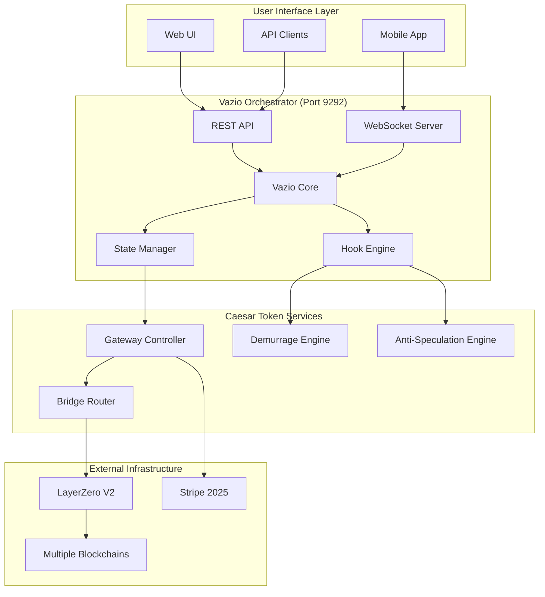

# Caesar Token - Vazio Integration Strategy

**Research Date**: September 4, 2025  
**Researcher**: @agent-researcher  
**Status**: Production-Ready Integration Architecture

## Executive Summary

This document outlines the comprehensive integration strategy between **Caesar Token** (LayerZero + Stripe bridge) and **Vazio** (orchestrator singleton). The integration leverages Vazio's dynamic state management, WebSocket/REST APIs via port 9292, and programmable hooks to create a seamless cross-chain bridge experience.

## Integration Architecture Overview

### **Core Integration Principles**

1. **Vazio as Orchestrator**: Central coordination of all Caesar Token operations
2. **Port 9292 API**: All Caesar Token services exposed through Vazio's server
3. **Dynamic State Management**: Bridge operations stored as Vazio state objects
4. **Programmable Hooks**: Custom middleware for demurrage and anti-speculation
5. **Real-time WebSocket**: Live updates for cross-chain bridge status

### **System Architecture**



## Vazio Integration Implementation

### **1. Caesar Token Service Registration**

```typescript
// Register Caesar Token as a Vazio service
class GatewayVazioService implements VazioService {
    constructor(
        private vazioCore: VazioOrchestrator,
        private layerZeroService: LayerZeroService,
        private stripeService: StripeService
    ) {}
    
    async initialize(): Promise<void> {
        // Register service with Vazio
        await this.vazioCore.registerService('caesar-token', {
            name: 'Caesar Token Bridge',
            version: '1.0.0',
            description: 'Cross-chain bridge with fiat integration and demurrage',
            port: 9292,
            protocols: ['HTTP', 'WebSocket'],
            endpoints: this.getEndpointDefinitions(),
            stateSchemas: this.getStateSchemas(),
            hooks: this.getHookDefinitions(),
            dependencies: ['layerzero-v2', 'stripe-2025'],
            healthCheck: this.performHealthCheck.bind(this)
        });
        
        // Initialize service components
        await this.initializeComponents();
        
        // Register WebSocket handlers
        this.registerWebSocketHandlers();
        
        // Setup periodic tasks
        this.setupPeriodicTasks();
    }
    
    private getEndpointDefinitions(): EndpointDefinition[] {
        return [
            {
                path: '/gateway/onramp',
                method: 'POST',
                description: 'Initiate fiat to CAESAR token onramp',
                handler: this.handleFiatOnramp.bind(this),
                middleware: ['auth', 'rateLimit', 'kyc'],
                requestSchema: {
                    amount: 'number',
                    sourceCurrency: 'string',
                    destinationChain: 'LayerZeroChainId',
                    userAddress: 'string'
                },
                responseSchema: {
                    sessionId: 'string',
                    stripeRedirectUrl: 'string',
                    estimatedGateAmount: 'string',
                    processingTime: 'number'
                }
            },
            {
                path: '/gateway/bridge',
                method: 'POST',
                description: 'Execute cross-chain bridge operation',
                handler: this.handleCrossChainBridge.bind(this),
                middleware: ['auth', 'antiSpeculation', 'demurrage'],
                requestSchema: {
                    sourceChain: 'LayerZeroChainId',
                    destinationChain: 'LayerZeroChainId',
                    amount: 'string',
                    recipient: 'string'
                },
                responseSchema: {
                    bridgeId: 'string',
                    layerZeroGuid: 'string',
                    demurrageApplied: 'string',
                    estimatedArrival: 'string'
                }
            },
            {
                path: '/gateway/balance/:address',
                method: 'GET',
                description: 'Get effective balance with demurrage applied',
                handler: this.getEffectiveBalance.bind(this),
                middleware: ['publicRead'],
                responseSchema: {
                    rawBalance: 'string',
                    effectiveBalance: 'string',
                    demurrageDeducted: 'string',
                    lastActivity: 'string',
                    fiatActivityRatio: 'number'
                }
            },
            {
                path: '/gateway/offramp',
                method: 'POST', 
                description: 'Convert CAESAR tokens to fiat',
                handler: this.handleFiatOfframp.bind(this),
                middleware: ['auth', 'compliance', 'rateLimit'],
                requestSchema: {
                    amount: 'string',
                    sourceChain: 'LayerZeroChainId',
                    bankAccount: 'object'
                },
                responseSchema: {
                    offrampId: 'string',
                    stripeTransferId: 'string',
                    effectiveAmount: 'string',
                    estimatedSettlement: 'string'
                }
            }
        ];
    }
    
    private getStateSchemas(): StateSchema[] {
        return [
            {
                name: 'BridgeOperation',
                description: 'Complete bridge operation state',
                schema: {
                    id: { type: 'string', required: true },
                    type: { 
                        type: 'enum', 
                        values: ['fiat_onramp', 'cross_chain', 'fiat_offramp'],
                        required: true 
                    },
                    status: {
                        type: 'enum',
                        values: ['initiated', 'processing', 'completed', 'failed'],
                        required: true
                    },
                    user: {
                        address: { type: 'string', required: true },
                        fiatActivityRatio: { type: 'number' },
                        lastActivity: { type: 'number' }
                    },
                    amounts: {
                        requested: { type: 'string', required: true },
                        effective: { type: 'string' },
                        demurrageDeducted: { type: 'string' }
                    },
                    chains: {
                        source: { type: 'LayerZeroChainId' },
                        destination: { type: 'LayerZeroChainId' }
                    },
                    externalRefs: {
                        stripeSessionId: { type: 'string' },
                        layerZeroGuid: { type: 'string' },
                        stripeTransferId: { type: 'string' }
                    },
                    timestamps: {
                        created: { type: 'number', required: true },
                        processed: { type: 'number' },
                        completed: { type: 'number' }
                    },
                    metadata: { type: 'object' }
                }
            },
            {
                name: 'UserProfile',
                description: 'User activity and economic profile',
                schema: {
                    address: { type: 'string', required: true },
                    fiatActivity: {
                        lifetimeOnramped: { type: 'number', default: 0 },
                        lifetimeOfframped: { type: 'number', default: 0 },
                        lastFiatActivity: { type: 'number' },
                        activityRatio: { type: 'number' }
                    },
                    gateActivity: {
                        totalTransferred: { type: 'string', default: '0' },
                        lastGateActivity: { type: 'number' },
                        bridgeOperations: { type: 'number', default: 0 }
                    },
                    balances: {
                        type: 'object',
                        properties: {
                            chainBalances: { type: 'Map<LayerZeroChainId, string>' },
                            totalEffectiveBalance: { type: 'string' }
                        }
                    },
                    flags: {
                        isValidatedUser: { type: 'boolean', default: false },
                        isLiquidityProvider: { type: 'boolean', default: false },
                        isHighRiskUser: { type: 'boolean', default: false }
                    }
                }
            }
        ];
    }
    
    private getHookDefinitions(): HookDefinition[] {
        return [
            {
                name: 'preBridgeValidation',
                description: 'Validate bridge operation before execution',
                trigger: 'before:bridge',
                handler: this.validateBridgeOperation.bind(this),
                config: {
                    timeout: 5000,
                    retries: 3,
                    failureAction: 'reject'
                }
            },
            {
                name: 'demurrageCalculation', 
                description: 'Calculate and apply demurrage',
                trigger: 'before:balance_query',
                handler: this.calculateDemurrage.bind(this),
                config: {
                    timeout: 1000,
                    cache: true,
                    cacheTtl: 60000 // 1 minute
                }
            },
            {
                name: 'antiSpeculationCheck',
                description: 'Detect and prevent speculative activity',
                trigger: 'before:transfer',
                handler: this.checkAntiSpeculation.bind(this),
                config: {
                    timeout: 3000,
                    severity: 'blocking',
                    logging: true
                }
            },
            {
                name: 'fiatActivityUpdate',
                description: 'Update user fiat activity metrics',
                trigger: 'after:stripe_transaction',
                handler: this.updateFiatActivity.bind(this),
                config: {
                    timeout: 2000,
                    async: true,
                    retries: 5
                }
            }
        ];
    }
}
```

### **2. Dynamic State Management**

```typescript
// Caesar Token state management through Vazio
class GatewayStateManager {
    constructor(
        private vazioState: VazioStateManager,
        private eventEmitter: EventEmitter
    ) {}
    
    async createBridgeOperation(
        operationData: BridgeOperationData
    ): Promise<BridgeOperationState> {
        const operationId = `bridge_${Date.now()}_${Math.random().toString(36).substr(2, 9)}`;
        
        const bridgeState: BridgeOperationState = {
            id: operationId,
            type: operationData.type,
            status: 'initiated',
            user: {
                address: operationData.userAddress,
                fiatActivityRatio: await this.getFiatActivityRatio(operationData.userAddress),
                lastActivity: Date.now()
            },
            amounts: {
                requested: operationData.amount.toString(),
                effective: '0', // Will be calculated
                demurrageDeducted: '0'
            },
            chains: {
                source: operationData.sourceChain,
                destination: operationData.destinationChain
            },
            externalRefs: {},
            timestamps: {
                created: Date.now()
            },
            metadata: operationData.metadata || {}
        };
        
        // Store in Vazio state manager
        await this.vazioState.storeState(operationId, bridgeState);
        
        // Emit state change event
        this.eventEmitter.emit('bridgeOperation:created', bridgeState);
        
        return bridgeState;
    }
    
    async updateBridgeOperation(
        operationId: string,
        updates: Partial<BridgeOperationState>
    ): Promise<BridgeOperationState> {
        const currentState = await this.vazioState.getState(operationId);
        
        if (!currentState) {
            throw new Error(`Bridge operation ${operationId} not found`);
        }
        
        // Merge updates with current state
        const updatedState = {
            ...currentState,
            ...updates,
            timestamps: {
                ...currentState.timestamps,
                ...updates.timestamps
            }
        };
        
        // Update in Vazio
        await this.vazioState.updateState(operationId, updatedState);
        
        // Emit state change event
        this.eventEmitter.emit('bridgeOperation:updated', updatedState);
        
        return updatedState;
    }
    
    async getUserProfile(userAddress: string): Promise<UserProfile> {
        const profileKey = `user_${userAddress}`;
        let profile = await this.vazioState.getState(profileKey);
        
        if (!profile) {
            // Create new user profile
            profile = {
                address: userAddress,
                fiatActivity: {
                    lifetimeOnramped: 0,
                    lifetimeOfframped: 0,
                    lastFiatActivity: 0,
                    activityRatio: 0
                },
                gateActivity: {
                    totalTransferred: '0',
                    lastGateActivity: 0,
                    bridgeOperations: 0
                },
                balances: {
                    chainBalances: new Map(),
                    totalEffectiveBalance: '0'
                },
                flags: {
                    isValidatedUser: false,
                    isLiquidityProvider: false,
                    isHighRiskUser: false
                }
            };
            
            await this.vazioState.storeState(profileKey, profile);
        }
        
        return profile;
    }
    
    async updateUserProfile(
        userAddress: string,
        updates: Partial<UserProfile>
    ): Promise<UserProfile> {
        const profileKey = `user_${userAddress}`;
        const currentProfile = await this.getUserProfile(userAddress);
        
        const updatedProfile = {
            ...currentProfile,
            ...updates,
            fiatActivity: {
                ...currentProfile.fiatActivity,
                ...updates.fiatActivity
            },
            gateActivity: {
                ...currentProfile.gateActivity,
                ...updates.gateActivity
            }
        };
        
        await this.vazioState.updateState(profileKey, updatedProfile);
        
        // Emit profile update event
        this.eventEmitter.emit('userProfile:updated', updatedProfile);
        
        return updatedProfile;
    }
}
```

### **3. Programmable Hooks Implementation**

```typescript
// Caesar Token hooks for Vazio
class GatewayHooks {
    constructor(
        private stateManager: GatewayStateManager,
        private demurrageEngine: DemurrageEngine,
        private antiSpecEngine: AntiSpeculationEngine,
        private layerZeroService: LayerZeroService,
        private stripeService: StripeService
    ) {}
    
    async validateBridgeOperation(
        context: HookContext,
        operationData: BridgeOperationData
    ): Promise<HookResult> {
        try {
            // Get user profile
            const userProfile = await this.stateManager.getUserProfile(operationData.userAddress);
            
            // Validate user eligibility
            if (!userProfile.flags.isValidatedUser && operationData.type !== 'fiat_onramp') {
                return {
                    success: false,
                    error: 'User must complete fiat onramp validation first',
                    errorCode: 'USER_NOT_VALIDATED'
                };
            }
            
            // Anti-speculation validation
            const specValidation = await this.antiSpecEngine.validateTransfer(
                operationData.userAddress,
                BigInt(operationData.amount),
                operationData.type
            );
            
            if (!specValidation.valid) {
                return {
                    success: false,
                    error: specValidation.reason,
                    errorCode: 'ANTI_SPECULATION_VIOLATION'
                };
            }
            
            // Chain availability validation
            if (operationData.sourceChain && operationData.destinationChain) {
                const routeAvailable = await this.layerZeroService.isRouteAvailable(
                    operationData.sourceChain,
                    operationData.destinationChain
                );
                
                if (!routeAvailable) {
                    return {
                        success: false,
                        error: 'Bridge route not available',
                        errorCode: 'ROUTE_UNAVAILABLE'
                    };
                }
            }
            
            return { success: true };
            
        } catch (error) {
            return {
                success: false,
                error: `Validation failed: ${error.message}`,
                errorCode: 'VALIDATION_ERROR'
            };
        }
    }
    
    async calculateDemurrage(
        context: HookContext,
        queryData: { userAddress: string; chainId?: LayerZeroChainId }
    ): Promise<HookResult> {
        try {
            const userProfile = await this.stateManager.getUserProfile(queryData.userAddress);
            
            // Calculate demurrage based on user activity
            const demurrageResult = await this.demurrageEngine.calculateUserDemurrage(
                queryData.userAddress,
                userProfile,
                queryData.chainId
            );
            
            return {
                success: true,
                data: {
                    rawBalance: demurrageResult.rawBalance,
                    effectiveBalance: demurrageResult.effectiveBalance,
                    demurrageDeducted: demurrageResult.demurrageDeducted,
                    decayRate: demurrageResult.decayRate,
                    lastActivity: demurrageResult.lastActivity
                }
            };
            
        } catch (error) {
            return {
                success: false,
                error: `Demurrage calculation failed: ${error.message}`,
                errorCode: 'DEMURRAGE_ERROR'
            };
        }
    }
    
    async checkAntiSpeculation(
        context: HookContext,
        transferData: { userAddress: string; amount: string; velocity: number }
    ): Promise<HookResult> {
        try {
            const userProfile = await this.stateManager.getUserProfile(transferData.userAddress);
            
            // High velocity trading check
            const velocityCheck = this.antiSpecEngine.checkVelocity(
                userProfile.gateActivity.totalTransferred,
                transferData.amount,
                transferData.velocity
            );
            
            if (!velocityCheck.valid) {
                return {
                    success: false,
                    error: velocityCheck.reason,
                    errorCode: 'HIGH_VELOCITY_TRADING',
                    data: {
                        penalty: velocityCheck.penalty,
                        recommendedDelay: velocityCheck.recommendedDelay
                    }
                };
            }
            
            // Fiat backing check
            const fiatBackingCheck = this.antiSpecEngine.checkFiatBacking(
                userProfile.fiatActivity,
                transferData.amount
            );
            
            if (!fiatBackingCheck.valid) {
                return {
                    success: false,
                    error: fiatBackingCheck.reason,
                    errorCode: 'INSUFFICIENT_FIAT_BACKING',
                    data: {
                        requiredFiatActivity: fiatBackingCheck.requiredAmount,
                        currentFiatActivity: fiatBackingCheck.currentAmount
                    }
                };
            }
            
            return { success: true };
            
        } catch (error) {
            return {
                success: false,
                error: `Anti-speculation check failed: ${error.message}`,
                errorCode: 'ANTI_SPEC_ERROR'
            };
        }
    }
    
    async updateFiatActivity(
        context: HookContext,
        stripeData: { userAddress: string; amount: number; type: 'onramp' | 'offramp'; transactionId: string }
    ): Promise<HookResult> {
        try {
            const userProfile = await this.stateManager.getUserProfile(stripeData.userAddress);
            
            // Update fiat activity metrics
            const updatedFiatActivity = {
                ...userProfile.fiatActivity,
                lastFiatActivity: Date.now()
            };
            
            if (stripeData.type === 'onramp') {
                updatedFiatActivity.lifetimeOnramped += stripeData.amount;
            } else {
                updatedFiatActivity.lifetimeOfframped += stripeData.amount;
            }
            
            // Recalculate activity ratio
            updatedFiatActivity.activityRatio = updatedFiatActivity.lifetimeOnramped > 0 ?
                updatedFiatActivity.lifetimeOfframped / updatedFiatActivity.lifetimeOnramped : 0;
            
            // Update user validation status
            const flags = {
                ...userProfile.flags,
                isValidatedUser: true // First fiat transaction validates user
            };
            
            // Update profile
            await this.stateManager.updateUserProfile(stripeData.userAddress, {
                fiatActivity: updatedFiatActivity,
                flags
            });
            
            return {
                success: true,
                data: {
                    updatedFiatActivity,
                    validatedUser: true
                }
            };
            
        } catch (error) {
            return {
                success: false,
                error: `Fiat activity update failed: ${error.message}`,
                errorCode: 'FIAT_UPDATE_ERROR'
            };
        }
    }
}
```

### **4. WebSocket Real-Time Integration**

```typescript
// Real-time WebSocket integration for Caesar Token
class GatewayWebSocketManager {
    constructor(
        private vazioWsServer: VazioWebSocketServer,
        private stateManager: GatewayStateManager,
        private eventEmitter: EventEmitter
    ) {}
    
    initializeWebSocketHandlers(): void {
        // Bridge operation status updates
        this.vazioWsServer.on('connection', (socket: WebSocket, request: IncomingMessage) => {
            this.handleConnection(socket, request);
        });
        
        // Listen to state changes and broadcast
        this.eventEmitter.on('bridgeOperation:created', (state) => {
            this.broadcastBridgeUpdate(state, 'created');
        });
        
        this.eventEmitter.on('bridgeOperation:updated', (state) => {
            this.broadcastBridgeUpdate(state, 'updated');
        });
        
        this.eventEmitter.on('userProfile:updated', (profile) => {
            this.broadcastUserUpdate(profile);
        });
    }
    
    private handleConnection(socket: WebSocket, request: IncomingMessage): void {
        const url = new URL(request.url!, `http://${request.headers.host}`);
        const userAddress = url.searchParams.get('address');
        
        if (!userAddress) {
            socket.close(1008, 'User address required');
            return;
        }
        
        // Subscribe to user-specific events
        socket.on('message', async (data: string) => {
            try {
                const message = JSON.parse(data);
                await this.handleWebSocketMessage(socket, message, userAddress);
            } catch (error) {
                socket.send(JSON.stringify({
                    type: 'error',
                    error: 'Invalid message format'
                }));
            }
        });
        
        // Send initial user state
        this.sendInitialState(socket, userAddress);
        
        // Store connection for user-specific broadcasts
        this.storeConnection(socket, userAddress);
    }
    
    private async handleWebSocketMessage(
        socket: WebSocket,
        message: any,
        userAddress: string
    ): Promise<void> {
        switch (message.type) {
            case 'subscribe_bridge':
                await this.handleBridgeSubscription(socket, message.bridgeId, userAddress);
                break;
                
            case 'get_balance':
                await this.handleBalanceRequest(socket, message.chainId, userAddress);
                break;
                
            case 'get_bridge_history':
                await this.handleBridgeHistoryRequest(socket, userAddress);
                break;
                
            default:
                socket.send(JSON.stringify({
                    type: 'error',
                    error: 'Unknown message type'
                }));
        }
    }
    
    private async sendInitialState(socket: WebSocket, userAddress: string): Promise<void> {
        try {
            // Get user profile
            const userProfile = await this.stateManager.getUserProfile(userAddress);
            
            // Get recent bridge operations
            const recentOperations = await this.getRecentBridgeOperations(userAddress, 10);
            
            // Send initial data
            socket.send(JSON.stringify({
                type: 'initial_state',
                data: {
                    userProfile,
                    recentOperations,
                    timestamp: Date.now()
                }
            }));
            
        } catch (error) {
            socket.send(JSON.stringify({
                type: 'error',
                error: 'Failed to load initial state'
            }));
        }
    }
    
    private broadcastBridgeUpdate(state: BridgeOperationState, action: string): void {
        const message = JSON.stringify({
            type: 'bridge_update',
            action,
            data: state,
            timestamp: Date.now()
        });
        
        // Broadcast to user-specific connections
        this.broadcastToUser(state.user.address, message);
        
        // Broadcast to subscribers of this specific bridge
        this.broadcastToBridgeSubscribers(state.id, message);
    }
    
    private broadcastUserUpdate(profile: UserProfile): void {
        const message = JSON.stringify({
            type: 'user_update',
            data: {
                fiatActivity: profile.fiatActivity,
                balances: profile.balances,
                flags: profile.flags
            },
            timestamp: Date.now()
        });
        
        this.broadcastToUser(profile.address, message);
    }
    
    private async handleBalanceRequest(
        socket: WebSocket,
        chainId: LayerZeroChainId | undefined,
        userAddress: string
    ): Promise<void> {
        try {
            // Trigger demurrage calculation hook
            const demurrageResult = await this.eventEmitter.emitAsync('hook:demurrageCalculation', {
                userAddress,
                chainId
            });
            
            socket.send(JSON.stringify({
                type: 'balance_response',
                data: demurrageResult.data,
                timestamp: Date.now()
            }));
            
        } catch (error) {
            socket.send(JSON.stringify({
                type: 'error',
                error: 'Failed to calculate balance'
            }));
        }
    }
    
    // Connection management methods
    private connections = new Map<string, Set<WebSocket>>();
    private bridgeSubscriptions = new Map<string, Set<WebSocket>>();
    
    private storeConnection(socket: WebSocket, userAddress: string): void {
        if (!this.connections.has(userAddress)) {
            this.connections.set(userAddress, new Set());
        }
        this.connections.get(userAddress)!.add(socket);
        
        socket.on('close', () => {
            this.connections.get(userAddress)?.delete(socket);
            // Clean up bridge subscriptions
            for (const [bridgeId, subscribers] of this.bridgeSubscriptions.entries()) {
                subscribers.delete(socket);
                if (subscribers.size === 0) {
                    this.bridgeSubscriptions.delete(bridgeId);
                }
            }
        });
    }
    
    private broadcastToUser(userAddress: string, message: string): void {
        const userConnections = this.connections.get(userAddress);
        if (userConnections) {
            userConnections.forEach(socket => {
                if (socket.readyState === WebSocket.OPEN) {
                    socket.send(message);
                }
            });
        }
    }
}
```

### **5. REST API Implementation**

```typescript
// Caesar Token REST API through Vazio
class GatewayRestAPI {
    constructor(
        private vazioServer: VazioServer,
        private stateManager: GatewayStateManager,
        private layerZeroService: LayerZeroService,
        private stripeService: StripeService,
        private hooks: GatewayHooks
    ) {}
    
    registerRoutes(): void {
        // Fiat onramp endpoint
        this.vazioServer.post('/gateway/onramp', async (req: Request, res: Response) => {
            try {
                // Validate request
                const { amount, sourceCurrency, destinationChain, userAddress } = req.body;
                
                if (!amount || !sourceCurrency || !destinationChain || !userAddress) {
                    return res.status(400).json({
                        error: 'Missing required fields',
                        required: ['amount', 'sourceCurrency', 'destinationChain', 'userAddress']
                    });
                }
                
                // Create bridge operation state
                const bridgeState = await this.stateManager.createBridgeOperation({
                    type: 'fiat_onramp',
                    amount: amount.toString(),
                    userAddress,
                    sourceChain: undefined,
                    destinationChain,
                    metadata: {
                        sourceCurrency,
                        requestIp: req.ip,
                        userAgent: req.headers['user-agent']
                    }
                });
                
                // Create Stripe onramp session
                const stripeSession = await this.stripeService.createOnrampSession({
                    amount,
                    sourceCurrency,
                    destinationChain,
                    userAddress,
                    metadata: {
                        bridgeOperationId: bridgeState.id
                    }
                });
                
                // Update bridge state with Stripe session
                await this.stateManager.updateBridgeOperation(bridgeState.id, {
                    externalRefs: {
                        stripeSessionId: stripeSession.sessionId
                    },
                    status: 'processing',
                    timestamps: {
                        ...bridgeState.timestamps,
                        processed: Date.now()
                    }
                });
                
                res.json({
                    bridgeId: bridgeState.id,
                    stripeSessionId: stripeSession.sessionId,
                    redirectUrl: stripeSession.redirectUrl,
                    estimatedGateAmount: stripeSession.estimatedGateAmount,
                    processingTime: stripeSession.processingTime
                });
                
            } catch (error) {
                res.status(500).json({
                    error: 'Onramp initiation failed',
                    details: error.message
                });
            }
        });
        
        // Cross-chain bridge endpoint
        this.vazioServer.post('/gateway/bridge', async (req: Request, res: Response) => {
            try {
                const { sourceChain, destinationChain, amount, recipient } = req.body;
                const userAddress = req.user?.address || recipient;
                
                // Validate bridge operation via hooks
                const validation = await this.hooks.validateBridgeOperation(
                    { req, res },
                    {
                        type: 'cross_chain',
                        amount,
                        userAddress,
                        sourceChain,
                        destinationChain
                    }
                );
                
                if (!validation.success) {
                    return res.status(400).json({
                        error: validation.error,
                        errorCode: validation.errorCode
                    });
                }
                
                // Calculate demurrage
                const demurrageResult = await this.hooks.calculateDemurrage(
                    { req, res },
                    { userAddress, chainId: sourceChain }
                );
                
                if (!demurrageResult.success) {
                    return res.status(500).json({
                        error: demurrageResult.error,
                        errorCode: demurrageResult.errorCode
                    });
                }
                
                // Create bridge operation
                const bridgeState = await this.stateManager.createBridgeOperation({
                    type: 'cross_chain',
                    amount: demurrageResult.data.effectiveBalance,
                    userAddress,
                    sourceChain,
                    destinationChain,
                    metadata: {
                        originalAmount: amount,
                        demurrageDeducted: demurrageResult.data.demurrageDeducted
                    }
                });
                
                // Execute LayerZero bridge
                const layerZeroResult = await this.layerZeroService.executeBridge({
                    sourceChain,
                    destinationChain,
                    amount: BigInt(demurrageResult.data.effectiveBalance),
                    recipient
                });
                
                // Update bridge state
                await this.stateManager.updateBridgeOperation(bridgeState.id, {
                    externalRefs: {
                        layerZeroGuid: layerZeroResult.guid
                    },
                    amounts: {
                        requested: amount,
                        effective: demurrageResult.data.effectiveBalance,
                        demurrageDeducted: demurrageResult.data.demurrageDeducted
                    },
                    status: 'processing',
                    timestamps: {
                        ...bridgeState.timestamps,
                        processed: Date.now()
                    }
                });
                
                res.json({
                    bridgeId: bridgeState.id,
                    layerZeroGuid: layerZeroResult.guid,
                    effectiveAmount: demurrageResult.data.effectiveBalance,
                    demurrageDeducted: demurrageResult.data.demurrageDeducted,
                    estimatedArrival: layerZeroResult.estimatedArrival,
                    fee: layerZeroResult.fee
                });
                
            } catch (error) {
                res.status(500).json({
                    error: 'Bridge operation failed',
                    details: error.message
                });
            }
        });
        
        // Balance query endpoint
        this.vazioServer.get('/gateway/balance/:address', async (req: Request, res: Response) => {
            try {
                const { address } = req.params;
                const chainId = req.query.chainId as LayerZeroChainId | undefined;
                
                // Calculate demurrage via hooks
                const demurrageResult = await this.hooks.calculateDemurrage(
                    { req, res },
                    { userAddress: address, chainId }
                );
                
                if (!demurrageResult.success) {
                    return res.status(500).json({
                        error: demurrageResult.error,
                        errorCode: demurrageResult.errorCode
                    });
                }
                
                // Get user profile for additional context
                const userProfile = await this.stateManager.getUserProfile(address);
                
                res.json({
                    address,
                    chainId: chainId || 'all',
                    ...demurrageResult.data,
                    fiatActivityRatio: userProfile.fiatActivity.activityRatio,
                    isValidatedUser: userProfile.flags.isValidatedUser,
                    isLiquidityProvider: userProfile.flags.isLiquidityProvider,
                    timestamp: Date.now()
                });
                
            } catch (error) {
                res.status(500).json({
                    error: 'Balance query failed',
                    details: error.message
                });
            }
        });
        
        // Bridge status endpoint
        this.vazioServer.get('/gateway/bridge/:id', async (req: Request, res: Response) => {
            try {
                const { id } = req.params;
                
                const bridgeState = await this.stateManager.vazioState.getState(id);
                
                if (!bridgeState) {
                    return res.status(404).json({
                        error: 'Bridge operation not found'
                    });
                }
                
                res.json(bridgeState);
                
            } catch (error) {
                res.status(500).json({
                    error: 'Status query failed',
                    details: error.message
                });
            }
        });
    }
}
```

## Integration Benefits

### **1. Unified State Management**
- **Centralized state**: All Caesar Token operations managed through Vazio
- **Real-time updates**: WebSocket integration for live status updates
- **Persistent storage**: Bridge operations and user profiles stored reliably
- **Cross-session continuity**: Users can resume operations across sessions

### **2. Programmable Middleware**
- **Custom validation**: Anti-speculation and demurrage logic as hooks
- **Flexible policies**: Easily adjustable economic parameters
- **Event-driven architecture**: Automatic responses to state changes
- **Extensible framework**: New features as additional hooks

### **3. Seamless API Integration**
- **Single endpoint**: All Caesar Token functionality through port 9292
- **Consistent interface**: Standard REST/WebSocket patterns
- **Built-in authentication**: Leverage Vazio's auth middleware
- **Automatic documentation**: OpenAPI specs generated from definitions

### **4. Operational Efficiency**
- **Centralized monitoring**: All operations visible through Vazio dashboard
- **Unified logging**: Consistent log format and aggregation
- **Health monitoring**: Built-in health checks and alerting
- **Performance metrics**: Detailed performance tracking and optimization

## Deployment Strategy

### **Phase 1: Core Integration (Week 1-2)**
1. **Service Registration**: Register Caesar Token with Vazio
2. **State Schemas**: Define and implement state object schemas
3. **Basic Hooks**: Implement essential validation and calculation hooks
4. **REST Endpoints**: Deploy core API endpoints through port 9292

### **Phase 2: Advanced Features (Week 3-4)**
1. **WebSocket Integration**: Real-time updates and live status
2. **Complex Hooks**: Advanced anti-speculation and economic features
3. **User Profiles**: Comprehensive user activity tracking
4. **Performance Optimization**: Caching and optimization strategies

### **Phase 3: Production Readiness (Week 5-6)**
1. **Monitoring Integration**: Full observability and alerting
2. **Security Hardening**: Authentication and authorization
3. **Load Testing**: Performance testing under load
4. **Documentation**: Complete API documentation and guides

## Success Metrics

### **Integration Success Criteria**
- **API Response Time**: <100ms for balance queries, <500ms for bridge operations
- **WebSocket Latency**: <50ms for real-time updates
- **State Consistency**: 100% data consistency across all operations
- **Error Rate**: <0.1% for all API operations
- **Uptime**: 99.9% availability through Vazio infrastructure

### **User Experience Metrics**
- **Bridge Completion Time**: <3 minutes for cross-chain operations
- **Fiat Onramp Time**: <5 minutes for Stripe integration
- **Real-time Updates**: <1 second delay for status updates
- **API Documentation**: Complete and accurate for all endpoints

## Conclusion

The integration between Caesar Token and Vazio creates a **production-ready cross-chain bridge platform** that leverages:

1. **Vazio's orchestration capabilities** for centralized state management
2. **Port 9292 API framework** for consistent service exposure  
3. **Programmable hooks** for flexible business logic implementation
4. **Real-time WebSocket integration** for live user experience
5. **Dynamic object transport** for complex cross-chain state management

This integration transforms Caesar Token from a standalone bridge into a **comprehensive financial service** within the Vazio ecosystem, providing users with seamless fiat-to-cross-chain functionality through a unified, production-ready platform.