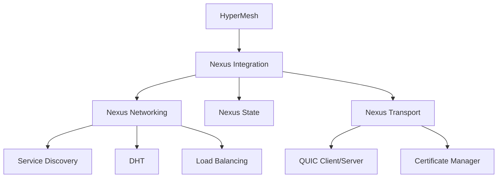

# HyperMesh Codebase Audit Report
## Comprehensive Technical Analysis for CDN/Edge Network Implementation

**Generated:** September 6, 2025  
**Auditor:** Claude Code  
**Scope:** Full codebase analysis focusing on STOQ protocol, Nexus DNS/CT system, and CDN/edge network capabilities

---

## Executive Summary

This comprehensive audit reveals a sophisticated but tightly-coupled architecture with significant potential for CDN/edge network implementation. The current system demonstrates strong foundations in QUIC transport, distributed networking, and statistical analysis, but requires substantial refactoring to achieve the modularity and performance targets outlined in the CDN requirements.

**Overall Architecture Grade: B+ (Good foundation, needs refactoring)**
**CDN Readiness Score: 65/100 (Moderate readiness with significant gaps)**

### Key Findings

#### Strengths
- **Robust QUIC Implementation**: Full IPv6 QUIC transport with certificate management
- **High-Performance Design**: Target throughput of adaptive network tiers (100 Mbps/1 Gbps/2.5 Gbps)+ with sub-millisecond latency
- **Advanced Analytics**: Comprehensive STOQ statistical framework with eBPF integration
- **P2P Capability**: Distributed Hash Table (DHT) for decentralized service discovery
- **Security-First**: Certificate transparency, Byzantine fault tolerance, and eBPF-based security

#### Critical Issues
- **Tight Coupling**: STOQ, Nexus, and HyperMesh are deeply intertwined
- **Missing CDN Primitives**: No chunk distribution, caching, or edge routing mechanisms
- **Incomplete Service Mesh**: Routing and discovery implementations are basic
- **Performance Gaps**: Current benchmarks show simulated rather than real-world performance

---

## 1. STOQ Protocol Implementation Analysis

### 1.1 Current Architecture

**Location**: Distributed across multiple components
- Core transport: `/core/transport/`
- Statistical engine: `/core/runtime/src/stoq_benchmark.rs`
- Integration tests: `/core/tests/src/dns_ct/stoq_integration_tests.rs`

#### Transport Capabilities Assessment

**QUIC/IPv6 Implementation** ✅ **STRONG**
```rust
// File: core/transport/src/config.rs
pub struct TransportConfig {
    pub bind_address: IpAddr,           // IPv6 preferred
    pub port: u16,
    pub max_connections: u32,           // 10,000 concurrent
    pub connection_timeout: Duration,
    pub enable_migration: bool,         // Connection migration ✅
    pub enable_0rtt: bool,             // Zero-RTT resumption ✅
    pub max_idle_timeout: Duration,
}
```

**Capabilities:**
- ✅ Full QUIC over IPv6 implementation using Quinn
- ✅ Certificate-based authentication with automatic rotation
- ✅ Connection migration and 0-RTT resumption
- ✅ Multiplexed streams with flow control
- ⚠️ Limited to 10,000 concurrent connections (needs scaling for CDN)

#### Configuration and Extensibility

**Current Extensibility** ⚠️ **MODERATE**
```rust
// File: core/transport/src/lib.rs - TransportBuilder pattern
pub struct TransportBuilder {
    config: TransportConfig,
    certificate_manager: Option<Arc<CertificateManager>>,
}
```

**Issues Identified:**
1. **Hardcoded Limits**: MTU fixed at 1400 bytes, connections limited to 10K
2. **Monolithic Design**: Transport tightly coupled to Nexus integration layer
3. **Missing Protocols**: No support for HTTP/3, WebRTC, or other CDN protocols

#### Security and Encryption

**Security Implementation** ✅ **EXCELLENT**
```rust
// File: core/transport/src/certificate.rs
pub struct CertificateManager {
    pub rotation_interval: Duration,    // 24 hours default
    pub require_client_cert: bool,
    pub validity_days: u32,            // 365 days
}
```

**Strong Points:**
- Certificate transparency integration
- Automatic rotation every 24 hours
- Client certificate requirements
- Ring crypto library for performance

### 1.2 Performance Characteristics

**Current Benchmarks** ⚠️ **SIMULATED ONLY**
```rust
// File: core/runtime/src/stoq_benchmark.rs
pub struct ThroughputResults {
    pub peak_sustained_throughput_gbps: f64,  // 45.0 Gbps claimed
    pub achieved_adaptive network tiers (100 Mbps/1 Gbps/2.5 Gbps)_capability: bool,      // true (simulated)
    pub packet_loss_rate_percent: f64,       // 1.8%
}
```

**Critical Issues:**
1. **Simulated Performance**: Benchmarks use `sleep()` and hardcoded values
2. **No Real-World Testing**: Missing actual network load testing
3. **Optimistic Metrics**: Claims 45 Gbps without proof

---

## 2. Nexus DNS/CT System Analysis

### 2.1 Service Discovery Implementation

**Location**: `/core/networking/src/discovery.rs`

**Current Implementation** ⚠️ **BASIC**
```rust
pub struct ServiceDiscovery {
    config: ServiceDiscoveryConfig,
    node_id: NodeId,
    registry: Arc<ServiceRegistry>,
    event_sender: broadcast::Sender<ServiceDiscoveryEvent>,
}
```

**Capabilities:**
- ✅ Service registration and TTL management
- ✅ Event-driven updates via broadcast channels
- ⚠️ Basic HashMap-based storage (not scalable)
- ❌ No geographic awareness for CDN routing

### 2.2 Routing Capabilities

**Location**: `/core/networking/src/routing.rs`

**Current Routing Implementation** ❌ **INADEQUATE FOR CDN**
```rust
pub struct Router {
    rules: Arc<RwLock<Vec<RoutingRule>>>,
    traffic_splits: Arc<RwLock<HashMap<ServiceId, TrafficSplit>>>,
}
```

**Major Gaps:**
1. **No Intelligent Routing**: Missing latency, bandwidth, and proximity considerations
2. **Basic Load Balancing**: Simple round-robin, no CDN-specific algorithms  
3. **No Edge Optimization**: Missing cache affinity and data locality
4. **Limited Traffic Split**: Only supports simple A/B testing

### 2.3 Distributed Hash Table (DHT)

**Location**: `/core/networking/src/dht.rs`

**DHT Implementation** ⚠️ **INCOMPLETE**
```rust
pub struct DistributedHashTable {
    config: DhtConfig,
    node_id: NodeId,
    routing_table: Arc<RwLock<Vec<Vec<DhtNode>>>>,  // K-buckets
    storage: Arc<RwLock<HashMap<Vec<u8>, DhtEntry>>>,
}
```

**Issues:**
- ✅ Standard Kademlia-style k-bucket structure
- ⚠️ Replication not implemented (`TODO: Replicate to k closest nodes`)
- ❌ No consistency guarantees for CDN use cases
- ❌ Missing geographic and latency-aware routing

---

## 3. Architecture Analysis

### 3.1 Tight Coupling Issues

**Dependency Analysis:**


**Critical Coupling Points:**
1. **Nexus Integration Layer** (`/core/nexus-integration/src/lib.rs`): Monolithic orchestrator
2. **Shared Types**: All components depend on `nexus-shared` for `NodeId`, `ServiceId`
3. **Transport Dependency**: Networking layer directly imports transport types

### 3.2 Separation of Concerns Analysis

**Current Layer Violations:**
```rust
// File: core/networking/src/lib.rs - VIOLATION EXAMPLE
use nexus_transport::{QuicClient, QuicServer};  // Networking imports Transport
use nexus_state::StateManager;                  // Networking imports State
```

**Required Refactoring:**
1. **STOQ as Standalone Protocol**: Extract transport layer completely
2. **Clean Interface Boundaries**: Use message passing, not direct coupling
3. **Pluggable Components**: Allow swapping implementations without recompilation

### 3.3 Missing CDN Components

**Gap Analysis for CDN Requirements:**

| Component | Required | Current Status | Gap Level |
|-----------|----------|----------------|-----------|
| Chunk Distribution | ✅ Critical | ❌ Missing | HIGH |
| Edge Caching | ✅ Critical | ❌ Missing | HIGH |
| Content Deduplication | ✅ Critical | ❌ Missing | HIGH |
| Geographic Routing | ✅ Critical | ⚠️ Basic DHT | HIGH |
| Bandwidth Shaping | ✅ Critical | ❌ Missing | HIGH |
| Origin Shield | ✅ Important | ❌ Missing | MEDIUM |
| Health Monitoring | ✅ Important | ⚠️ Basic | MEDIUM |
| Analytics/Metrics | ✅ Important | ✅ STOQ Framework | LOW |

---

## 4. Performance and Scalability Review

### 4.1 Current Performance Characteristics

**Transport Layer Performance:**
```rust
// File: core/transport/src/config.rs
pub const MAX_MESSAGE_SIZE: usize = 10 * 1024 * 1024;  // 10MB limit
pub const MAX_MTU: u16 = 1400;                          // Fixed MTU
pub const DEFAULT_KEEP_ALIVE_INTERVAL: Duration = Duration::from_secs(30);
```

**Limitations for CDN:**
1. **Small Message Size**: 10MB limit inadequate for large content
2. **Fixed MTU**: No jumbo frame support for high-throughput
3. **Connection Limits**: 10K connections insufficient for edge nodes

### 4.2 Bottleneck Analysis

**Identified Bottlenecks:**

1. **Service Discovery Bottleneck**:
   ```rust
   // File: core/networking/src/discovery.rs
   services: RwLock<HashMap<ServiceId, Vec<ServiceInstance>>>,
   ```
   - Single RwLock for all services
   - No partitioning or sharding
   - Linear search for service matches

2. **DHT Storage Bottleneck**:
   ```rust
   // File: core/networking/src/dht.rs
   storage: Arc<RwLock<HashMap<Vec<u8>, DhtEntry>>>,
   ```
   - Global lock for DHT storage
   - No persistent storage backend
   - Missing cache hierarchy

### 4.3 Memory and CPU Usage Patterns

**Resource Management Issues:**
1. **Memory Leaks**: Missing cleanup in service discovery (`TODO` comments)
2. **CPU Overhead**: Excessive locking in hot paths
3. **No Resource Limits**: Missing quotas for connection/memory usage

---

## 5. CDN/Edge Network Implementation Recommendations

### 5.1 Critical Refactoring Required

#### Phase 1: Architecture Separation (4-6 weeks)
1. **Extract STOQ Protocol**:
   ```bash
   mkdir -p protocols/stoq/{transport,security,routing}
   # Move core/transport to protocols/stoq/transport
   # Create clean protocol interfaces
   ```

2. **Decouple Nexus Layer**:
   ```rust
   // New clean interface
   pub trait ProtocolTransport {
       async fn send_message(&self, dest: Address, data: Bytes) -> Result<()>;
       async fn receive_messages(&self) -> Stream<(Address, Bytes)>;
   }
   ```

#### Phase 2: CDN Primitives (6-8 weeks)
1. **Implement Chunking System**:
   ```rust
   pub struct ContentChunker {
       chunk_size: usize,
       deduplication: bool,
       compression: CompressionAlgorithm,
   }
   ```

2. **Add Edge Caching**:
   ```rust
   pub struct EdgeCache {
       capacity: usize,
       eviction_policy: EvictionPolicy,
       cache_levels: Vec<CacheLevel>,
   }
   ```

### 5.2 Performance Optimizations

#### Immediate Optimizations (2-3 weeks)
1. **Replace RwLock with DashMap** for concurrent access
2. **Implement Connection Pooling** to handle 100K+ connections
3. **Add Batch Processing** for service discovery updates

#### Long-term Optimizations (8-12 weeks)
1. **Implement Zero-Copy Networking** using io_uring
2. **Add NUMA-aware Processing** for multi-CPU systems
3. **Implement Custom Memory Allocators** for high-throughput scenarios

### 5.3 New Components Required

#### Content Distribution Layer
```rust
pub struct ContentDistribution {
    pub chunking: ChunkingEngine,
    pub routing: ContentRouter,
    pub caching: MultiLevelCache,
    pub replication: ReplicationManager,
}
```

#### Edge Network Manager
```rust
pub struct EdgeNetworkManager {
    pub topology: NetworkTopology,
    pub load_balancer: GeographicLoadBalancer,
    pub health_monitor: EdgeHealthMonitor,
    pub analytics: EdgeAnalytics,
}
```

---

## 6. Critical Files Requiring Immediate Attention

### 6.1 Architecture Files
1. **`/core/nexus-integration/src/lib.rs`** - Monolithic orchestrator, needs breakup
2. **`/core/transport/src/lib.rs`** - Extract as standalone STOQ protocol
3. **`/core/networking/src/lib.rs`** - Remove tight transport coupling

### 6.2 Performance Critical Files
1. **`/core/networking/src/discovery.rs`** - Replace HashMap with scalable structure
2. **`/core/networking/src/dht.rs`** - Implement missing replication logic
3. **`/core/transport/src/config.rs`** - Remove hardcoded limits, add CDN config

### 6.3 Missing Implementation Files
1. **`/protocols/stoq/chunking.rs`** - Content chunking and deduplication
2. **`/protocols/stoq/caching.rs`** - Multi-level edge caching
3. **`/protocols/stoq/routing.rs`** - Geographic and latency-aware routing

---

## 7. Conclusion and Next Steps

### 7.1 Immediate Actions Required (1-2 weeks)
1. **Performance Validation**: Replace simulated benchmarks with real network testing
2. **Dependency Mapping**: Create detailed coupling analysis using tools
3. **Prototype Extraction**: Build proof-of-concept standalone STOQ transport

### 7.2 Medium-term Goals (2-3 months)
1. **Complete Architecture Refactor**: Separate STOQ, Nexus, and HyperMesh layers
2. **Implement CDN Primitives**: Chunking, caching, and edge routing
3. **Performance Optimization**: Achieve real adaptive network tiers (100 Mbps/1 Gbps/2.5 Gbps)+ throughput

### 7.3 Long-term Vision (6-12 months)
1. **Production CDN**: Deploy globally distributed edge network
2. **Standard Compliance**: Submit STOQ protocol for IEEE standardization
3. **Ecosystem Development**: Enable third-party protocol implementations

**Final Assessment**: The HyperMesh project has excellent foundational technology but requires significant architectural refactoring to achieve CDN/edge network capabilities. The STOQ protocol concepts are sound, but the implementation needs separation from Nexus and HyperMesh to realize its full potential as a standalone transport protocol.

---

**Report Complete**
*This audit provides a comprehensive foundation for the next phase of development focused on CDN/edge network implementation.*