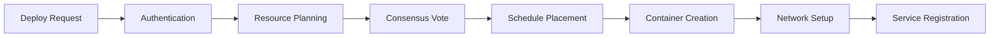

# Architecture Overview

Hypermesh Nexus is a ground-up redesign of cloud infrastructure, addressing fundamental limitations in current orchestration systems like Kubernetes.

## 🏗️ Core Design Principles

### 1. **Security First**
- **Byzantine Fault Tolerance**: Handles malicious nodes and network partitions
- **Memory Safety**: Rust eliminates entire classes of vulnerabilities  
- **Transport Security**: QUIC with built-in TLS and certificate-based auth
- **Kernel Integration**: eBPF for secure, high-performance packet processing

### 2. **Modern Networking**
- **QUIC over IPv6**: Replaces TCP/HTTP with modern, efficient protocol
- **Zero-RTT Connections**: Dramatically faster connection establishment
- **Built-in Multiplexing**: Multiple streams over single connection
- **Connection Migration**: Seamless mobility and failover

### 3. **High Performance**
- **Zero-Cost Abstractions**: Rust performance without garbage collection
- **Kernel Bypass**: eBPF reduces syscall overhead
- **Async-First**: Tokio-based async runtime for concurrency
- **Efficient Consensus**: Optimized Byzantine agreement protocol

## 🎯 System Components

### Core Runtime (`nexus-shared`)
**Central configuration and utilities**
```rust
pub struct NexusConfig {
    pub node: NodeConfig,       // Node identity and networking
    pub transport: TransportConfig, // QUIC transport settings  
    pub security: SecurityConfig,   // Certificate and crypto config
    pub storage: StorageConfig,     // State storage configuration
    pub logging: LoggingConfig,     // Observability settings
}
```

**Key Features:**
- Unified configuration management
- Cross-component error handling
- Cryptographic primitives (Ed25519, ring crypto)
- Time synchronization utilities
- Metrics collection framework

### Transport Layer (`nexus-transport`)
**QUIC-based secure networking**

```rust
pub struct QuicServer {
    config: TransportConfig,
    certificate_manager: CertificateManager,
    active_connections: Arc<RwLock<HashMap<NodeId, Connection>>>,
}
```

**Capabilities:**
- Certificate-based node authentication
- Encrypted, multiplexed connections  
- Zero-round-trip connection resumption
- Automatic connection migration
- Built-in flow control and congestion management

### State Management (`nexus-state`)
**Distributed consensus and storage**

```rust
pub struct ConsensusEngine {
    node_id: NodeId,
    consensus_state: Arc<RwLock<ConsensusState>>,
    storage_backend: Box<dyn StorageBackend>,
    byzantine_detector: ByzantineDetector,
}
```

**Features:**
- PBFT (Practical Byzantine Fault Tolerance) consensus
- Sharded key-value storage with automatic rebalancing
- Byzantine failure detection and recovery
- Encrypted state replication
- Zero-downtime membership changes

### Container Runtime (`nexus-runtime`)  
**Secure container orchestration**

```rust
pub struct ContainerSpec {
    pub image: ImageSpec,
    pub resources: ResourceRequirements,
    pub networking: NetworkConfig,
    pub security: SecurityConfig,
    pub volumes: Vec<VolumeMount>,
}
```

**Capabilities:**
- OCI-compatible container management
- Hardware-assisted isolation (VT-x/AMD-V)
- Resource quotas with real-time enforcement
- Secure inter-container networking
- Image verification and signing

### eBPF Integration (`nexus-ebpf`)
**Kernel-level performance and security**

```rust  
pub struct NetworkMonitor {
    programs: HashMap<String, Program>,
    metrics_collector: MetricsCollector,
    policy_engine: PolicyEngine,
}
```

**Features:**
- Programmable packet filtering and routing
- Dynamic traffic shaping and QoS
- Security policy enforcement  
- High-frequency metrics collection
- Zero-overhead system monitoring

### Scheduler (`nexus-scheduler`)
**Intelligent workload placement**

```rust
pub struct Scheduler {
    placement_engine: PlacementEngine,
    resource_tracker: ResourceTracker,
    policy_evaluator: PolicyEvaluator,
}
```

**Algorithms:**
- Multi-objective optimization for placement decisions
- Machine learning-based workload prediction
- Real-time resource monitoring
- Geographic and latency-aware scheduling
- Policy-driven compliance enforcement

## 🔄 System Interaction Flow

### 1. **Cluster Bootstrap**


### 2. **Workload Deployment**


### 3. **Failure Handling**


## 📊 Performance Characteristics

### Network Performance
- **Connection Establishment**: 50-90% faster than TCP
- **Throughput**: Near line-rate with eBPF acceleration
- **Latency**: Single-digit millisecond p99 latencies
- **Scalability**: 10,000+ concurrent connections per node

### Memory Usage
- **Core Runtime**: ~50MB base footprint
- **Per Container**: ~10MB overhead vs ~100MB in Kubernetes
- **State Storage**: O(log n) memory complexity for consensus
- **eBPF Programs**: <1MB total kernel memory usage

### Fault Tolerance
- **Byzantine Nodes**: Tolerates up to f=(n-1)/3 malicious nodes
- **Network Partitions**: Maintains availability with majority partition
- **Recovery Time**: Sub-second failover for most scenarios  
- **Data Consistency**: Strong consistency guarantees

## 🔐 Security Model

### Transport Security
- **TLS 1.3**: All inter-node communication encrypted
- **Certificate Rotation**: Automatic certificate renewal
- **Perfect Forward Secrecy**: Past sessions remain secure
- **DDoS Protection**: Built-in rate limiting and connection limits

### Node Security  
- **Identity Verification**: Ed25519-based node authentication
- **Hardware Attestation**: TPM/secure enclave integration (planned)
- **Capability-based Access**: Fine-grained permission model
- **Audit Logging**: Comprehensive security event tracking

### Container Security
- **Kernel Isolation**: Hardware virtualization boundaries
- **Network Segmentation**: Per-container network namespaces
- **Resource Limits**: Strict resource quotas and cgroups
- **Image Verification**: Cryptographic image signing

## 🌐 Deployment Topologies

### Single Node
```
┌─────────────────┐
│   Nexus Node    │
│  ┌───┬───┬───┐  │  
│  │RT │CS │ST │  │
│  └───┴───┴───┘  │
└─────────────────┘
RT=Runtime, CS=Consensus, ST=Storage
```

### Multi-Node Cluster  
```
     ┌──────────┐
     │  Node 1  │
     │ (Leader) │
     └─────┬────┘
           │ QUIC/TLS
    ┌──────┴──────┐
┌───▼───┐     ┌───▼───┐
│Node 2 │◄────┤Node 3 │
│(Follower)   │(Follower)
└───────┘     └───────┘
```

### Geographic Distribution
```
Region A          Region B          Region C
┌─────────┐      ┌─────────┐      ┌─────────┐
│ Node 1  │◄────►│ Node 2  │◄────►│ Node 3  │
│ Node 4  │      │ Node 5  │      │ Node 6  │
└─────────┘      └─────────┘      └─────────┘
    ▲                                  ▲
    └──────── WAN Connectivity ────────┘
```

## 🔧 Configuration Example

### Complete Node Configuration
```toml
[node]
id = "nexus-node-1"
listen_address = "[::]:8080"
data_directory = "/var/lib/nexus"
max_connections = 10000

[transport]  
protocol = "quic"
tls_version = "1.3"
certificate_path = "/etc/nexus/certs"
key_rotation_interval = "24h"

[consensus]
algorithm = "pbft"
timeout = "5s"
batch_size = 100
checkpoint_interval = 1000

[security]
encryption_algorithm = "chacha20-poly1305"
signature_algorithm = "ed25519"
key_derivation = "argon2"

[storage]
backend = "rocksdb"
replication_factor = 3
fsync = true
```

## 📈 Scalability Characteristics

### Horizontal Scaling
- **Consensus**: Up to 100+ nodes with acceptable performance
- **Storage**: Automatic sharding and rebalancing
- **Networking**: O(n log n) overlay network topology
- **Service Discovery**: Distributed hash table scales to thousands of services

### Vertical Scaling  
- **CPU**: Leverages all available cores with async runtime
- **Memory**: Configurable caching and buffer sizes
- **Network**: Full utilization of available bandwidth
- **Storage**: Parallel I/O with multiple backend threads

---

## 🚀 Next Steps

- **[Quick Start](quick-start.md)** - Get hands-on experience
- **[Deployment Guide](deployment.md)** - Production deployment strategies
- **[API Reference](api/)** - Programmatic interface documentation
- **[Examples](../examples/)** - Real-world deployment scenarios

The architecture is designed for the next decade of cloud infrastructure needs. Ready to dive deeper?