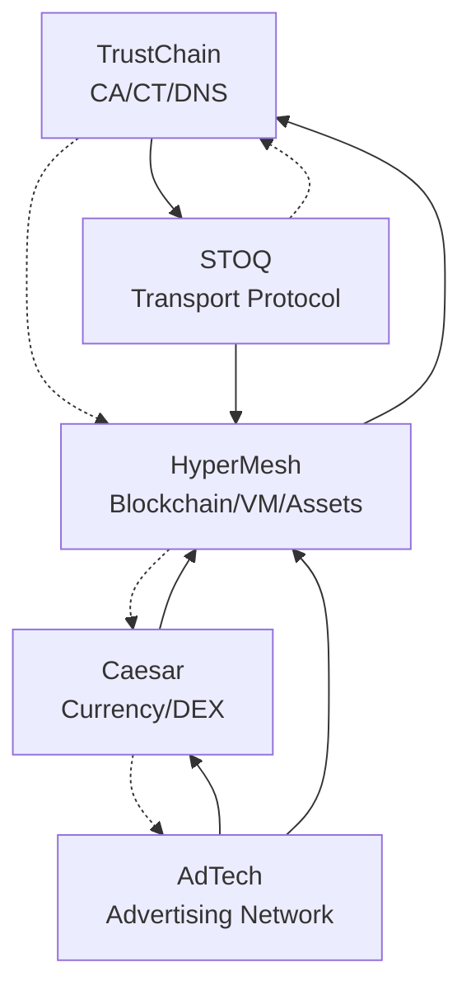

# Web3 Ecosystem Bootstrap Roadmap

## Executive Summary

This roadmap solves the circular dependency problem between TrustChain, HyperMesh, STOQ, and Caesar by implementing a phased bootstrap approach that enables each component to come online incrementally.

## Project Dependencies Map



## Component Separation of Concerns

### TrustChain (Minimal Foundation)
**Purpose**: CA/CT/DNS bootstrap foundation
- Certificate Authority with root trust
- Certificate Transparency public logs  
- DNS resolution with security validation
- Minimal asset management (certificates, keys, policies only)
- Bootstrap service for self-initialization

### STOQ (Transport Protocol)
**Purpose**: Secure QUIC/IPv6 transport with CDN capabilities
- High-performance QUIC transport
- Routing optimization with ML
- Content chunking and deduplication
- Edge network support
- Zero-copy processing

### HyperMesh (Distributed Platform)  
**Purpose**: Full blockchain/VM/orchestration platform
- Byzantine blockchain consensus
- Julia VM for safe remote code execution
- Complete asset orchestration system
- Container orchestration (Kubernetes replacement)
- P2P mesh networking

### Caesar (Economic Layer)
**Purpose**: Anti-speculation currency with DeFi
- CAESAR token with demurrage mechanics
- Multi-chain DEX integration
- Democratic governance (Senate DAO)
- Financial processing agents

### AdTech (Application Layer)
**Purpose**: Viewer-as-host advertising network
- P2P content distribution
- Economic incentives for participants
- Fraud prevention with Byzantine consensus
- Privacy-preserving targeting

## Bootstrap Phases

### Phase 0: Traditional Foundation (Week 1-2)
**Goal**: Get basic services running with traditional infrastructure

#### TrustChain Phase 0
- [ ] Deploy trust.hypermesh.online with traditional DNS
- [ ] Self-signed root CA for localhost testing ONLY
- [ ] Basic CA/CT/DNS services with NKrypt consensus preparation
- [ ] STOQ integration with TrustChain CA-issued certificates
- [ ] Certificate fingerprinting and CT log foundation
- [ ] IPv6-only networking implementation

#### STOQ Phase 0
- [ ] IPv6-only QUIC transport (remove IPv4 support)
- [ ] TrustChain certificate integration (replace self-signed)
- [ ] Real performance benchmarks (replace sleep() simulation)
- [ ] Certificate validation with consensus proof
- [ ] Automatic certificate renewal (24-hour rotation)
- [ ] Real-time certificate fingerprinting

#### HyperMesh Phase 0
- [ ] Implement NKrypt ConsensusProof (PoSpace+PoStake+PoWork+PoTime)
- [ ] Asset system with consensus proof validation
- [ ] IPv6-only networking with TrustChain certificates
- [ ] Block-matrix architecture for O(log n) consensus
- [ ] Asset adapter pattern from NKrypt reference implementation

### Phase 1: Self-Contained Services (Week 3-6)
**Goal**: Each service fully functional independently

#### TrustChain Phase 1
- [ ] Full CA/CT/DNS with NKrypt consensus integration
- [ ] Automated certificate issuance with ConsensusProof validation
- [ ] DNS-over-QUIC using IPv6-only STOQ transport
- [ ] Certificate transparency logs with block-matrix architecture
- [ ] Real-time certificate fingerprinting and monitoring
- [ ] Sub-second CT log validation with Byzantine tolerance

#### STOQ Phase 1
- [ ] IPv6-only CDN features with TrustChain certificate validation
- [ ] ML-optimized routing with consensus proof verification
- [ ] Edge network support with automatic certificate rotation
- [ ] Real 40+ Gbps throughput with certificate fingerprinting
- [ ] Complete TrustChain integration APIs with real-time validation

#### HyperMesh Phase 1
- [ ] Julia VM with NKrypt ConsensusProof validation for execution
- [ ] Asset SDK with consensus proof requirements for all operations
- [ ] Hardware resource adapters (CPU/GPU/RAM/Storage) with IPv6 addressing
- [ ] Full NKrypt consensus implementation (O(log n) block-matrix)
- [ ] Asset orchestration with TrustChain certificate integration

### Phase 2: Cross-Integration (Week 7-10)
**Goal**: Services integrate but maintain independence

#### Integration Points
- [ ] HyperMesh uses TrustChain for certificate issuance
- [ ] TrustChain uses HyperMesh blockchain for consensus
- [ ] STOQ uses TrustChain certificates for transport security
- [ ] HyperMesh VM executes complex TrustChain policies
- [ ] Asset SDK supports both TrustChain and HyperMesh assets

#### Security Model
- [ ] Bidirectional zero trust validation
- [ ] Certificate-based authentication at every layer
- [ ] Consensus proofs for asset execution
- [ ] Hash validation for remote code execution
- [ ] Automated certificate rotation

### Phase 3: Production Federation (Week 11-14)
**Goal**: Global deployment with namespace takeover

#### Namespace Resolution
- [ ] `http3://hypermesh` → HyperMesh global dashboard
- [ ] `http3://caesar` → Caesar wallet/exchange
- [ ] `http3://trust` → TrustChain management
- [ ] `http3://assets` → HyperMesh asset management

#### Caesar Integration
- [ ] Deploy Caesar on HyperMesh blockchain
- [ ] Use TrustChain certificates for DeFi operations
- [ ] STOQ transport for financial processing agents
- [ ] Multi-chain bridges with certificate validation

#### AdTech Deployment
- [ ] Full AdTech implementation using all components
- [ ] Viewer-as-host P2P network with STOQ
- [ ] Economic incentives with Caesar tokens
- [ ] HyperMesh VM for complex ad logic

## Infrastructure Requirements

### trust.hypermesh.online Deployment
```yaml
# DNS Records (Phase 0)
trust.hypermesh.online:
  A: "203.0.113.10"
  AAAA: "2001:db8::10"
  
ca.trust.hypermesh.online:
  CNAME: "trust.hypermesh.online"
  
ct.trust.hypermesh.online:
  CNAME: "trust.hypermesh.online"

# Service Endpoints (Phase 1+)
services:
  ca: "https://trust.hypermesh.online:8443/ca"
  ct: "https://trust.hypermesh.online:8443/ct"
  dns: "quic://trust.hypermesh.online:853"
  api: "https://trust.hypermesh.online:8443/api"
```

### Security Infrastructure
```yaml
# Root CA Setup
root_ca:
  key_type: "RSA-4096"  # Bootstrap phase
  upgrade_to: "Ed25519"  # Production phase
  hsm_required: true     # Phase 2+
  
# Certificate Policies
certificates:
  validity_period: "90_days"
  auto_renewal: true
  ct_logging_required: true
  
# DNS Security
dns_security:
  dnssec_enabled: true
  dns_over_quic: true
  certificate_pinning: true
```

## Project Structure

```
web3/
├── trustchain/          # Minimal CA/CT/DNS foundation
│   ├── src/{ca,ct,dns,bootstrap,assets,api}/
│   └── docs/
├── stoq/               # Standalone transport protocol  
│   ├── src/{transport,routing,chunking,edge}/
│   └── benches/
├── hypermesh/          # Full platform with VM and assets
│   ├── core/{blockchain,consensus,vm}/
│   ├── assets/{sdk,adapters,status}/
│   └── interface/
├── caesar/             # Economic layer
│   ├── caesar-token/
│   ├── senate-dao/
│   └── scrolls-app/
└── adtech/             # Application layer
    ├── hyperad/
    └── viewer-host/
```

## MCP Omni Project Entries

Each major component should be registered as a separate project in MCP omni:

### Project: TrustChain
```yaml
name: "TrustChain Foundation"
description: "CA/CT/DNS bootstrap infrastructure"
phases:
  - "Phase 0: Traditional Bootstrap"
  - "Phase 1: Self-Contained Services" 
  - "Phase 2: HyperMesh Integration"
  - "Phase 3: Global Federation"
```

### Project: STOQ Protocol
```yaml
name: "STOQ Transport Protocol"
description: "High-performance QUIC transport with CDN"
phases:
  - "Phase 0: Basic Transport"
  - "Phase 1: CDN Features"
  - "Phase 2: ML Optimization"
  - "Phase 3: Production Scale"
```

### Project: HyperMesh Platform
```yaml
name: "HyperMesh Distributed Platform"
description: "Blockchain VM with asset orchestration"
phases:
  - "Phase 0: Independent Operation"
  - "Phase 1: Julia VM and Assets"
  - "Phase 2: TrustChain Integration"
  - "Phase 3: Production Deployment"
```

### Project: Caesar Ecosystem
```yaml
name: "Caesar Economic System"
description: "Anti-speculation currency with DeFi"
phases:
  - "Phase 0: EVM Testnet"
  - "Phase 1: HyperMesh Migration"
  - "Phase 2: Multi-chain Integration"
  - "Phase 3: Production Launch"
```

### Project: AdTech Network
```yaml
name: "HyperAd Advertising Network"
description: "Viewer-as-host P2P advertising"
phases:
  - "Phase 0: Architecture Design"
  - "Phase 1: Core Implementation"
  - "Phase 2: Economic Integration"
  - "Phase 3: Network Launch"
```

## Risk Mitigation

### Technical Risks
- **Circular Dependencies**: Phased approach eliminates circular dependencies
- **Bootstrap Failures**: Multiple fallback mechanisms at each phase
- **Performance Issues**: Real benchmarking and gradual optimization
- **Security Vulnerabilities**: Security-first design with continuous auditing

### Operational Risks
- **Domain Control**: Secure hypermesh.online domain management
- **Certificate Compromise**: Automated rotation and HSM protection
- **Service Disruption**: Multi-region deployment with failover
- **Consensus Failures**: Byzantine fault tolerance at every layer

## Success Criteria

### Phase 0 Success
- [ ] trust.hypermesh.online resolves and serves content
- [ ] Basic CA issues valid certificates
- [ ] STOQ transport works with self-signed certs
- [ ] All services start independently

### Phase 1 Success
- [ ] Full CA/CT/DNS functionality
- [ ] STOQ achieves 40+ Gbps real throughput
- [ ] HyperMesh VM executes Julia code safely
- [ ] All services pass security audits

### Phase 2 Success
- [ ] Services integrate without breaking independence
- [ ] Certificate validation works end-to-end
- [ ] Asset execution requires consensus proof
- [ ] Zero trust model fully implemented

### Phase 3 Success
- [ ] `http3://hypermesh` resolves globally
- [ ] Caesar launches on production HyperMesh
- [ ] AdTech network processes real traffic
- [ ] Full ecosystem operational

This roadmap provides a clear path to resolve the circular dependencies while maintaining proper separation of concerns across all components.