# Phase 4 Delegation: Enhanced Development & Implementation

## FORMAL PROJECT DELEGATION

**FROM**: Project Manager  
**TO**: Engineering Manager  
**DATE**: 2025-01-09  
**PROJECT**: Caesar Token Ecosystem Development  
**PHASE**: Phase 4 - Enhanced Development & Implementation  

## PROJECT SCOPE & AUTHORITY

### Full Authority Granted
The Engineering Manager is hereby granted **complete authority** for Phase 4 execution including:

✅ **Technical Architecture**: All implementation decisions and technical direction  
✅ **Team Coordination**: Direct management of Frontend Developer, Backend Developer, Product Designer  
✅ **Sprint Management**: Sprint planning, task assignment, progress tracking  
✅ **Resource Allocation**: Development environment setup, tool selection, infrastructure decisions  
✅ **Quality Standards**: Code review, testing requirements, performance benchmarks  
✅ **Timeline Management**: Sprint scheduling, milestone planning, delivery coordination  

### Project Context

#### Current Infrastructure (Completed)
✅ **Smart Contracts**: DEX Factory + CAESAR Token deployed on Sepolia  
✅ **Basic Trading Interface**: React/TypeScript with basic functionality  
✅ **Cross-Chain Bridge**: LayerZero V2 integration operational  
✅ **Wallet Integration**: RainbowKit multi-chain support  
✅ **Analytics**: Basic volume tracking and TVL calculation  

#### Target Deliverables (Phase 4)
🎯 **Agora DEX**: Professional trading platform with advanced features  
🎯 **Satchel Wallet**: Secure multi-chain wallet with Caesar optimizations  
🎯 **Tablets UI**: Comprehensive analytics and management dashboard  
🎯 **Integration**: Seamless ecosystem with cross-component functionality  
🎯 **Deployment**: Production-ready multi-chain deployment  

## SPRINT STRUCTURE & TIMELINE

### Sprint 4.1: Agora DEX Enhancement (Days 1-3) ⚡ PRIORITY 1
**Lead**: Engineering Manager  
**Team**: Frontend Developer, Product Designer  
**Status**: READY TO START IMMEDIATELY  
**Documentation**: `SPRINT_4_1_AGORA_DEX_ENHANCEMENT.md`  

**Key Deliverables**:
- Advanced trading interface with professional charts
- Limit orders and stop-loss functionality
- DAO governance integration
- Mobile-responsive design
- Real-time market data integration

### Sprint 4.2: Satchel Wallet Development (Days 2-4) ⚡ PARALLEL
**Lead**: Backend Developer (under Engineering Manager supervision)  
**Team**: Security Auditor support  
**Status**: Ready for initiation Day 2  

**Key Deliverables**:
- Hardware wallet support (Ledger, Trezor)
- Multi-chain asset management
- Security features and recovery options
- DeFi protocol integrations
- Caesar token native optimizations

### Sprint 4.3: Tablets UI Dashboard (Days 3-5) ⚡ PARALLEL
**Lead**: Product Designer (under Engineering Manager supervision)  
**Team**: Frontend Developer support  
**Status**: Ready for initiation Day 3  

**Key Deliverables**:
- Comprehensive portfolio dashboard
- Token analytics with demurrage tracking
- Mining interface and performance monitoring
- Cross-chain bridge management UI
- Real-time data visualization

### Sprint 4.4: Integration & Testing (Days 4-6)
**Lead**: QA Engineer (coordinated with Engineering Manager)  
**Team**: All development teams  
**Status**: Continuous throughout + dedicated phase  

### Sprint 4.5: Production Deployment (Days 6-7)
**Lead**: DevOps Engineer (under Engineering Manager direction)  
**Team**: Engineering Manager oversight  
**Status**: Final deployment and launch preparation  

## PARALLEL DEVELOPMENT COORDINATION

### Worktree Strategy
Engineering Manager should establish:
- `.claude/worktrees/agora-dex-enhancement/` - Sprint 4.1
- `.claude/worktrees/satchel-wallet-development/` - Sprint 4.2  
- `.claude/worktrees/tablets-ui-dashboard/` - Sprint 4.3
- `.claude/worktrees/ecosystem-integration/` - Sprint 4.4

### Dependency Management

```mermaid
gantt
    title Engineering Manager Coordination
    dateFormat X
    axisFormat %d
    
    section Sprint 4.1
    Agora DEX Enhancement    :active, a1, 0, 3d
    
    section Sprint 4.2
    Satchel Wallet Development :a2, 1, 3d
    
    section Sprint 4.3  
    Tablets UI Dashboard     :a3, 2, 3d
    
    section Sprint 4.4
    Integration Testing      :a4, 3, 3d
    
    section Sprint 4.5
    Production Deployment    :a5, 5, 2d
```

## MANDATORY REQUIREMENTS

### Quality Standards
- **Code Quality**: TypeScript strict mode, maximum 500 lines per file
- **Testing**: 90%+ coverage for critical components
- **Performance**: Sub-3 second load times, real-time data updates
- **Security**: Hardware wallet support, comprehensive security auditing
- **Documentation**: Complete API docs, user guides, deployment instructions

### Communication Protocol
- **Daily Updates**: Progress via `mcp__nabu__discord_notify`
- **QA Coordination**: Continuous QA Engineer involvement
- **Memory Storage**: Critical findings in `mcp__telos__telos_store`
- **Service Registration**: All services registered with `mcp__nabu__start_service`

### Success Criteria (Phase 4 Completion)
✅ All three ecosystem components operational and integrated  
✅ Cross-component integration tested and validated  
✅ Performance benchmarks met across all applications  
✅ Security audit passed for wallet components  
✅ Multi-chain deployment successful  
✅ QA Engineer sign-off on all deliverables  
✅ Complete documentation and user guides  

## IMMEDIATE ACTION ITEMS

### Hour 1: Project Setup
1. **Acknowledge Delegation**: Confirm receipt and understanding of scope
2. **Environment Preparation**: Set up development infrastructure
3. **Service Registration**: Register all development services with Nabu
4. **Team Coordination**: Brief Frontend Developer and Product Designer

### Hour 2-4: Sprint 4.1 Initiation
1. **Directory Creation**: Set up `scrolls-app/agora-dex/` structure
2. **Worktree Setup**: Create development environment
3. **Task Assignment**: Delegate specific tasks to Frontend Developer
4. **Progress Tracking**: Establish daily reporting cadence

## ESCALATION & SUPPORT

### Project Manager Support
- Available for strategic decisions and resource conflicts
- Escalation point for timeline or scope changes
- Coordination with stakeholders and external dependencies

### QA Engineer Coordination
- **MANDATORY**: QA validation required for all sprint completions
- Embedded QA throughout development process
- Final sign-off authority for phase completion

### Specialized Agent Support
- **Security Auditor**: Available for wallet security consultation
- **DevOps Engineer**: Infrastructure and deployment support
- **Performance Engineer**: Optimization and scaling consultation

## SUCCESS METRICS & REPORTING

### Weekly Milestones
- **End of Week 1**: Agora DEX enhancement complete, Satchel Wallet 70% complete
- **End of Week 2**: All components complete, integration testing underway
- **Week 2.5**: Production deployment and launch readiness

### Quality Gates
- QA Engineer approval required for each sprint completion
- Performance benchmarks must be met before next sprint
- Security audit completion before production deployment

## DELEGATION AUTHORIZATION

**Project Manager**: Formally delegates Phase 4 authority to Engineering Manager  
**Scope**: Complete ecosystem development (Agora DEX, Satchel Wallet, Tablets UI)  
**Timeline**: 7-10 days for full completion  
**Authority Level**: Full technical and team management authority  
**Success Criteria**: All deliverables operational with QA approval  

**Next Check-in**: Daily progress reports via Nabu  
**Phase Completion Review**: Scheduled after Sprint 4.5 completion  

---

## FORMAL HANDOFF COMPLETE

✅ **Project Scope**: Clearly defined and documented  
✅ **Authority Granted**: Full engineering leadership authorization  
✅ **Resources Available**: All specialized agents and tools accessible  
✅ **Quality Framework**: QA requirements and success criteria established  
✅ **Communication Protocol**: Reporting and escalation procedures defined  

**Engineering Manager**: You have full authority to proceed with Phase 4 execution.  
**Next Action**: Begin Sprint 4.1 immediately with Agora DEX enhancement.  

🚀 **PHASE 4 OFFICIALLY DELEGATED - PROCEED WITH IMMEDIATE EXECUTION**