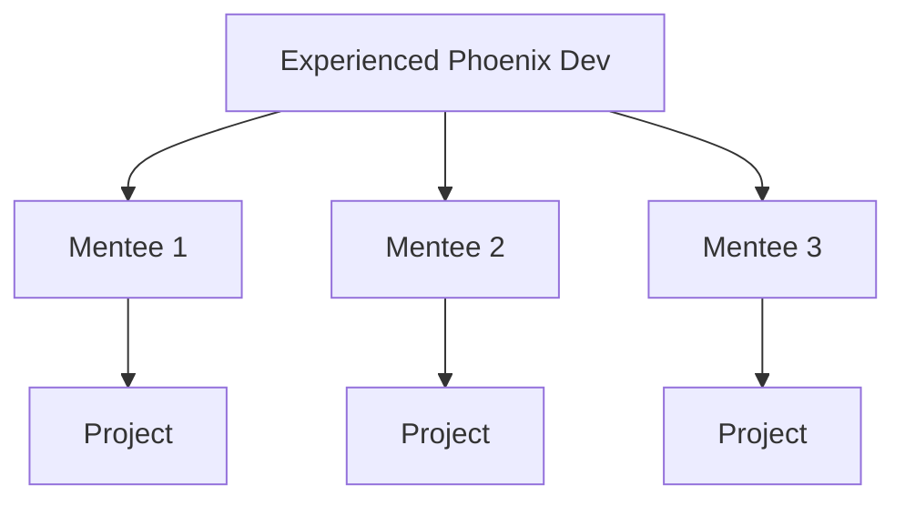
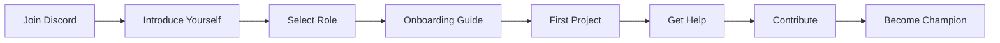
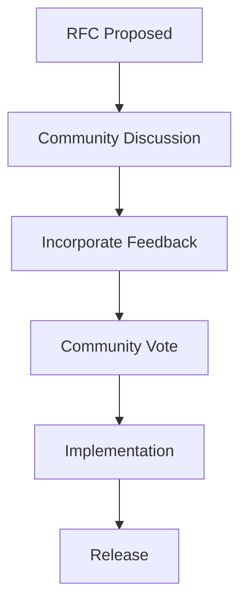

# Phoenix Community Strategy

## Vision
**Build the most vibrant, helpful, and innovative developer community in distributed computing.**

## Community Principles

### Core Values
1. **Developer First**: Every decision prioritizes developer experience
2. **Inclusive**: Welcome developers of all backgrounds and skill levels
3. **Transparent**: Open development, clear roadmap, honest communication
4. **Collaborative**: Community contributions are valued and celebrated
5. **Innovative**: Push boundaries of what's possible in distributed systems

## Community Infrastructure

### Discord Server Architecture

```yaml
Phoenix Community Discord:
  Welcome:
    - 👋-welcome (auto-role assignment)
    - 📜-rules (community guidelines)
    - 📢-announcements (official updates)
    - 🎯-start-here (onboarding guide)

  General:
    - 💬-general (community chat)
    - 🎨-showcase (project showcase)
    - 🎉-celebrations (milestones, achievements)
    - 😂-off-topic (casual conversation)

  Support:
    - 🆘-quick-help (beginner questions)
    - 🔧-troubleshooting (technical issues)
    - 📚-resources (tutorials, guides)
    - 🎓-learning-together (study groups)

  Development:
    - 💻-development (general dev discussion)
    - 🏗️-architecture (system design)
    - ⚡-performance (optimization tips)
    - 🔒-security (security best practices)

  Advanced:
    - 🧪-experimental (cutting-edge features)
    - 🤝-contributing (contribution discussion)
    - 🔬-internals (Phoenix internals)
    - 📊-benchmarks (performance comparisons)

  Community:
    - 💡-ideas (feature requests)
    - 🐛-bug-reports (issue tracking)
    - 📝-documentation (docs improvement)
    - 🌍-translations (i18n efforts)

  Regional:
    - 🇺🇸-americas
    - 🇪🇺-europe
    - 🇯🇵-asia-pacific
    - 🌏-global

  Voice Channels:
    - 🎤-office-hours (weekly with team)
    - 🎓-workshops (live coding)
    - 💬-community-chat (open voice)
    - 🎮-pair-programming (collaboration)

  Special:
    - 🏆-champions (Phoenix Champions only)
    - 🚀-beta-testing (early access)
    - 💼-enterprise (business users)
    - 📺-streaming (live coding streams)
```

### GitHub Organization Structure

```
github.com/phoenix-sdk/
├── phoenix/                 # Core SDK
├── phoenix-cli/             # CLI tools
├── phoenix-examples/        # Example applications
├── phoenix-docs/           # Documentation
├── phoenix-contrib/        # Community contributions
├── awesome-phoenix/        # Curated resources
├── phoenix-benchmarks/     # Performance benchmarks
├── phoenix-plugins/        # Plugin ecosystem
├── phoenix-templates/      # Project templates
└── phoenix-community/      # Community governance
```

### Community Platforms

| Platform | Purpose | Activity Goal |
|----------|---------|---------------|
| **Discord** | Real-time support & discussion | 500+ daily active |
| **GitHub** | Code, issues, contributions | 100+ weekly contributors |
| **Forum** | Long-form discussion | 50+ topics/week |
| **Reddit** | Community news & discussion | 1000+ members |
| **Stack Overflow** | Q&A knowledge base | 100+ questions/month |
| **Twitter/X** | News & updates | 5K+ followers |
| **YouTube** | Video tutorials | 10K+ subscribers |
| **Dev.to** | Technical articles | 20+ posts/month |
| **Twitch** | Live coding | 100+ concurrent viewers |

## Community Programs

### 1. Phoenix Champions Program

**Tiers and Benefits:**

#### 🌱 Contributor (Entry Level)
**Requirements:**
- 1+ merged PR
- Active in Discord for 30+ days
- Helped 5+ community members

**Benefits:**
- Contributor badge
- Early feature access
- Monthly newsletter
- Phoenix stickers

#### 🌟 Advocate (Intermediate)
**Requirements:**
- 5+ merged PRs
- Created tutorial or blog post
- Helped 25+ community members
- 3+ months active

**Benefits:**
- Advocate badge
- Direct team access via private channel
- Conference speaking support ($500/year)
- Phoenix swag pack
- Beta features access

#### 🏆 Champion (Advanced)
**Requirements:**
- 10+ merged PRs
- Multiple content pieces
- Maintained community package
- Conference speaker
- 6+ months active

**Benefits:**
- Champion badge
- Quarterly team calls
- Conference sponsorship ($2000/year)
- Co-marketing opportunities
- Phoenix hoodie + premium swag
- Product roadmap influence

#### 🚀 Phoenix Core Team (Honorary)
**By invitation only for exceptional contributors**

**Benefits:**
- All Champion benefits
- Annual team meetup invitation
- Phoenix Core Team title
- Significant roadmap influence
- Recognition on website

### 2. Mentorship Program

**Structure:**


**Program Details:**
- **Duration**: 3 months
- **Commitment**: 2 hours/week
- **Format**: 1:3 mentor to mentees
- **Outcome**: Complete Phoenix project
- **Recognition**: Certificate + LinkedIn recommendation

### 3. Phoenix Student Program

**University Partnerships:**
- Free Phoenix licenses for students
- Guest lectures by Phoenix team
- Hackathon sponsorship
- Internship opportunities
- Research collaboration

**Student Ambassador Program:**
- Lead Phoenix clubs at universities
- Organize workshops and events
- Receive training and resources
- Annual student summit

### 4. Phoenix Bounty Program

```markdown
# Bounty Categories and Rewards

## 🐛 Bug Fixes
- Critical: $1000-5000
- Major: $500-1000
- Minor: $100-500
- Documentation: $50-200

## ✨ Features
- Core features: $2000-10000
- Integrations: $1000-5000
- CLI improvements: $500-2000
- Examples: $200-1000

## 📝 Content
- Technical tutorials: $300-1000
- Video tutorials: $500-2000
- Blog posts: $200-500
- Translations: $100-500 per language

## 🔒 Security
- Critical vulnerabilities: $5000-20000
- High severity: $2000-5000
- Medium severity: $500-2000
- Low severity: $100-500

## 🏆 Special Bounties
- Performance improvements: 10% improvement = $1000
- Reduce binary size: 10% reduction = $500
- Startup time: 10% faster = $500
- Memory usage: 10% less = $500
```

## Content Strategy

### Content Calendar

#### Weekly Content
- **Monday**: Week ahead newsletter
- **Tuesday**: Technical blog post
- **Wednesday**: Community showcase
- **Thursday**: Tutorial/guide
- **Friday**: Week in review

#### Monthly Events
- **First Tuesday**: Office hours with core team
- **Second Thursday**: Community showcase live stream
- **Third Tuesday**: Technical deep dive webinar
- **Last Thursday**: Community town hall

#### Quarterly Events
- **Hackathon**: 48-hour online hackathon
- **Summit**: Virtual community summit
- **Awards**: Community awards ceremony

### Content Types and Owners

| Content Type | Frequency | Owner | Platform |
|-------------|-----------|-------|----------|
| Blog Posts | 2/week | DevRel + Community | Blog, Dev.to |
| Tutorials | 1/week | DevRel | Docs, YouTube |
| Livestreams | 2/week | DevRel | Twitch, YouTube |
| Podcasts | 1/month | DevRel | Podcast platforms |
| Newsletter | 1/week | Community Manager | Email |
| Social Media | Daily | Community Manager | Twitter, LinkedIn |
| Case Studies | 1/month | Marketing | Website |
| Release Notes | Per release | Engineering | GitHub, Blog |

### Content Themes

#### Technical Content
- Performance optimization techniques
- Architecture patterns
- Security best practices
- Integration guides
- Migration guides
- Debugging techniques

#### Community Content
- Success stories
- Community spotlights
- Project showcases
- Learning journeys
- Event recaps
- Contributor interviews

## Community Engagement Strategies

### Onboarding Flow



### Engagement Tactics

#### Daily Engagement
- Answer questions within 2 hours
- Welcome new members personally
- Share interesting projects
- Recognize helpful members
- Post daily tips

#### Weekly Engagement
- Community spotlight
- Code review sessions
- Pair programming sessions
- Project showcases
- Learning challenges

#### Monthly Engagement
- Community awards
- Hackathons
- Workshops
- Town halls
- Surveys

### Gamification Elements

#### Points System
- Answer question: 10 points
- Create tutorial: 100 points
- Fix bug: 50-500 points
- Share project: 25 points
- Help newcomer: 15 points

#### Achievements
- 🎯 **First PR**: Submit first pull request
- 💬 **Helpful Hand**: Help 10 community members
- 📚 **Knowledge Sharer**: Create 3 tutorials
- 🐛 **Bug Hunter**: Report 5 valid bugs
- 🚀 **Early Adopter**: Try beta features
- 🏗️ **Architect**: Design accepted RFC
- 🌟 **Rising Star**: 100+ points in first month
- 🏆 **Phoenix Master**: 1000+ total points

#### Leaderboards
- Monthly contributors
- Most helpful members
- Top bug reporters
- Best content creators
- Fastest growing projects

## Community Metrics

### Health Metrics

| Metric | Target | Measurement |
|--------|--------|-------------|
| **Response Time** | <2 hours | Time to first response |
| **Resolution Rate** | >90% | Questions answered |
| **Member Growth** | 20% MoM | New Discord members |
| **Active Members** | >30% | Weekly active in Discord |
| **Contributor Growth** | 10% MoM | New GitHub contributors |
| **Content Creation** | 20+ pieces/month | Community content |
| **NPS Score** | >50 | Quarterly survey |

### Growth Metrics

| Stage | Month 1 | Month 3 | Month 6 | Month 12 |
|-------|---------|---------|---------|----------|
| Discord Members | 100 | 500 | 2,000 | 10,000 |
| GitHub Stars | 100 | 1,000 | 5,000 | 20,000 |
| Contributors | 10 | 50 | 150 | 500 |
| Community Content | 5 | 20 | 50 | 100 |
| Production Users | 5 | 25 | 100 | 500 |

## Community Governance

### Decision Making



### Governance Structure

#### Core Team
- Technical decisions
- Roadmap planning
- Release management

#### Community Council
- 7 elected members
- 6-month terms
- Community representation
- Advisory role

#### Working Groups
- Performance WG
- Security WG
- Documentation WG
- Ecosystem WG

### Code of Conduct

**Core Principles:**
1. Be respectful and inclusive
2. Welcome newcomers
3. Assume positive intent
4. Provide constructive feedback
5. Focus on what's best for community

**Enforcement:**
- Warning for first violation
- Temporary ban for second
- Permanent ban for severe/repeated violations

## International Expansion

### Localization Strategy

**Priority Languages:**
1. Chinese (Mandarin)
2. Spanish
3. Japanese
4. Portuguese
5. German
6. French
7. Korean
8. Russian

**Localization Targets:**
- Documentation: Full translation
- CLI: Interface translation
- Website: Landing pages
- Tutorials: Top 10 guides

### Regional Communities

**Regional Leads:**
- Organize local meetups
- Translate content
- Provide regional support
- Cultural adaptation

**Regional Events:**
- Time-zone friendly office hours
- Regional hackathons
- Local conference presence

## Community Tools

### Discord Bots

**Phoenix Bot Features:**
- Welcome message
- Role assignment
- FAQ responses
- Code formatting
- GitHub integration
- Points tracking
- Moderation tools

### Analytics Dashboard

**Metrics Tracked:**
- Member growth
- Message activity
- Help response times
- Popular topics
- Content engagement
- Contributor activity

### Community Platform

**Features:**
- Project showcase
- Job board
- Event calendar
- Resource library
- Member directory
- Success stories

## Budget Allocation

### Annual Community Budget: $300K

```
Community Events:        $80K (27%)
- Hackathons:           $30K
- Conferences:          $30K
- Meetups:             $20K

Bounty Program:         $60K (20%)
- Bug bounties:         $20K
- Feature bounties:     $20K
- Content bounties:     $20K

Champions Program:      $50K (17%)
- Travel sponsorship:   $30K
- Swag and rewards:     $20K

Content Creation:       $40K (13%)
- Video production:     $20K
- Written content:      $10K
- Livestreaming:        $10K

Tools & Infrastructure: $30K (10%)
- Community platform:   $15K
- Analytics tools:      $10K
- Discord bots:         $5K

Student Program:        $25K (8%)
- Hackathon prizes:     $15K
- Scholarships:         $10K

International:          $15K (5%)
- Translation:          $10K
- Regional events:      $5K
```

## Success Stories Template

### Case Study Format
1. **Challenge**: What problem were they solving?
2. **Solution**: How did Phoenix help?
3. **Implementation**: Technical details
4. **Results**: Measurable outcomes
5. **Testimonial**: Quote from developer
6. **Lessons Learned**: Key takeaways

### Showcase Format
- Project name and description
- Architecture diagram
- Performance metrics
- Code snippets
- Live demo link
- GitHub repository

## Risk Mitigation

### Community Risks

| Risk | Impact | Mitigation |
|------|--------|------------|
| **Toxic behavior** | High | Code of conduct, moderation |
| **Burnout** | Medium | Rotation, boundaries |
| **Fork/competition** | Medium | Open governance, engagement |
| **Scaling issues** | Medium | Automation, delegation |
| **Legal issues** | Low | Clear licenses, guidelines |

## Conclusion

The Phoenix community strategy focuses on creating a welcoming, helpful, and innovative environment where developers can learn, build, and succeed with distributed computing. Through comprehensive programs, clear governance, and strong engagement, we'll build the most vibrant developer community in the distributed systems space.

**Key Success Factors:**
1. Exceptional developer experience
2. Fast, helpful support
3. Rich learning resources
4. Strong contributor culture
5. Global, inclusive community

*Together, we're not just building software - we're building the future of distributed computing.*