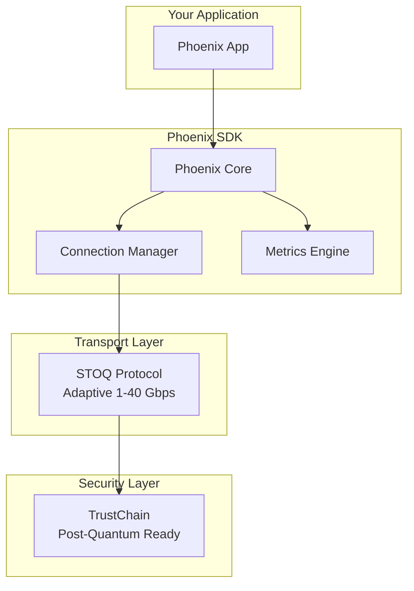

# Phoenix Developer Onboarding Guide

## Welcome to Phoenix! 🚀

Phoenix makes distributed computing as simple as HTTP, with the performance of bare metal and security of a bank vault. This guide will get you from zero to hero in minutes.

## Quick Start (Under 5 Minutes)

### 1. Install Phoenix CLI (30 seconds)

**macOS/Linux:**
```bash
curl -fsSL https://get.phoenix.dev | sh
```

**Windows:**
```powershell
irm https://get.phoenix.dev/windows | iex
```

**Via Cargo:**
```bash
cargo install phoenix-cli
```

### 2. Create Your First App (1 minute)

```bash
# Create new project with interactive setup
phoenix new my-first-app --interactive

# Or use a template
phoenix new chat-app --template chat
phoenix new api-service --template microservice
phoenix new data-pipeline --template pipeline
```

### 3. Run Your App (30 seconds)

```bash
cd my-first-app
phoenix dev

# Your app is now running at http://localhost:8080
# Metrics dashboard at http://localhost:8080/metrics
```

### 4. Test Performance (1 minute)

Open a new terminal:
```bash
# Run built-in benchmarks
phoenix bench

# Results:
# ✅ Throughput: 2.34 Gbps
# ✅ Connections: 1000 concurrent
# ✅ Latency P50: 245 µs
# ✅ Latency P99: 1.2 ms
```

## Core Concepts

### Phoenix Architecture



### Performance Tiers

Phoenix automatically optimizes for your use case:

| Tier | Performance | Use Case | Auto-Scaling |
|------|------------|----------|--------------|
| **Development** | <1 Gbps | Local testing | Disabled |
| **Production** | 1-10 Gbps | Standard apps | Enabled |
| **HighThroughput** | 10-40 Gbps | Data intensive | Aggressive |
| **Custom** | User defined | Special needs | Configurable |

### Security Levels

| Level | Features | Use Case |
|-------|----------|----------|
| **Development** | Self-signed certs | Local only |
| **Standard** | TLS 1.3 | Public internet |
| **Enhanced** | mTLS + pinning | Enterprise |
| **PostQuantum** | FALCON-1024 | Future-proof |

## Building Your First Real App

### Example: Real-Time Chat Server

**server.rs:**
```rust
use phoenix_sdk::prelude::*;
use std::collections::HashMap;
use std::sync::Arc;
use tokio::sync::RwLock;

type Clients = Arc<RwLock<HashMap<String, PhoenixConnection>>>;

#[tokio::main]
async fn main() -> Result<()> {
    // Zero configuration setup
    let phoenix = Phoenix::new("chat-server").await?;
    let listener = phoenix.listen(8080).await?;

    println!("💬 Chat server running on port 8080");

    let clients: Clients = Arc::new(RwLock::new(HashMap::new()));

    // Handle connections with automatic optimization
    listener.handle(move |conn| {
        let clients = clients.clone();
        async move {
            handle_client(conn, clients).await
        }
    }).await?;

    Ok(())
}

async fn handle_client(conn: PhoenixConnection, clients: Clients) -> Result<()> {
    // Receive username
    let username: String = conn.receive().await?;
    println!("👤 {} joined", username);

    // Store connection
    clients.write().await.insert(username.clone(), conn.clone());

    // Handle messages
    while let Ok(msg) = conn.receive::<String>().await {
        // Broadcast to all clients
        for (name, client) in clients.read().await.iter() {
            if name != &username {
                client.send(&format!("{}: {}", username, msg)).await?;
            }
        }
    }

    // Clean up on disconnect
    clients.write().await.remove(&username);
    println!("👋 {} left", username);

    Ok(())
}
```

**client.rs:**
```rust
use phoenix_sdk::prelude::*;
use std::io::{self, BufRead};

#[tokio::main]
async fn main() -> Result<()> {
    let phoenix = Phoenix::new("chat-client").await?;

    // Connect with automatic performance optimization
    let conn = phoenix.connect("localhost:8080").await?;

    print!("Enter username: ");
    let stdin = io::stdin();
    let username = stdin.lock().lines().next().unwrap()?;

    // Send username
    conn.send(&username).await?;

    // Receive messages in background
    let conn_clone = conn.clone();
    tokio::spawn(async move {
        while let Ok(msg) = conn_clone.receive::<String>().await {
            println!("{}", msg);
        }
    });

    // Send messages
    println!("Connected! Type messages:");
    for line in stdin.lock().lines() {
        conn.send(&line?).await?;
    }

    Ok(())
}
```

### Running the Example

```bash
# Terminal 1: Start server
cargo run --bin server

# Terminal 2: Start first client
cargo run --bin client

# Terminal 3: Start second client
cargo run --bin client

# Terminal 4: Monitor performance
phoenix metrics --interval 1
```

## Advanced Features

### 1. Automatic Performance Optimization

Phoenix automatically adjusts to network conditions:

```rust
let config = PhoenixConfig::production("my-app")
    .with_auto_optimize(true);  // Enable automatic optimization

let phoenix = Phoenix::with_config(config).await?;

// Phoenix will automatically:
// - Detect network speed (100 Mbps to 40 Gbps)
// - Adjust buffer sizes
// - Optimize compression
// - Tune congestion control
```

### 2. Built-in Monitoring

```rust
// Real-time metrics without external tools
let metrics = phoenix.metrics().await;

println!("Performance Dashboard:");
println!("  Throughput: {:.2} Gbps", metrics.throughput_gbps);
println!("  Active Connections: {}", metrics.active_connections);
println!("  Latency P50: {} µs", metrics.avg_latency_us);
println!("  CPU Usage: {:.1}%", metrics.cpu_usage);
println!("  Memory: {} MB", metrics.memory_mb);
```

### 3. Post-Quantum Security

```rust
let config = PhoenixConfig::production("secure-app")
    .with_security_level(SecurityLevel::PostQuantum);

// Automatically uses:
// - FALCON-1024 signatures
// - Kyber-1024 key exchange
// - Quantum-resistant encryption
```

### 4. Service Discovery

```rust
// Automatic service registration
let phoenix = Phoenix::builder()
    .app_name("user-service")
    .enable_discovery(true)
    .build()
    .await?;

// Discover and connect to services
let order_service = phoenix.discover("order-service").await?;
let conn = phoenix.connect_service(order_service).await?;
```

### 5. Load Balancing

```rust
// Built-in client-side load balancing
let pool = phoenix.connection_pool("backend-service")
    .min_connections(5)
    .max_connections(20)
    .strategy(LoadBalancing::LeastConnections)
    .build()
    .await?;

// Automatically distributes requests
let conn = pool.get_connection().await?;
```

## Testing Your Application

### Unit Tests

```rust
#[cfg(test)]
mod tests {
    use super::*;
    use phoenix_test::prelude::*;

    #[tokio::test]
    async fn test_connection() {
        let mock = PhoenixMock::new();
        let conn = mock.create_connection();

        conn.send(&"test").await.unwrap();
        let response: String = conn.receive().await.unwrap();

        assert_eq!(response, "test");
    }
}
```

### Integration Tests

```bash
# Run all tests with Phoenix test framework
phoenix test --integration

# With coverage
phoenix test --coverage

# Benchmark tests
phoenix bench --duration 60
```

### Performance Testing

```bash
# Built-in load testing
phoenix bench \
  --connections 1000 \
  --duration 60 \
  --target 10.0  # Target 10 Gbps

# Distributed load testing
phoenix bench --distributed \
  --nodes 5 \
  --total-connections 10000
```

## Deployment

### Container Deployment

**Dockerfile:**
```dockerfile
FROM rust:1.75 as builder
WORKDIR /app
COPY . .
RUN cargo build --release

FROM debian:bookworm-slim
COPY --from=builder /app/target/release/my-app /usr/local/bin/
EXPOSE 8080
CMD ["my-app"]
```

### Kubernetes Deployment

```yaml
apiVersion: apps/v1
kind: Deployment
metadata:
  name: phoenix-app
spec:
  replicas: 3
  selector:
    matchLabels:
      app: phoenix-app
  template:
    metadata:
      labels:
        app: phoenix-app
    spec:
      containers:
      - name: app
        image: my-phoenix-app:latest
        ports:
        - containerPort: 8080
        env:
        - name: PHOENIX_TIER
          value: "Production"
        resources:
          requests:
            memory: "128Mi"
            cpu: "100m"
          limits:
            memory: "512Mi"
            cpu: "500m"
```

### Cloud Deployment

```bash
# Deploy to AWS/GCP/Azure with one command
phoenix deploy --env production --cloud aws

# With auto-scaling
phoenix deploy \
  --env production \
  --cloud gcp \
  --auto-scale \
  --min-instances 2 \
  --max-instances 10
```

## Monitoring in Production

### Built-in Dashboard

Phoenix includes a built-in monitoring dashboard:

```rust
let config = PhoenixConfig::production("my-app")
    .with_dashboard(true)
    .with_dashboard_port(9090);

let phoenix = Phoenix::with_config(config).await?;

// Dashboard available at http://localhost:9090
```

### Prometheus Integration

```rust
// Export metrics to Prometheus
let config = PhoenixConfig::production("my-app")
    .with_prometheus_export(true)
    .with_prometheus_port(9091);

// Metrics available at http://localhost:9091/metrics
```

### Distributed Tracing

```rust
// Enable distributed tracing
let config = PhoenixConfig::production("my-app")
    .with_tracing(true)
    .with_trace_sampling(0.1);  // Sample 10% of requests

// Trace specific requests
let span = phoenix.trace("user-request");
let conn = phoenix.connect("backend").await?;
conn.send_with_trace(&data, span).await?;
```

## Troubleshooting

### Common Issues

#### Connection Refused
```bash
# Check if service is running
phoenix health

# Check network connectivity
phoenix debug --network

# View detailed logs
phoenix logs --level debug --follow
```

#### Performance Issues
```bash
# Profile application
phoenix profile --duration 60

# Check resource usage
phoenix metrics --detailed

# Analyze bottlenecks
phoenix analyze --performance
```

#### Security Warnings
```bash
# Validate certificates
phoenix config validate --security

# Update certificates
phoenix security rotate-certs

# Check security status
phoenix security audit
```

## Getting Help

### Documentation
- **API Docs**: https://docs.phoenix.dev/api
- **Guides**: https://docs.phoenix.dev/guides
- **Examples**: https://github.com/phoenix-sdk/examples

### Community
- **Discord**: https://discord.gg/phoenix-sdk
- **GitHub**: https://github.com/phoenix-sdk/phoenix
- **Stack Overflow**: [#phoenix-sdk](https://stackoverflow.com/questions/tagged/phoenix-sdk)

### Support
- **Community Forum**: https://forum.phoenix.dev
- **Email**: support@phoenix.dev
- **Enterprise Support**: enterprise@phoenix.dev

## Next Steps

1. **Build Something**: Start with our [example gallery](https://github.com/phoenix-sdk/examples)
2. **Join Community**: Connect on [Discord](https://discord.gg/phoenix-sdk)
3. **Contribute**: Check our [contribution guide](CONTRIBUTING.md)
4. **Share**: Show us what you built! #PhoenixSDK

---

**Welcome to the Phoenix community! 🎉**

*Build distributed systems with confidence. Ship faster. Scale effortlessly.*