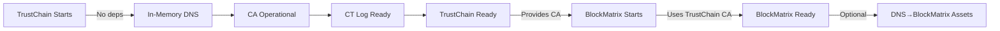

# TrustChain Bootstrap Sequence

## Overview
TrustChain MUST be able to bootstrap independently without ANY external dependencies. This is critical to avoid circular dependencies with BlockMatrix, which depends on TrustChain for certificates.

## Bootstrap Phases

### Phase 1: Standalone Bootstrap (NO DEPENDENCIES)
**Purpose**: Get TrustChain operational with zero external dependencies.

```rust
// Start TrustChain in standalone mode
let bootstrap = TrustChainBootstrap::bootstrap_standalone().await?;
```

**What happens**:
1. TrustChain starts with in-memory DNS backend
2. CA generates root certificate using FALCON-1024
3. CT (Certificate Transparency) log initialized
4. DNS resolver starts with seed records (localhost, trust.hypermesh.local)
5. **TrustChain is FULLY OPERATIONAL**

**No dependencies on**:
- BlockMatrix
- External DNS servers
- External databases
- Any network services

### Phase 2: Persistent Bootstrap (OPTIONAL)
**Purpose**: Add file-based persistence while maintaining independence.

```rust
// Start TrustChain with file persistence
let bootstrap = TrustChainBootstrap::bootstrap_with_persistence(
    PathBuf::from("/var/lib/trustchain/dns")
).await?;
```

**What happens**:
1. Same as Phase 1, but with file-based DNS persistence
2. DNS records saved to disk for recovery after restart
3. Still NO external dependencies

### Phase 3: BlockMatrix Integration (AFTER TRUSTCHAIN RUNNING)
**Purpose**: Once both systems are running, integrate for enhanced features.

```rust
// BlockMatrix starts AFTER TrustChain is operational
// 1. Start TrustChain first
let trustchain = TrustChainBootstrap::bootstrap_standalone().await?;

// 2. BlockMatrix can now start and connect to TrustChain
// BlockMatrix uses localhost or known IP to reach TrustChain CA
let blockmatrix = BlockMatrix::start_with_trustchain("::1:8080").await?;

// 3. Optional: Upgrade TrustChain to use BlockMatrix for DNS
// trustchain.upgrade_to_blockmatrix().await?; // Future feature
```

## Dependency Resolution

### The Problem (Circular Dependency)
- TrustChain needs DNS records → BlockMatrix provides DNS-as-Asset
- BlockMatrix needs certificates → TrustChain provides CA
- **DEADLOCK**: Neither can start if they depend on each other

### The Solution (Independent Bootstrap)


## DNS Bootstrap Records

Default seed records loaded during bootstrap:
```json
[
  {
    "name": "trust.hypermesh.local",
    "type": "AAAA",
    "value": "::1",
    "ttl": 3600
  },
  {
    "name": "ca.trust.hypermesh.local",
    "type": "AAAA",
    "value": "::1",
    "ttl": 3600
  },
  {
    "name": "dns.trust.hypermesh.local",
    "type": "AAAA",
    "value": "::1",
    "ttl": 3600
  },
  {
    "name": "ct.trust.hypermesh.local",
    "type": "AAAA",
    "value": "::1",
    "ttl": 3600
  }
]
```

## Implementation Files

### TrustChain Bootstrap Components
- `/trustchain/src/dns/bootstrap.rs` - Bootstrap implementation
- `/trustchain/src/ca/` - Certificate Authority (no BlockMatrix deps)
- `/trustchain/src/ct/` - Certificate Transparency (no BlockMatrix deps)
- `/trustchain/src/dns/` - DNS resolver (no BlockMatrix deps)

### BlockMatrix Integration Points
- `/blockmatrix/src/dns/trustchain.rs` - TrustChain client (stub for now)
- `/blockmatrix/src/intelligence/trustchain_stub.rs` - Stub client implementation

## Running the System

### Development Mode
```bash
# Terminal 1: Start TrustChain first (no dependencies)
cd trustchain
cargo run --bin trustchain-bootstrap

# Terminal 2: Start BlockMatrix (after TrustChain is running)
cd ../blockmatrix
TRUSTCHAIN_URL=http://[::1]:8080 cargo run
```

### Production Mode
```bash
# Start TrustChain as a service
systemctl start trustchain

# Wait for TrustChain to be ready
trustchain-cli status --wait-ready

# Start BlockMatrix
systemctl start blockmatrix
```

## Key Design Principles

1. **TrustChain Independence**: TrustChain MUST work without BlockMatrix
2. **Graceful Upgrade**: DNS-as-Asset is an enhancement, not a requirement
3. **Backward Compatibility**: System continues working if upgrade fails
4. **No Tight Coupling**: Services communicate via well-defined APIs
5. **Fail-Safe**: If BlockMatrix is down, TrustChain continues working

## Testing Bootstrap Independence

```bash
# Test 1: TrustChain starts alone
cd trustchain
cargo test bootstrap::test_standalone_bootstrap

# Test 2: TrustChain with persistence
cargo test bootstrap::test_bootstrap_with_persistence

# Test 3: BlockMatrix connects to running TrustChain
# (Start TrustChain in one terminal, then run BlockMatrix tests)
cd ../blockmatrix
cargo test dns::test_trustchain_connection
```

## Future Enhancements

Once the circular dependency is resolved and both systems are stable:

1. **DNS-as-Asset Migration**: Migrate DNS records to BlockMatrix for CAESAR rewards
2. **state proof Integration**: DNS updates validated through Proof of State
3. **Multi-Network DNS**: Different DNS views per privacy tier
4. **Distributed DNS**: DNS records sharded across matrix topology

These are ENHANCEMENTS, not requirements. The system works without them.